<!--
#
# Licensed to the Apache Software Foundation (ASF) under one or more
# contributor license agreements.  See the NOTICE file distributed with
# this work for additional information regarding copyright ownership.
# The ASF licenses this file to You under the Apache License, Version 2.0
# (the "License"); you may not use this file except in compliance with
# the License.  You may obtain a copy of the License at
#
#     http://www.apache.org/licenses/LICENSE-2.0
#
# Unless required by applicable law or agreed to in writing, software
# distributed under the License is distributed on an "AS IS" BASIS,
# WITHOUT WARRANTIES OR CONDITIONS OF ANY KIND, either express or implied.
# See the License for the specific language governing permissions and
# limitations under the License.
#
-->

## What is PubSub

Publish-subscribe is a messaging paradigm:

- Producers send messages to specific brokers rather than directly to consumers.
- Brokers cache messages sent by producers and then actively push them to subscribed consumers or pull them.

The system architectures use this pattern to decouple or handle high traffic scenarios.

In Apache APISIX, the most common scenario is handling north-south traffic from the server to the client. Combining it with a publish-subscribe system, we can achieve more robust features, such as real-time collaboration on online documents, online games, etc.

## Architecture



Currently, Apache APISIX supports WebSocket communication with the client, which can be any application that supports WebSocket, with Protocol Buffer as the serialization mechanism, see the [protocol definition](https://github.com/apache/apisix/blob/master/apisix/include/apisix/model/pubsub.proto).

## Supported messaging systems

- [Apache Kafka](pubsub/kafka.md)

## How to support other messaging systems

Apache APISIX implement an extensible pubsub module, which is responsible for starting the WebSocket server, coding and decoding communication protocols, handling client commands, and adding support for the new messaging system.

### Basic Steps

- Add new commands and response body definitions to `pubsub.proto`
- Add a new option to the `scheme` configuration item in upstream
- Add a new `scheme` judgment branch to `http_access_phase`
- Implement the required message system instruction processing functions
- Optional: Create plugins to support advanced configurations of this messaging system

### Example of Apache Kafka

#### Add new commands and response body definitions to `pubsub.proto`

The core of the protocol definition in `pubsub.proto` is the two parts `PubSubReq` and `PubSubResp`.

First, create the `CmdKafkaFetch` command and add the required parameters. Then, register this command in the list of commands for `req` in `PubSubReq`, which is named `cmd_kafka_fetch`.

Then create the corresponding response body `KafkaFetchResp` and register it in the `resp` of `PubSubResp`, named `kafka_fetch_resp`.

The protocol definition [pubsub.proto](https://github.com/apache/apisix/blob/master/apisix/include/apisix/model/pubsub.proto).

#### Add a new option to the `scheme` configuration item in upstream

Add a new option `kafka` to the `scheme` field enumeration in the `upstream` of `apisix/schema_def.lua`.

The schema definition [schema_def.lua](https://github.com/apache/apisix/blob/master/apisix/schema_def.lua).

#### Add a new `scheme` judgment branch to `http_access_phase`

Add a `scheme` judgment branch to the `http_access_phase` function in `apisix/init.lua` to support the processing of `kafka` type upstreams. Because Apache Kafka has its clustering and partition scheme, we do not need to use the Apache APISIX built-in load balancing algorithm, so we intercept and take over the processing flow before selecting the upstream node, using the `kafka_access_phase` function.

The APISIX init file [init.lua](https://github.com/apache/apisix/blob/master/apisix/init.lua).

#### Implement the required message system commands processing functions

First, create an instance of the `pubsub` module, which is provided in the `core` package.

Then, an instance of the Apache Kafka client is created and omitted code here.

Next, add the command registered in the protocol definition above to the `pubsub` instance, which will provide a callback function that provides the parameters parsed from the communication protocol, in which the developer needs to call the kafka client to get the data and return it to the `pubsub` module as the function return value.

:::note Callback function prototype

The `params` is the data in the protocol definition; the first return value is the data, which needs to contain the fields in the response body definition, and returns the `nil` value when there is an error; the second return value is the error, and returns the error string when there is an error

:::

Finally, it enters the loop to wait for client commands, and when an error occurs, it returns the error and stops the processing flow.

The kafka pubsub implementation [kafka.lua](https://github.com/apache/apisix/blob/master/apisix/pubsub/kafka.lua).

#### Optional: Create plugins to support advanced configurations of this messaging system

Add the required fields to the plugin schema definition and write them to the context of the current request in the `access` function.

The `kafka-proxy` plugin [kafka-proxy.lua](https://github.com/apache/apisix/blob/master/apisix/plugins/kafka-proxy.lua).

Add this plugin to [the existing list of plugins](https://github.com/apache/apisix/blob/master/apisix/cli/config.yaml.example) in the APISIX configuration file [`config.yaml`](https://github.com/apache/apisix/blob/master/conf/config.yaml). For instance:

```yaml title="conf/config.yaml"
plugins:         # see `conf/config.yaml.example` for an example
  - ...          # add existing plugins
  - kafka-proxy
```

#### Results

After this is done, create a route like the one below to connect to this messaging system via APISIX using the WebSocket.

```shell
curl -X PUT 'http://127.0.0.1:9180/apisix/admin/routes/kafka' \
    -H 'X-API-KEY: ${api-key}' \
    -H 'Content-Type: application/json' \
    -d '{
    "uri": "/kafka",
    "plugins": {
        "kafka-proxy": {
            "sasl": {
              "username": "user",
              "password": "pwd"
            }
        }
    },
    "upstream": {
        "nodes": {
            "kafka-server1:9092": 1,
            "kafka-server2:9092": 1,
            "kafka-server3:9092": 1
        },
        "type": "none",
        "scheme": "kafka",
        "tls": {
            "verify": true
        }
    }
}'
```
