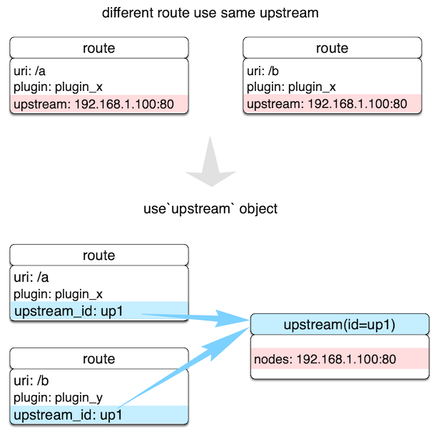

<!--
#
# Licensed to the Apache Software Foundation (ASF) under one or more
# contributor license agreements.  See the NOTICE file distributed with
# this work for additional information regarding copyright ownership.
# The ASF licenses this file to You under the Apache License, Version 2.0
# (the "License"); you may not use this file except in compliance with
# the License.  You may obtain a copy of the License at
#
#     http://www.apache.org/licenses/LICENSE-2.0
#
# Unless required by applicable law or agreed to in writing, software
# distributed under the License is distributed on an "AS IS" BASIS,
# WITHOUT WARRANTIES OR CONDITIONS OF ANY KIND, either express or implied.
# See the License for the specific language governing permissions and
# limitations under the License.
#
-->

## Description

Upstream is a virtual host abstraction that performs load balancing on a given set of service nodes according to the configured rules.

Although Upstream can be directly configured to the [Route](./route.md) or [Service](./service.md), using an Upstream object is recommended when there is duplication as shown below.



By creating an Upstream object and referencing it by `upstream_id` in the Route, you can ensure that there is only a single value of the object that needs to be maintained.

An Upstream configuration can be directly bound to a Route or a Service, but the configuration in Route has a higher priority. This behavior is consistent with priority followed by the [Plugin](./plugin.md) object.

## Configuration

In addition to the equalization algorithm selections, Upstream also supports passive health check and retry for the upstream. You can learn more about this [Admin API Upstream](../admin-api.md#upstream).

To create an Upstream object, you can use the Admin API as shown below.

:::note
You can fetch the `admin_key` from `config.yaml` and save to an environment variable with the following command:

```bash
admin_key=$(yq '.deployment.admin.admin_key[0].key' conf/config.yaml | sed 's/"//g')
```

:::

```shell
curl http://127.0.0.1:9180/apisix/admin/upstreams/1 \
-H "X-API-KEY: $admin_key" -X PUT -d '
{
    "type": "chash",
    "key": "remote_addr",
    "nodes": {
        "127.0.0.1:80": 1,
        "foo.com:80": 2
    }
}'
```

After creating an Upstream object, it can be referenced by a specific Route or Service as shown below.

```shell
curl http://127.0.0.1:9180/apisix/admin/routes/1 \
-H "X-API-KEY: $admin_key" -X PUT -d '
{
    "uri": "/index.html",
    "upstream_id": 1
}'
```

For convenience, you can directly bind the upstream address to a Route or Service.

```shell
curl http://127.0.0.1:9180/apisix/admin/routes/1 \
-H "X-API-KEY: $admin_key" -X PUT -d '
{
    "uri": "/index.html",
    "plugins": {
        "limit-count": {
            "count": 2,
            "time_window": 60,
            "rejected_code": 503,
            "key": "remote_addr"
        }
    },
    "upstream": {
        "type": "roundrobin",
        "nodes": {
            "127.0.0.1:1980": 1
        }
    }
}'
```

## Example

The example below shows how you can configure a health check.

```shell
curl http://127.0.0.1:9180/apisix/admin/routes/1 \
-H "X-API-KEY: $admin_key" -X PUT -d '
{
    "uri": "/index.html",
    "plugins": {
        "limit-count": {
            "count": 2,
            "time_window": 60,
            "rejected_code": 503,
            "key": "remote_addr"
        }
    },
    "upstream": {
         "nodes": {
            "127.0.0.1:1980": 1
        }
        "type": "roundrobin",
        "retries": 2,
        "checks": {
            "active": {
                "http_path": "/status",
                "host": "foo.com",
                "healthy": {
                    "interval": 2,
                    "successes": 1
                },
                "unhealthy": {
                    "interval": 1,
                    "http_failures": 2
                }
            }
        }
    }
}'
```

You can learn more about health checks [health-check](../tutorials/health-check.md).

The examples below show configurations that use different `hash_on` types.

### Consumer

Creating a Consumer object.

```shell
curl http://127.0.0.1:9180/apisix/admin/consumers \
-H "X-API-KEY: $admin_key" -X PUT -d '
{
    "username": "jack",
    "plugins": {
       "key-auth": {
            "key": "auth-jack"
        }
    }
}'
```

Creating a Route object and enabling the `key-auth` authentication Plugin.

```shell
curl http://127.0.0.1:9180/apisix/admin/routes/1 \
-H "X-API-KEY: $admin_key" -X PUT -d '
{
    "plugins": {
        "key-auth": {}
    },
    "upstream": {
        "nodes": {
            "127.0.0.1:1980": 1,
            "127.0.0.1:1981": 1
        },
        "type": "chash",
        "hash_on": "consumer"
    },
    "uri": "/server_port"
}'
```

To test the request, the `consumer_name` passed for authentication will be used as the hash value of the load balancing hash algorithm.

```shell
curl http://127.0.0.1:9080/server_port -H "apikey: auth-jack"
```

### Cookie

Creating a Route and an upstream object.

```shell
curl http://127.0.0.1:9180/apisix/admin/routes/1 \
-H "X-API-KEY: $admin_key" -X PUT -d '
{
    "uri": "/hash_on_cookie",
    "upstream": {
        "key": "sid",
        "type": "chash",
        "hash_on": "cookie",
        "nodes": {
            "127.0.0.1:1980": 1,
            "127.0.0.1:1981": 1
        }
    }
}'
```

The client can then send a request with a cookie.

```shell
 curl http://127.0.0.1:9080/hash_on_cookie \
 -H "Cookie: sid=3c183a30cffcda1408daf1c61d47b274"
```

### Header

Creating a Route and an upstream object.

```shell
curl http://127.0.0.1:9180/apisix/admin/routes/1 \
-H "X-API-KEY: $admin_key" -X PUT -d '
{
    "uri": "/hash_on_header",
    "upstream": {
        "key": "content-type",
        "type": "chash",
        "hash_on": "header",
        "nodes": {
            "127.0.0.1:1980": 1,
            "127.0.0.1:1981": 1
        }
    }
}'
```

The client can now send requests with a header. The example below shows using the header `Content-Type`.

```shell
 curl http://127.0.0.1:9080/hash_on_header \
 -H "X-API-KEY: $admin_key" \
 -H "Content-Type: application/json"
```
