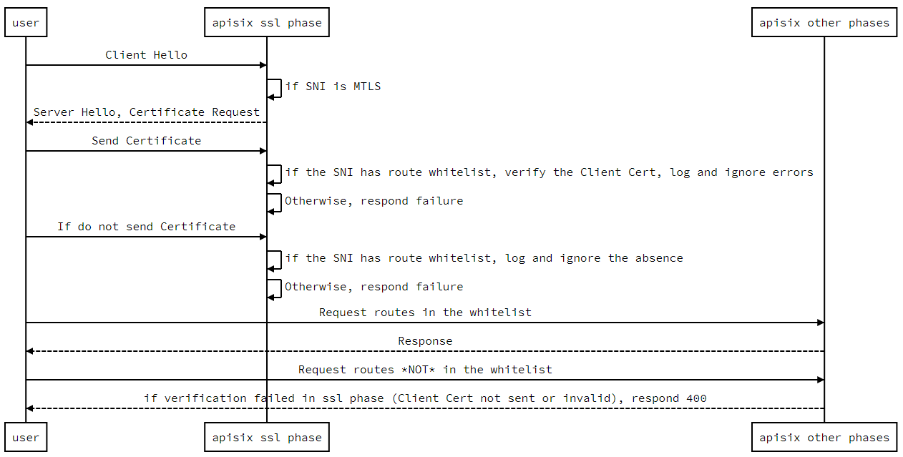

<!--
#
# Licensed to the Apache Software Foundation (ASF) under one or more
# contributor license agreements.  See the NOTICE file distributed with
# this work for additional information regarding copyright ownership.
# The ASF licenses this file to You under the Apache License, Version 2.0
# (the "License"); you may not use this file except in compliance with
# the License.  You may obtain a copy of the License at
#
#     http://www.apache.org/licenses/LICENSE-2.0
#
# Unless required by applicable law or agreed to in writing, software
# distributed under the License is distributed on an "AS IS" BASIS,
# WITHOUT WARRANTIES OR CONDITIONS OF ANY KIND, either express or implied.
# See the License for the specific language governing permissions and
# limitations under the License.
#
-->

mTLS is a method for mutual authentication. Suppose in your network environment, only trusted clients are required to access the server. In that case, you can enable mTLS to verify the client's identity and ensure the server API's security. This article mainly introduces how to configure mutual authentication (mTLS) between the client and Apache APISIX.

## Configuration

This example includes the following procedures:

1. Generate certificates;
2. Configure the certificate in APISIX;
3. Create and configure routes in APISIX;
4. Test verification.

To make the test results clearer, the examples mentioned in this article pass some information about the client credentials upstream, including: `serial`, `fingerprint` and `common name`.

### Generate certificates

We need to generate three test certificates: the root, server, and client. Just use the following command to generate the test certificates we need via `OpenSSL`.

```shell
# For ROOT CA
openssl genrsa -out ca.key 2048
openssl req -new -sha256 -key ca.key -out ca.csr -subj "/CN=ROOTCA"
openssl x509 -req -days 36500 -sha256 -extensions v3_ca -signkey ca.key -in ca.csr -out ca.cer

# For server certificate
openssl genrsa -out server.key 2048
# Note: The `test.com` in the CN value is the domain name/hostname we want to test
openssl req -new -sha256 -key server.key -out server.csr -subj "/CN=test.com"
openssl x509 -req -days 36500 -sha256 -extensions v3_req  -CA  ca.cer -CAkey ca.key  -CAserial ca.srl  -CAcreateserial -in server.csr -out server.cer

# For client certificate
openssl genrsa -out client.key 2048
openssl req -new -sha256 -key client.key  -out client.csr -subj "/CN=CLIENT"
openssl x509 -req -days 36500 -sha256 -extensions v3_req  -CA  ca.cer -CAkey ca.key  -CAserial ca.srl  -CAcreateserial -in client.csr -out client.cer

# Convert client certificate to pkcs12 for Windows usage (optional)
openssl pkcs12 -export -clcerts -in client.cer -inkey client.key -out client.p12
```

### Configure the certificate in APISIX

Use the `curl` command to request APISIX Admin API to set up SSL for specific SNI.

:::note

Note that the newline character in the certificate needs to be replaced with its escape character `\n`.

:::

```shell
curl -X PUT 'http://127.0.0.1:9180/apisix/admin/ssls/1' \
--header 'X-API-KEY: edd1c9f034335f136f87ad84b625c8f1' \
--header 'Content-Type: application/json' \
--data-raw '{
    "sni": "test.com",
    "cert": "<content of server.cer>",
    "key": "<content of server.key>",
    "client": {
        "ca": "<content of ca.cer>"
    }
}'
```

- `sni`: Specify the domain name (CN) of the certificate. When the client tries to handshake with APISIX via TLS, APISIX will match the SNI data in `ClientHello` with this field and find the corresponding server certificate for handshaking.
- `cert`: The server certificate.
- `key`: The private key of the server certificate.
- `client.ca`: The CA (certificate authority) file to verfiy the client certificate. For demonstration purposes, the same `CA` is used here.

### Configure the route in APISIX

Use the `curl` command to request the APISIX Admin API to create a route.

```shell
curl -X PUT 'http://127.0.0.1:9180/apisix/admin/routes/1' \
--header 'X-API-KEY: edd1c9f034335f136f87ad84b625c8f1' \
--header 'Content-Type: application/json' \
--data-raw '{
    "uri": "/anything",
    "plugins": {
        "proxy-rewrite": {
            "headers": {
                "X-Ssl-Client-Fingerprint": "$ssl_client_fingerprint",
                "X-Ssl-Client-Serial": "$ssl_client_serial",
                "X-Ssl-Client-S-DN": "$ssl_client_s_dn"
            }
        }
    },
    "upstream": {
        "nodes": {
            "httpbin.org":1
        },
        "type":"roundrobin"
    }
}'
```

APISIX automatically handles the TLS handshake based on the SNI and the SSL resource created in the previous step, so we do not need to specify the hostname in the route (but it is possible to specify the hostname if you need it).

Also, in the `curl` command above, we enabled the [proxy-rewrite](../plugins/proxy-rewrite.md) plugin, which will dynamically update the request header information. The source of the variable values in the example are the `NGINX` variables, and you can find them here: [http://nginx.org/en/docs/http/ngx_http_ssl_module.html#variables](http://nginx.org/en/docs/http/ngx_http_ssl_module.html#variables).

### Test

Since we are using the domain `test.com` as the test domain, we have to add the test domain to your DNS or local `hosts` file before we can start the verification.

1. If we don't use `hosts` and just want to test the results, then you can do so directly using the following command.

```
curl --resolve "test.com:9443:127.0.0.1" https://test.com:9443/anything -k --cert ./client.cer --key ./client.key
```

2. If you need to modify `hosts`, please read the following example (for Ubuntu).

- Modify the `/etc/hosts` file

  ```shell
  # 127.0.0.1 localhost
  127.0.0.1 test.com
  ```

- Verify that the test domain name is valid

  ```shell
  ping test.com

  PING test.com (127.0.0.1) 56(84) bytes of data.
  64 bytes from localhost.localdomain (127.0.0.1): icmp_seq=1 ttl=64 time=0.028 ms
  64 bytes from localhost.localdomain (127.0.0.1): icmp_seq=2 ttl=64 time=0.037 ms
  64 bytes from localhost.localdomain (127.0.0.1): icmp_seq=3 ttl=64 time=0.036 ms
  64 bytes from localhost.localdomain (127.0.0.1): icmp_seq=4 ttl=64 time=0.031 ms
  ^C
  --- test.com ping statistics ---
  4 packets transmitted, 4 received, 0% packet loss, time 3080ms
  rtt min/avg/max/mdev = 0.028/0.033/0.037/0.003 ms
  ```

- Test results

  ```shell
  curl https://test.com:9443/anything -k --cert ./client.cer --key ./client.key
  ```

  You will then receive the following response body.

  ```shell
  {
    "args": {},
    "data": "",
    "files": {},
    "form": {},
    "headers": {
      "Accept": "*/*",
      "Host": "test.com",
      "User-Agent": "curl/7.81.0",
      "X-Amzn-Trace-Id": "Root=1-63256343-17e870ca1d8f72dc40b2c5a9",
      "X-Forwarded-Host": "test.com",
      "X-Ssl-Client-Fingerprint": "c1626ce3bca723f187d04e3757f1d000ca62d651",
      "X-Ssl-Client-S-Dn": "CN=CLIENT",
      "X-Ssl-Client-Serial": "5141CC6F5E2B4BA31746D7DBFE9BA81F069CF970"
    },
    "json": null,
    "method": "GET",
    "origin": "127.0.0.1",
    "url": "http://test.com/anything"
  }
  ```

Since we configured the [proxy-rewrite](../plugins/proxy-rewrite.md) plugin in the example, we can see that the response body contains the request body received upstream, containing the correct data.

## MTLS bypass based on regular expression matching against URI

APISIX allows configuring an URI whitelist to bypass MTLS.
If the URI of a request is in the whitelist, then the client certificate will not be checked.
Note that other URIs of the associated SNI will get HTTP 400 response
instead of alert error in the SSL handshake phase, if the client certificate is missing or invalid.

### Timing diagram



### Example

:::note
You can fetch the `admin_key` from `config.yaml` and save to an environment variable with the following command:

```bash
admin_key=$(yq '.deployment.admin.admin_key[0].key' conf/config.yaml | sed 's/"//g')
```

:::

1. Configure route and ssl via admin API

```bash
curl http://127.0.0.1:9180/apisix/admin/routes/1 \
-H "X-API-KEY: $admin_key" -X PUT -d '
{
    "uri": "/*",
    "upstream": {
        "nodes": {
            "httpbin.org": 1
        }
    }
}'

curl http://127.0.0.1:9180/apisix/admin/ssls/1 \
-H "X-API-KEY: $admin_key" -X PUT -d '
{
    "cert": "'"$(<t/certs/mtls_server.crt)"'",
    "key": "'"$(<t/certs/mtls_server.key)"'",
    "snis": [
        "*.apisix.dev"
    ],
    "client": {
        "ca": "'"$(<t/certs/mtls_ca.crt)"'",
        "depth": 10,
        "skip_mtls_uri_regex": [
            "/anything.*"
        ]
    }
}'
```

2. If the client certificate is missing and the URI is not in the whitelist,
then you'll get HTTP 400 response.

```bash
curl https://admin.apisix.dev:9443/uuid -v \
--resolve 'admin.apisix.dev:9443:127.0.0.1' --cacert t/certs/mtls_ca.crt
* Added admin.apisix.dev:9443:127.0.0.1 to DNS cache
* Hostname admin.apisix.dev was found in DNS cache
*   Trying 127.0.0.1:9443...
* TCP_NODELAY set
* Connected to admin.apisix.dev (127.0.0.1) port 9443 (#0)
* ALPN, offering h2
* ALPN, offering http/1.1
* successfully set certificate verify locations:
*   CAfile: t/certs/mtls_ca.crt
  CApath: /etc/ssl/certs
* TLSv1.3 (OUT), TLS handshake, Client hello (1):
* TLSv1.3 (IN), TLS handshake, Server hello (2):
* TLSv1.3 (IN), TLS handshake, Encrypted Extensions (8):
* TLSv1.3 (IN), TLS handshake, Request CERT (13):
* TLSv1.3 (IN), TLS handshake, Certificate (11):
* TLSv1.3 (IN), TLS handshake, CERT verify (15):
* TLSv1.3 (IN), TLS handshake, Finished (20):
* TLSv1.3 (OUT), TLS change cipher, Change cipher spec (1):
* TLSv1.3 (OUT), TLS handshake, Certificate (11):
* TLSv1.3 (OUT), TLS handshake, Finished (20):
* SSL connection using TLSv1.3 / TLS_AES_256_GCM_SHA384
* ALPN, server accepted to use h2
* Server certificate:
*  subject: C=cn; ST=GuangDong; L=ZhuHai; CN=admin.apisix.dev; OU=ops
*  start date: Dec  1 10:17:24 2022 GMT
*  expire date: Aug 18 10:17:24 2042 GMT
*  subjectAltName: host "admin.apisix.dev" matched cert's "admin.apisix.dev"
*  issuer: C=cn; ST=GuangDong; L=ZhuHai; CN=ca.apisix.dev; OU=ops
*  SSL certificate verify ok.
* Using HTTP2, server supports multi-use
* Connection state changed (HTTP/2 confirmed)
* Copying HTTP/2 data in stream buffer to connection buffer after upgrade: len=0
* Using Stream ID: 1 (easy handle 0x56246de24e30)
> GET /uuid HTTP/2
> Host: admin.apisix.dev:9443
> user-agent: curl/7.68.0
> accept: */*
>
* TLSv1.3 (IN), TLS handshake, Newsession Ticket (4):
* TLSv1.3 (IN), TLS handshake, Newsession Ticket (4):
* old SSL session ID is stale, removing
* Connection state changed (MAX_CONCURRENT_STREAMS == 128)!
< HTTP/2 400
< date: Fri, 21 Apr 2023 07:53:23 GMT
< content-type: text/html; charset=utf-8
< content-length: 229
< server: APISIX/3.2.0
<
<html>
<head><title>400 Bad Request</title></head>
<body>
<center><h1>400 Bad Request</h1></center>
<hr><center>openresty</center>
<p><em>Powered by <a href="https://apisix.apache.org/">APISIX</a>.</em></p></body>
</html>
* Connection #0 to host admin.apisix.dev left intact
```

3. Although the client certificate is missing, but the URI is in the whitelist,
you get successful response.

```bash
curl https://admin.apisix.dev:9443/anything/foobar -i \
--resolve 'admin.apisix.dev:9443:127.0.0.1' --cacert t/certs/mtls_ca.crt
HTTP/2 200
content-type: application/json
content-length: 416
date: Fri, 21 Apr 2023 07:58:28 GMT
access-control-allow-origin: *
access-control-allow-credentials: true
server: APISIX/3.2.0
...
```

## Conclusion

If you don't want to use curl or test on windows, you can read this gist for more details. [APISIX mTLS for client to APISIX](https://gist.github.com/bzp2010/6ce0bf7c15c191029ed54724547195b4).

For more information about the mTLS feature of Apache APISIX, you can read [Mutual TLS Authentication](../mtls.md).
