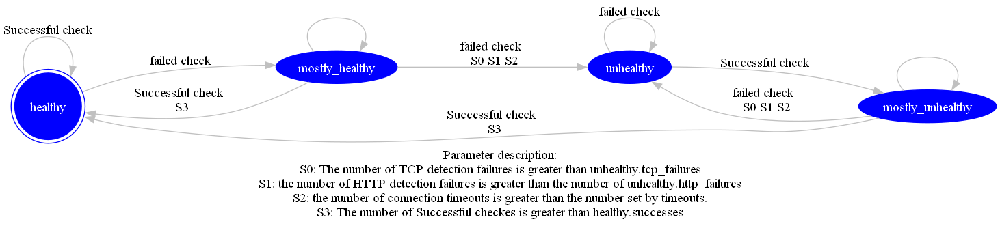

<!--
#
# Licensed to the Apache Software Foundation (ASF) under one or more
# contributor license agreements.  See the NOTICE file distributed with
# this work for additional information regarding copyright ownership.
# The ASF licenses this file to You under the Apache License, Version 2.0
# (the "License"); you may not use this file except in compliance with
# the License.  You may obtain a copy of the License at
#
#     http://www.apache.org/licenses/LICENSE-2.0
#
# Unless required by applicable law or agreed to in writing, software
# distributed under the License is distributed on an "AS IS" BASIS,
# WITHOUT WARRANTIES OR CONDITIONS OF ANY KIND, either express or implied.
# See the License for the specific language governing permissions and
# limitations under the License.
#
-->

## Description

This article mainly introduces the health check function of Apache APISIX. The health check function can proxy requests to healthy nodes when the upstream node fails or migrates, avoiding the problem of service unavailability to the greatest extent. The health check function of APISIX is implemented using [lua-resty-healthcheck](https://github.com/api7/lua-resty-healthcheck), which is divided into active check and passive check.

## Active check

Active health check mainly means that APISIX actively detects the survivability of upstream nodes through preset probe types. APISIX supports three probe types: `HTTP`, `HTTPS`, and `TCP`.

When N consecutive probes sent to healthy node `A` fail, the node will be marked as unhealthy, and the unhealthy node will be ignored by APISIX's load balancer and cannot receive requests; if For an unhealthy node, if M consecutive probes are successful, the node will be re-marked as healthy and can be proxied.

## Passive check

Passive health check refers to judging whether the corresponding upstream node is healthy by judging the response status of the request forwarded from APISIX to the upstream node. Compared with the active health check, the passive health check method does not need to initiate additional probes, but it cannot sense the node status in advance, and there may be a certain amount of failed requests.

If `N` consecutive requests to a healthy node A fail, the node will be marked as unhealthy.

:::note

Since unhealthy nodes cannot receive requests, nodes cannot be re-marked as healthy using the passive health check strategy alone, so combining the active health check strategy is usually necessary.

:::

:::tip

- We only start the health check when the upstream is hit by a request. There won't be any health check if an upstream is configured but isn't in used.
- If there is no healthy node can be chosen, we will continue to access the upstream.

:::

### Configuration instructions

| Name                                      | Configuration type              | Value type | Valid values         | Default                                                                                      | Description                                                                                                          |
| ----------------------------------------------- | ------------------------------- | ---------- | -------------------- | --------------------------------------------------------------------------------------------- | -------------------------------------------------------------------------------------------------------------------- |
| upstream.checks.active.type                     | Active check                    | string     | `http` `https` `tcp` | http                                                                                          | The type of active check.                                                                                            |
| upstream.checks.active.timeout                  | Active check                    | integer    |                      | 1                                                                                             | The timeout period of the active check (unit: second).                                                               |
| upstream.checks.active.concurrency              | Active check                    | integer    |                      | 10                                                                                            | The number of targets to be checked at the same time during the active check.                                        |
| upstream.checks.active.http_path                | Active check                    | string     |                      | /                                                                                             | The HTTP request path that is actively checked.                                                                      |
| upstream.checks.active.host                     | Active check                    | string     |                      | ${upstream.node.host}                                                                         | The hostname of the HTTP request actively checked.                                                                   |
| upstream.checks.active.port                     | Active check                    | integer    | `1` to `65535`       | ${upstream.node.port}                                                                         | The host port of the HTTP request that is actively checked.                                                          |
| upstream.checks.active.https_verify_certificate | Active check                    | boolean    |                      | true                                                                                          | Active check whether to check the SSL certificate of the remote host when HTTPS type checking is used.               |
| upstream.checks.active.req_headers              | Active check                    | array      |                      | []                                                                                            | Active check When using HTTP or HTTPS type checking, set additional request header information.                      |
| upstream.checks.active.healthy.interval         | Active check (healthy node)    | integer    | `>= 1`               | 1                                                                                             | Active check (healthy node) check interval (unit: second)                                                            |
| upstream.checks.active.healthy.http_statuses    | Active check (healthy node)    | array      | `200` to `599`       | [200, 302]                                                                                    | Active check (healthy node) HTTP or HTTPS type check, the HTTP status code of the healthy node.                      |
| upstream.checks.active.healthy.successes        | Active check (healthy node)    | integer    | `1` to `254`         | 2                                                                                             | Active check (healthy node) determine the number of times a node is healthy.                                         |
| upstream.checks.active.unhealthy.interval       | Active check (unhealthy node)  | integer    | `>= 1`               | 1                                                                                             | Active check (unhealthy node) check interval (unit: second)                                                          |
| upstream.checks.active.unhealthy.http_statuses  | Active check (unhealthy node)  | array      | `200` to `599`       | [429, 404, 500, 501, 502, 503, 504, 505]                                                      | Active check (unhealthy node) HTTP or HTTPS type check, the HTTP status code of the non-healthy node.                |
| upstream.checks.active.unhealthy.http_failures  | Active check (unhealthy node)  | integer    | `1` to `254`         | 5                                                                                             | Active check (unhealthy node) HTTP or HTTPS type check, determine the number of times that the node is not healthy.  |
| upstream.checks.active.unhealthy.tcp_failures   | Active check (unhealthy node)  | integer    | `1` to `254`         | 2                                                                                             | Active check (unhealthy node) TCP type check, determine the number of times that the node is not healthy.            |
| upstream.checks.active.unhealthy.timeouts       | Active check (unhealthy node)  | integer    | `1` to `254`         | 3                                                                                             | Active check (unhealthy node) to determine the number of timeouts for unhealthy nodes.                              |
| upstream.checks.passive.type      | Passive check  | string    | `http` `https` `tcp`    | http                                                                                             | The type of passive check.                             |
| upstream.checks.passive.healthy.http_statuses   | Passive check (healthy node)   | array      | `200` to `599`       | [200, 201, 202, 203, 204, 205, 206, 207, 208, 226, 300, 301, 302, 303, 304, 305, 306, 307, 308] | Passive check (healthy node) HTTP or HTTPS type check, the HTTP status code of the healthy node.                     |
| upstream.checks.passive.healthy.successes       | Passive check (healthy node)   | integer    | `0` to `254`         | 5                                                                                             | Passive checks (healthy node) determine the number of times a node is healthy.                                       |
| upstream.checks.passive.unhealthy.http_statuses | Passive check (unhealthy node) | array      | `200` to `599`       | [429, 500, 503]                                                                               | Passive check (unhealthy node) HTTP or HTTPS type check, the HTTP status code of the non-healthy node.               |
| upstream.checks.passive.unhealthy.tcp_failures  | Passive check (unhealthy node) | integer    | `0` to `254`         | 2                                                                                             | Passive check (unhealthy node) When TCP type is checked, determine the number of times that the node is not healthy. |
| upstream.checks.passive.unhealthy.timeouts      | Passive check (unhealthy node) | integer    | `0` to `254`         | 7                                                                                             | Passive checks (unhealthy node) determine the number of timeouts for unhealthy nodes.                                |
| upstream.checks.passive.unhealthy.http_failures | Passive check (unhealthy node) | integer    | `0` to `254`         | 5                                                                                                           | Passive check (unhealthy node) The number of times that the node is not healthy during HTTP or HTTPS type checking.  |

### Configuration example

You can enable health checks in routes via the Admin API:

:::note
You can fetch the `admin_key` from `config.yaml` and save to an environment variable with the following command:

```bash
admin_key=$(yq '.deployment.admin.admin_key[0].key' conf/config.yaml | sed 's/"//g')
```

:::

```shell
curl http://127.0.0.1:9180/apisix/admin/routes/1 -H "X-API-KEY: $admin_key" -X PUT -d '
{
    "uri": "/index.html",
    "plugins": {
        "limit-count": {
            "count": 2,
            "time_window": 60,
            "rejected_code": 503,
            "key": "remote_addr"
        }
    },
    "upstream": {
         "nodes": {
            "127.0.0.1:1980": 1,
            "127.0.0.1:1970": 1
        },
        "type": "roundrobin",
        "retries": 2,
        "checks": {
            "active": {
                "timeout": 5,
                "http_path": "/status",
                "host": "foo.com",
                "healthy": {
                    "interval": 2,
                    "successes": 1
                },
                "unhealthy": {
                    "interval": 1,
                    "http_failures": 2
                },
                "req_headers": ["User-Agent: curl/7.29.0"]
            },
            "passive": {
                "healthy": {
                    "http_statuses": [200, 201],
                    "successes": 3
                },
                "unhealthy": {
                    "http_statuses": [500],
                    "http_failures": 3,
                    "tcp_failures": 3
                }
            }
        }
    }
}'
```

If APISIX detects an unhealthy node, the following logs will be output in the error log:

```shell
enabled healthcheck passive while logging request
failed to receive status line from 'nil (127.0.0.1:1980)': closed
unhealthy TCP increment (1/2) for '(127.0.0.1:1980)'
failed to receive status line from 'nil (127.0.0.1:1980)': closed
unhealthy TCP increment (2/2) for '(127.0.0.1:1980'
```

:::tip

To observe the above log information, you need to adjust the error log level to `info`.

:::

The health check status can be fetched via `GET /v1/healthcheck` in [Control API](../control-api.md).

```shell

curl http://127.0.0.1:9090/v1/healthcheck/upstreams/healthycheck -s | jq .

```

## Health Check Status

APISIX provides comprehensive health check information, with particular emphasis on the `status` and `counter` parameters for effective health monitoring. In the APISIX context, nodes exhibit four states: `healthy`, `unhealthy`, `mostly_unhealthy`, and `mostly_healthy`. The `mostly_healthy` status indicates that the current node is considered healthy, but during health checks, the node's health status is not consistently successful. The `mostly_unhealthy` status indicates that the current node is considered unhealthy, but during health checks, the node's health detection is not consistently unsuccessful. The transition of a node's state depends on the success or failure of the current health check, along with the recording of four key metrics in the `counter`: `tcp_failure`, `http_failure`, `success`, and `timeout_failure`.

To retrieve health check information, you can use the following curl command:

```shell
 curl -i http://127.0.0.1:9090/v1/healthcheck
```

Response Example:

```json
[
  {
    "nodes": {},
    "name": "/apisix/routes/1",
    "type": "http"
  },
  {
    "nodes": [
      {
        "port": 1970,
        "hostname": "127.0.0.1",
        "status": "healthy",
        "ip": "127.0.0.1",
        "counter": {
          "tcp_failure": 0,
          "http_failure": 0,
          "success": 0,
          "timeout_failure": 0
        }
      },
      {
        "port": 1980,
        "hostname": "127.0.0.1",
        "status": "healthy",
        "ip": "127.0.0.1",
        "counter": {
          "tcp_failure": 0,
          "http_failure": 0,
          "success": 0,
          "timeout_failure": 0
        }
      }
    ],
    "name": "/apisix/routes/example-hc-route",
    "type": "http"
  }
]
```

### State Transition Diagram



Note that all nodes start with the `healthy` status without any initial probes, and the counter only resets and updates with a state change. Hence, when nodes are `healthy` and all subsequent checks are successful, the `success` counter is not updated and remains zero.

### Counter Information

In the event of a health check failure, the `success` count in the counter will be reset to zero. Upon a successful health check, the `tcp_failure`, `http_failure`, and `timeout_failure` data will be reset to zero.

| Name            | Description                            | Purpose                                                                                                                  |
|----------------|----------------------------------------|--------------------------------------------------------------------------------------------------------------------------|
| success        | Number of successful health checks     | When `success` exceeds the configured `healthy.successes` value, the node transitions to a `healthy` state.              |
| tcp_failure    | Number of TCP health check failures    | When `tcp_failure` exceeds the configured `unhealthy.tcp_failures` value, the node transitions to an `unhealthy` state.  |
| http_failure   | Number of HTTP health check failures   | When `http_failure` exceeds the configured `unhealthy.http_failures` value, the node transitions to an `unhealthy` state. |
| timeout_failure | Number of health check timeouts        | When `timeout_failure` exceeds the configured `unhealthy.timeouts` value, the node transitions to an `unhealthy` state.  |
