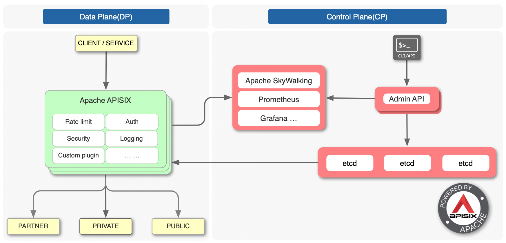
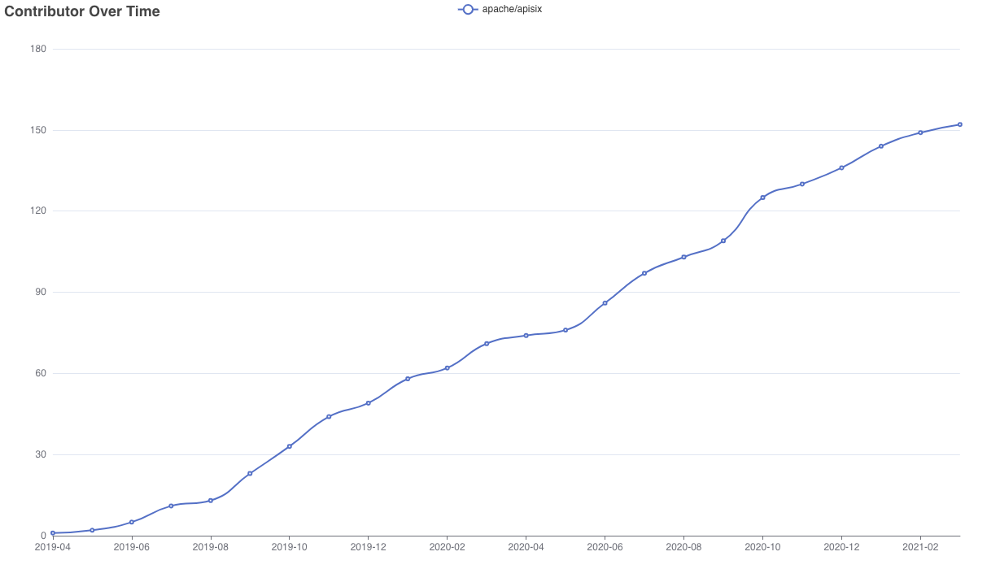

<!--
#
# Licensed to the Apache Software Foundation (ASF) under one or more
# contributor license agreements.  See the NOTICE file distributed with
# this work for additional information regarding copyright ownership.
# The ASF licenses this file to You under the Apache License, Version 2.0
# (the "License"); you may not use this file except in compliance with
# the License.  You may obtain a copy of the License at
#
#     http://www.apache.org/licenses/LICENSE-2.0
#
# Unless required by applicable law or agreed to in writing, software
# distributed under the License is distributed on an "AS IS" BASIS,
# WITHOUT WARRANTIES OR CONDITIONS OF ANY KIND, either express or implied.
# See the License for the specific language governing permissions and
# limitations under the License.
#
-->


[](https://github.com/apache/apisix/actions)
[](https://github.com/apache/apisix/blob/master/LICENSE)

**Apache APISIX** es un portal API en tiempo real, dinámico y de alto rendimiento.

APISIX proporciona variadas opciones de manejo de tráfico tales como balanceo de cargas, upstream dinámico, comprobación tipo despliegue de canarios (canary release), interrupción de circuitos, autenticación, observabilidad y más.

Usted puede usar Apache APISIX para manejar el tráfico tradicional norte-sur,
así como tráfico este-oeste entre servicios.
También puede usarse como [k8s ingress controller (control de ingreso)](https://github.com/apache/apisix-ingress-controller).

La arquitectura técnica de Apache APISIX:



## Communidad

- Lista de Correos: Enviar correos a dev-subscribe@apisix.apache.org, luego siga la respuesta para suscribirse a la Lista de Correos.
- QQ Group - 578997126
- [Slack Workspace](http://s.apache.org/slack-invite) - únase a `#apisix` en nuestro Slack para encontrarse con el equipo y formular preguntas
-  - síganos e interactúe con nosotros usando hashtag `#ApacheAPISIX`
- [bilibili video](https://space.bilibili.com/551921247)
- **Good first issues**:
  - [Apache APISIX](https://github.com/apache/apisix/issues?q=is%3Aissue+is%3Aopen+label%3A%22good+first+issue%22)
  - [Controlador de ingreso Apache APISIX](https://github.com/apache/apisix-ingress-controller/issues?q=is%3Aissue+is%3Aopen+label%3A%22good+first+issue%22)
  - [Tablero Apache APISIX](https://github.com/apache/apisix-dashboard/issues?q=is%3Aissue+is%3Aopen+label%3A%22good+first+issue%22)
  - [Carta Helm Apache APISIX](https://github.com/apache/apisix-helm-chart/issues?q=is%3Aissue+is%3Aopen+label%3A%22good+first+issue%22)
  - [Distribución de Dockers para APISIX](https://github.com/apache/apisix-docker/issues?q=is%3Aissue+is%3Aopen+label%3A%22good+first+issue%22)
  - [Sitio Web Apache APISIX](https://github.com/apache/apisix-website/issues?q=is%3Aissue+is%3Aopen+label%3A%22good+first+issue%22)
  - [El Plano de Control para APISIX](https://github.com/apache/apisix-control-plane/issues?q=is%3Aissue+is%3Aopen+label%3A%22good+first+issue%22)

## Características

Usted puede usar Apache APISIX como un acceso de tráfico para procesar todos los datos del negocio, incluyendo direccionamiento dinámico (dynamic routing), upstream dinámico, certificados dinámicos,
ensayos A/B, ensayos de despliegue de canarios (canary release), despliegue azul-verde (blue-green), límite de tasa, defensa contra ataques maliciosos, métrica, monitoreo de alarmas, visibilidad de servicios, gobernabilidad de servicios, etc.

- **Todas las Plataformas**

  - Nativo de la Nube: Agnóstico de Plataforma, libre de restricciones del vendedor, APISIX puede ejecutarse desde metal desnudo hasta Kubernetes.
  - Entorno de Ejecución: Soporta tanto OpenResty como Tengine.
  - Soporta ARM64: No hay que preocuparse por las restricciones de la infra tecnología.

- **Multi protocolos**

  - [Proxy TCP/UDP](../../en/latest/stream-proxy.md): Proxy TCP/UDP dinámico.
  - [Proxy Dubbo](../../en/latest/plugins/dubbo-proxy.md): Proxy dinámico HTTP a Dubbo.
  - [Proxy MQTT Dinámico](../../en/latest/plugins/mqtt-proxy.md): Soporte de balance de carga MQTT por `client_id`, soporta ambos MQTT [3.1.\*](http://docs.oasis-open.org/mqtt/mqtt/v3.1.1/os/mqtt-v3.1.1-os.html), [5.0](https://docs.oasis-open.org/mqtt/mqtt/v5.0/mqtt-v5.0.html).
  - [Proxy gRPC](../../en/latest/grpc-proxy.md): Tráfico gRPC a través de Proxy.
  - [Transcodificado gRPC](../../en/latest/plugins/grpc-transcode.md): Soporta transcodificado de protocolo para que los clientes puedan acceder su gRPC API usando HTTP/JSON.
  - Proxy de Websocket
  - Proxy de Protocolo
  - Proxy Dubbo: Proxy de Dubbo basado en Tengine.
  - Proxy de HTTP(S) hacia adelante
  - [SSL](../../en/latest/certificate.md): Carga dinámica de certificado SSL.

- **Completamente Dinámico**

  - [Las actualizaciones y los plugins más recientes](../../en/latest/plugins.md): Actualiza sus configuraciones y plugins sin reinicios!
  - [Reescritura de proxy](../../en/latest/plugins/proxy-rewrite.md): Soporta la reescritura de `host`, `uri`, `schema`, `enable_websocket`, `headers` para el request antes de reenviarlo aguas arriba (upstream).
  - [Reescritura de respuesta](../../en/latest/plugins/response-rewrite.md): Establece el código de estatus de respuesta personalizado, así como el cuerpo y el encabezado para el cliente.
  - [Sin servidor (serverless)](../../en/latest/plugins/serverless.md): Invoque funciones en cada fase en APISIX.
  - Balance dinámico de cargas: Balanceo de cargas Round-robin usando pesos.
  - Balance de cargas basado en Hash: Balanceo de cargas con sesiones de hashing consistentes.
  - [Comprobaciones del sistema](../../en/latest/health-check.md): Permite comprobaciones del sistema en el nodo aguas arriba, y automáticamente filtrará nodos problemáticos durante el balanceo de cargas para asegurar la estabilidad del sistema.
  - Interruptor del circuito: Rastreo inteligente de servicios aguas arriba que tengan problemas.
  - [Reflejo de proxy (mirror)](../../en/latest/plugins/proxy-mirror.md): Proporciona la capacidad de reflejar (mirror) los request (solicitudes) del cliente.
  - [Bifurcación de tráfico](../../en/latest/plugins/traffic-split.md): Permite a los usuarios dirigir de manera creciente porciones del tráfico entre varias corrientes aguas arriba (upstreams).

- **Enrutamiento con control fino (fine grain)**

  - [Soporta correspondencia completa de la ruta y correspondencia del prefijo](../../en/latest/router-radixtree.md#how-to-use-libradixtree-in-apisix)
  - [Soporta todas las variables integradas en Nginx como condiciones para el enrutamiento](../../en/latest/router-radixtree.md#how-to-filter-route-by-nginx-builtin-variable), así que pueden usarse `cookie`, `args`, etc. como condiciones de enrutamiento para implementar ensayos de desplegado de canarios, ensayoss A/B, etc.
  - Soporta [varios operadores como condiciones de juicio para el enrutamiento](https://github.com/iresty/lua-resty-radixtree#operator-list), por ejemplo `{"arg_age", ">", 24}`
  - Soporta [función personalizada de correspondencia de ruta](https://github.com/iresty/lua-resty-radixtree/blob/master/t/filter-fun.t#L10)
  - IPv6: Usar IPv6 para hacer corresponder la ruta.
  - Soporta [TTL](../../en/latest/admin-api.md#route)
  - [Soporta prioridades](../../en/latest/router-radixtree.md#3-match-priority)
  - [Soporta solicitudes Batch Http (por lotes)](../../en/latest/plugins/batch-requests.md)

- **Seguridad**

  - Autenticaciones: [key-auth](../../en/latest/plugins/key-auth.md), [JWT](../../en/latest/plugins/jwt-auth.md), [basic-auth](../../en/latest/plugins/basic-auth.md), [wolf-rbac](../../en/latest/plugins/wolf-rbac.md)
  - [IP Whitelist/Blacklist](../../en/latest/plugins/ip-restriction.md)
  - [Referente Whitelist/Blacklist (listas blancas y negras)](../../en/latest/plugins/referer-restriction.md)
  - [IdP](../../en/latest/plugins/openid-connect.md): Soporta servicios externos de autenticación, tales como Auth0, okta, etc., los usuarios pueden usar esto para conectarse a OAuth 2.0 y otros métodos de autenticación.
  - [Límite de procesamiento de solicitudes (Limit-req)](../../en/latest/plugins/limit-req.md)
  - [Límite de contador (Limit-count)](../../en/latest/plugins/limit-count.md)
  - [Límite de concurrencia (Limit-concurrency)](../../en/latest/plugins/limit-conn.md)
  - Anti-ReDoS (Negación regular del servicio): políticas integradas para Anti ReDoS sin configuración.
  - [CORS](../../en/latest/plugins/cors.md) Activa CORS (Compartir recursos de origen cruzado) para su API.
  - [Bloqueador URI](../../en/latest/plugins/uri-blocker.md): Bloquea solicitudes del cliente por URI.
  - [Validador de solicitudes (Request Validator)](../../en/latest/plugins/request-validation.md)

- **OPS amigable**

  - OpenTracing (rastreo abierto): Soporta [Apache Skywalking](../../en/latest/plugins/skywalking.md) y [Zipkin](../../en/latest/plugins/zipkin.md)
  - Trabaja con descubrimiento de servicio externo：Aparte del etcd integrado (Equipo Terminal del Circuito de Datos), también soporta `Consul` y `Nacos` [DNS en modo descubrimiento](https://github.com/apache/apisix/issues/1731#issuecomment-646392129), y [Eureka](../../en/latest/discovery.md)
  - Monitoreo y métrica (control de mediciones): [Prometheus](../../en/latest/plugins/prometheus.md)
  - Agrupación (clustering): Nodos APISIX sin estados, crea agrupaciones del centro de configuración, por favor consultar [etcd Clustering Guide](https://github.com/etcd-io/etcd/blob/master/Documentation/op-guide/clustering.md).
  - Alta disponibilidad: Soporta configurar múltiples direcciones etcd en el mismo grupo (cluster).
  - [Tablero](https://github.com/apache/apisix-dashboard)
  - Control de versión: Soporta retroceso o deshacer de operaciones.
  - CLI: comenzar\detenerse\recargar APISIX usando la línea de comando.
  - [Modo stand-alone (por su cuenta)](../../en/latest/stand-alone.md): Soporta cargar reglas de ruta desde un archivo local yaml, siendo más amigable que kubernetes(k8s).
  - [Regla global](../../en/latest/architecture-design/global-rule.md): Permite ejecutar cualquier plugin para todas las solicitudes, como: limit rate, IP filter etc.
  - Alto desempeño: El QPS de un sólo núcleo alcanza 18k con un retraso promedio de menos de 0.2 milisegundos.
  - [Fault Injection](../../en/latest/plugins/fault-injection.md)
  - [REST Admin API](../../en/latest/admin-api.md): Al usar REST Admin API para controlar Apache APISIX, el cual solamente permite acceso 127.0.0.1 por defecto, usted puede modificar el campo `allow_admin` en `conf/config.yaml` para especificar una lista de IPs a los que se les permite llamar el Admin API. Nótese también que el Admin API utiliza autentificación de clave (key auth) para verificar la identidad de quien llama. **El campo `admin_key` en `conf/config.yaml` debe ser modificado antes del despliegue para asegurar la seguridad**.
  - Loggers (accesos de registro) externos: Exporte accesos de registro para herramientas de control de acceso externo. ([HTTP Logger](../../en/latest/plugins/http-logger.md), [TCP Logger](../../en/latest/plugins/tcp-logger.md), [Kafka Logger](../../en/latest/plugins/kafka-logger.md), [UDP Logger](../../en/latest/plugins/udp-logger.md))
  - [Cartas Helm](https://github.com/apache/apisix-helm-chart)

- **Altamente escalable**
  - [Plugins personalizados](../../en/latest/plugin-develop.md): Permite engancharse en fases comunes, tales como `rewrite`, `access`, `header filer`, `body filter` y `log`, y también permite engancharse en la etapa `balancer`.
  - Carga personalizada de algoritmos de balanceo: Usted puede cargar los algoritmos de balanceo de manera personalizada durante la fase de `balancer`.
  - Routing personalizado: Soporta que los usuarios implementen algoritmos de enrutamiento por sí mismos.

## Comenzando

### Configuración e Instalación

APISIX ha sido instalado y probado en los siguientes sistemas:

CentOS 7, Ubuntu 16.04, Ubuntu 18.04, Debian 9, Debian 10, macOS, **ARM64** Ubuntu 18.04

Hay varias maneras de instalar la versión publicada Apache de APISIX:

1. Compilación de código fuente (aplicable a todos los sistemas)

   - Instalación de dependencias en tiempo de ejecución: OpenResty y etcd, y dependencias de compilación: luarocks. Consultar [install dependencies documentation](../../en/latest/install-dependencies.md)
   - Bajar el paquete de publicación más reciente de código fuente:

     ```shell
     $ mkdir apisix-2.6
     $ wget https://downloads.apache.org/apisix/2.6/apache-apisix-2.6-src.tgz
     $ tar zxvf apache-apisix-2.6-src.tgz -C apisix-2.6
     ```

   - Instalar las dependencias：

     ```shell
     $ make deps
     ```

   - Chequear la versión de APISIX:

     ```shell
     $ ./bin/apisix version
     ```

   - Iniciar APISIX:

     ```shell
     $ ./bin/apisix start
     ```

2. [Imagen del contenedor Docker](https://hub.docker.com/r/apache/apisix) （aplicable a todos los sistemas）

   Por defecto, el paquete de Apache de más reciente publicación será descargado:

   ```shell
   $ docker pull apache/apisix
   ```

   La imagen del contenedor Docker no incluye `etcd`, usted puede consultar [docker compose example](https://github.com/apache/apisix-docker/tree/master/example) para iniciar un grupo de ensayos.

3. Paquete RPM（sólo para CentOS 7）

   - Instalación de dependencias en tiempo de ejecución: Librerías de desarrollo OpenResty, etcd y OpenSSL, consultar [install dependencies documentation](../../en/latest/install-dependencies.md#centos-7)
   - Instalar APISIX：

   ```shell
   $ sudo yum install -y https://github.com/apache/apisix/releases/download/2.6/apisix-2.6-0.x86_64.rpm
   ```

   - Chequear versión de APISIX:

     ```shell
     $ apisix version
     ```

   - Iniciar APISIX:

     ```shell
     $ apisix start
     ```

**Nota**: Apache APISIX no soportaría más el protocolo v2 de etcd desde APISIX v2.0, y la mínima versión soportada de etcd es v3.4.0. Favor actualizar etcd cuando sea necesario. Si usted necesita migrar sus datos desde etcd v2 a la v3, por favor siga los pasos indicados en [etcd migration guide](https://etcd.io/docs/v3.4.0/op-guide/v2-migration/).

### Para desarrolladores

1. Para desarrolladores, usted puede usar la más reciente rama maestra (master branch) para experimentar más prestaciones

   - Construir a partir del código fuente

   ```shell
   $ git clone git@github.com:apache/apisix.git
   $ cd apisix
   $ make deps
   ```

   - Imagen del contenedor Docker

   ```shell
   $ git clone https://github.com/apache/apisix-docker.git
   $ cd apisix-docker
   $ sudo docker build -f alpine-dev/Dockerfile .
   ```

2. Comenzando

   La Guía para Comenzar es una excelente manera de aprender los fundamentos de APISIX, basta seguir los pasos en [Getting Started](../../en/latest/getting-started.md).

   Más aún, usted puede seguir la documentación para ensayar más [plugins](../../en/latest/plugins.md).

3. Admin API

   Apache APISIX brinda [REST Admin API](../../en/latest/admin-api.md) para controlar de forma dinámica el grupo (cluster) Apache APISIX.

4. Desarrollo de Plugin

   Usted puede consultar la guía [plugin development guide](../../en/latest/plugin-develop.md), y la documentación e implementación de código [sample plugin `echo`](../../en/latest/plugins/echo.md).

   Por favor note que los plugins de Apache APISIX added, updated, deleted, etc. no son cargados sin reiniciar el servicio.

Para más documentación, por favor visitar [Apache APISIX Document Index](README.md)

## Evaluación comparativa (Benchmark)

Al usar el servidor de 8 núcleos de AWS, los QPS de APISIX alcanzan 140,000 con una latencia de solamente 0.2 ms.

[Resultados de la evaluación (Benchmark script)](../../../benchmark/run.sh), [método de ensayo y proceso](https://gist.github.com/membphis/137db97a4bf64d3653aa42f3e016bd01) han sido fuente abierta, usted es bienvenido a intentarlo y contribuir.

## Apache APISIX vs Kong

#### Ambos han sido cubiertos en cuanto a prestaciones del núcleo del portal (gateway) API

| **Prestaciones**         | **Apache APISIX** | **KONG** |
| :----------------------- | :---------------- | :------- |
| **Upstream dinámico**    | Sí                | Sí       |
| **Router dinámico**      | Sí                | Sí       |
| **Chequeo del sistema**  | Sí                | Sí       |
| **SSL dinámico**         | Sí                | Sí       |
| **Proxy L4 y L7**        | Sí                | Sí       |
| **Rastreo abierto**      | Sí                | Sí       |
| **Plugin personalizado** | Sí                | Sí       |
| **REST API**             | Sí                | Sí       |
| **CLI**                  | Sí                | Sí       |

#### Las ventajas de Apache APISIX

| **Prestaciones**                                                     | **Apache APISIX**                                               | **Kong**               |
| :------------------------------------------------------------------- | :-------------------------------------------------------------- | :--------------------- |
| Le pertenece a                                                       | Apache Software Foundation                                      | Kong Inc.              |
| Arquitectura de la tecnología                                        | Nginx + etcd                                                    | Nginx + postgres       |
| Canales de comunicación                                              | Lista de correos, grupo Wechat, grupo QQ, [GitHub](https://github.com/apache/apisix/issues), [Slack](https://join.slack.com/t/the-asf/shared_invite/zt-nggtva4i-hDCsW1S35MuZ2g_2DgVDGg), meetup | GitHub, freenode, foro |
| CPU de un solo núcleo, QPS (activa limit-count y plugins prometheus) | 18000                                                           | 1700                   |
| Latencia                                                             | 0.2 ms                                                          | 2 ms                   |
| Dubbo                                                                | Sí                                                              | No                     |
| Retroceso-deshacer de configuration                                  | Sí                                                              | No                     |
| Ruta con TTL                                                         | Sí                                                              | No                     |
| Plug-in carga en caliente                                            | Sí                                                              | No                     |
| LB y ruta personalizados                                             | Sí                                                              | No                     |
| REST API <--> transcodificación gRPC                                 | Sí                                                              | No                     |
| Tengine                                                              | Sí                                                              | No                     |
| MQTT                                                                 | Sí                                                              | No                     |
| Tiempo efectivo de Configuración                                     | Determinado por los eventos, < 1ms                              | Recabando datos, 5 seg |
| Tablero                                                              | Sí                                                              | No                     |
| IdP                                                                  | Sí                                                              | No                     |
| Centro de configuración HA                                           | Sí                                                              | No                     |
| Límite de velocidad para una ventana específica de tiempo            | Sí                                                              | No                     |
| Soporta cualquier variable Nginx como condición de enrutamiento      | Sí                                                              | No                     |

Ensayo de comparación de desempeño [datos detallados](https://gist.github.com/membphis/137db97a4bf64d3653aa42f3e016bd01)

### Contribuciones a través del tiempo



## Videos y Artículos

- [Apache APISIX: How to implement plugin orchestration in API Gateway](https://www.youtube.com/watch?v=iEegNXOtEhQ)
- [Improve Apache APISIX observability with Apache Skywalking](https://www.youtube.com/watch?v=DleVJwPs4i4)
- [APISIX technology selection, testing and continuous integration](https://medium.com/@ming_wen/apache-apisixs-technology-selection-testing-and-continuous-integration-313221b02542)
- [Analysis of Excellent Performance of Apache APISIX Microservices Gateway](https://medium.com/@ming_wen/analysis-of-excellent-performance-of-apache-apisix-microservices-gateway-fc77db4090b5)

## Historias de Usuarios

- [European Factory Platform: API Security Gateway – Using APISIX in the eFactory Platform](https://www.efactory-project.eu/post/api-security-gateway-using-apisix-in-the-efactory-platform)
- [ke.com: How to Build a Gateway Based on Apache APISIX(Chinese)](https://mp.weixin.qq.com/s/yZl9MWPyF1-gOyCp8plflA)
- [360: Apache APISIX Practice in OPS Platform(Chinese)](https://mp.weixin.qq.com/s/zHF_vlMaPOSoiNvqw60tVw)
- [HelloTalk: Exploring Globalization Based on OpenResty and Apache APISIX(Chinese)](https://www.upyun.com/opentalk/447.html)
- [Tencent Cloud: Why choose Apache APISIX to implement the k8s ingress controller?(Chinese)](https://www.upyun.com/opentalk/448.html)
- [aispeech: Why we create a new k8s ingress controller?(Chinese)](https://mp.weixin.qq.com/s/bmm2ibk2V7-XYneLo9XAPQ)

## ¿Quién usa APISIX?

Una gran variedad de compañías y organizacioes usan APISIX para investigación, producción y productos comerciales, incluyendo:


Se alienta a los usuarios a sumarse a la página [Powered By](https://github.com/apache/apisix/blob/master/powered-by.md).

## Landscape (panorama)

<p align="left">
&nbsp;&nbsp;
<br /><br />
APISIX enriquece el <a href="https://landscape.cncf.io/card-mode?category=api-gateway&grouping=category">
CNCF API Gateway Landscape.</a>
</p>

## Logos

- [Apache APISIX logo(PNG)](../../../logos/apache-apisix.png)
- [Apache APISIX logo source](https://apache.org/logos/#apisix)

## Reconocimientos

Inspirado por Kong y Orange.

## Licencia

[Licencia Apache 2.0](../../../LICENSE)
