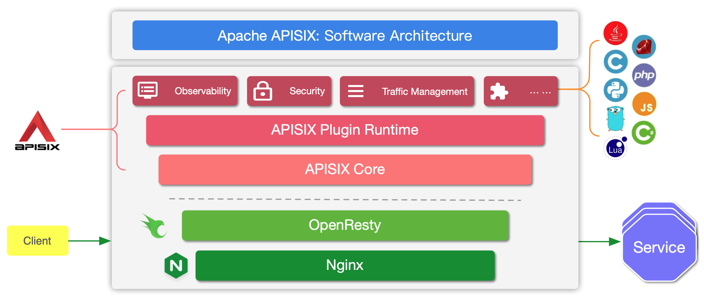
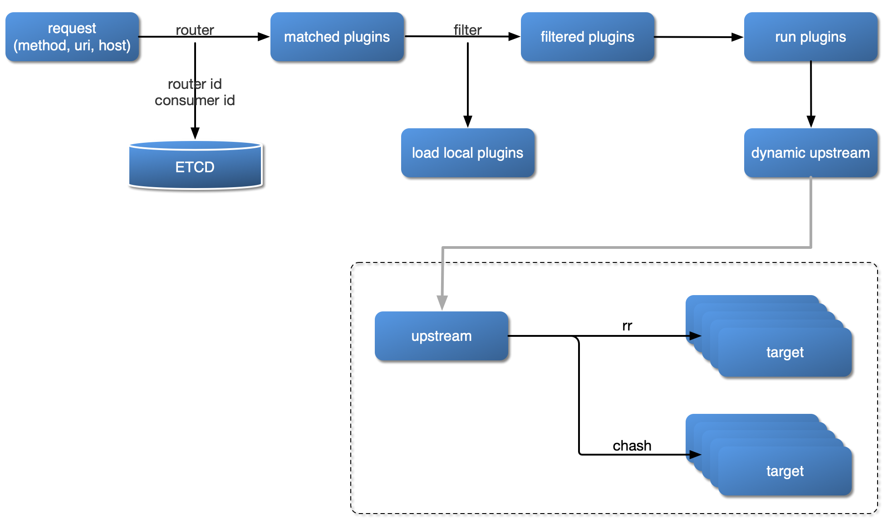
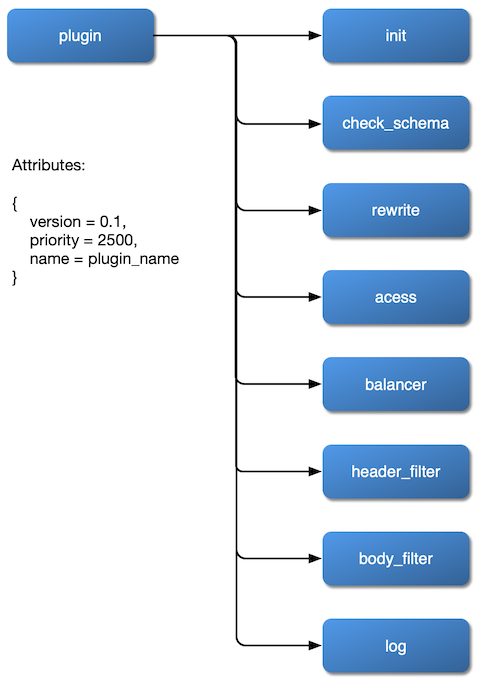

<!--
#
# Licensed to the Apache Software Foundation (ASF) under one or more
# contributor license agreements.  See the NOTICE file distributed with
# this work for additional information regarding copyright ownership.
# The ASF licenses this file to You under the Apache License, Version 2.0
# (the "License"); you may not use this file except in compliance with
# the License.  You may obtain a copy of the License at
#
#     http://www.apache.org/licenses/LICENSE-2.0
#
# Unless required by applicable law or agreed to in writing, software
# distributed under the License is distributed on an "AS IS" BASIS,
# WITHOUT WARRANTIES OR CONDITIONS OF ANY KIND, either express or implied.
# See the License for the specific language governing permissions and
# limitations under the License.
#
-->

Apache APISIX 是一个动态、实时、高性能的云原生 API 网关。它构建于 NGINX + ngx_lua 的技术基础之上，充分利用了 LuaJIT 所提供的强大性能。 [为什么 Apache APISIX 选择 NGINX+Lua 技术栈？](https://apisix.apache.org/zh/blog/2021/08/25/why-apache-apisix-chose-nginx-and-lua/)。

APISIX 主要分为两个部分：

1. APISIX 核心：包括 Lua 插件、多语言插件运行时（Plugin Runner）、Wasm 插件运行时等；
2. 功能丰富的各种内置插件：包括可观测性、安全、流量控制等。

APISIX 在其核心中，提供了路由匹配、负载均衡、服务发现、API 管理等重要功能，以及配置管理等基础性模块。除此之外，APISIX 插件运行时也包含其中，提供原生 Lua 插件的运行框架和多语言插件的运行框架，以及实验性的 Wasm 插件运行时等。APISIX 多语言插件运行时提供多种开发语言的支持，比如 Golang、Java、Python、JS 等。

APISIX 目前也内置了各类插件，覆盖了 API 网关的各种领域，如认证鉴权、安全、可观测性、流量管理、多协议接入等。当前 APISIX 内置的插件使用原生 Lua 实现，关于各个插件的介绍与使用方式，可以查看相关[插件文档](https://apisix.apache.org/docs/apisix/plugins/batch-requests)。

## 插件加载流程

## 插件内部结构

