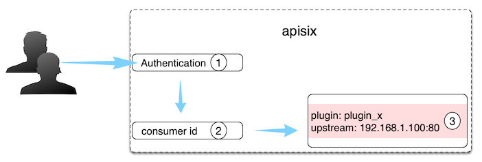

<!--
#
# Licensed to the Apache Software Foundation (ASF) under one or more
# contributor license agreements.  See the NOTICE file distributed with
# this work for additional information regarding copyright ownership.
# The ASF licenses this file to You under the Apache License, Version 2.0
# (the "License"); you may not use this file except in compliance with
# the License.  You may obtain a copy of the License at
#
#     http://www.apache.org/licenses/LICENSE-2.0
#
# Unless required by applicable law or agreed to in writing, software
# distributed under the License is distributed on an "AS IS" BASIS,
# WITHOUT WARRANTIES OR CONDITIONS OF ANY KIND, either express or implied.
# See the License for the specific language governing permissions and
# limitations under the License.
#
-->

对于 API 网关通常可以用请求域名、客户端 IP 地址等字段识别到某类请求方，
然后进行插件过滤并转发请求到指定上游，但有时候这个深度不够。


如上图所示，作为 API 网关，需要知道 API Consumer（消费方）具体是谁，这样就可以对不同 API Consumer 配置不同规则。

| 字段     | 必选 | 说明                                                                                                                             |
| -------- | ---- | -------------------------------------------------------------------------------------------------------------------------------- |
| username | 是   | Consumer 名称。                                                                                                                  |
| plugins  | 否   | 该 Consumer 对应的插件配置，它的优先级是最高的：Consumer > Route > Service。对于具体插件配置，可以参考 [Plugins](plugin.md) 章节。 |

在 APISIX 中，识别 Consumer 的过程如下图：



1. 授权认证：比如有 [key-auth](../plugins/key-auth.md)、[JWT](../plugins/jwt-auth.md) 等。
2. 获取 consumer_name：通过授权认证，即可自然获取到对应的 Consumer name，它是 Consumer 对象的唯一识别标识。
3. 获取 Consumer 上绑定的 Plugin 或 Upstream 信息：完成对不同 Consumer 做不同配置的效果。

概括一下，Consumer 是某类服务的消费者，需与用户认证体系配合才能使用。
比如不同的 Consumer 请求同一个 API，网关服务根据当前请求用户信息，对应不同的 Plugin 或 Upstream 配置。

此外，大家也可以参考 [key-auth](../plugins/key-auth.md) 认证授权插件的调用逻辑，辅助大家来进一步理解 Consumer 概念和使用。

如何对某个 Consumer 开启指定插件，可以看下面例子：

```shell
# 创建 Consumer ，指定认证插件 key-auth ，并开启特定插件 limit-count
$ curl http://127.0.0.1:9080/apisix/admin/consumers -H 'X-API-KEY: edd1c9f034335f136f87ad84b625c8f1' -X PUT -d '
{
    "username": "jack",
    "plugins": {
        "key-auth": {
            "key": "auth-one"
        },
        "limit-count": {
            "count": 2,
            "time_window": 60,
            "rejected_code": 503,
            "key": "remote_addr"
        }
    }
}'

# 创建 Router，设置路由规则和启用插件配置
$ curl http://127.0.0.1:9080/apisix/admin/routes/1 -H 'X-API-KEY: edd1c9f034335f136f87ad84b625c8f1' -X PUT -d '
{
    "plugins": {
        "key-auth": {}
    },
    "upstream": {
        "nodes": {
            "127.0.0.1:1980": 1
        },
        "type": "roundrobin"
    },
    "uri": "/hello"
}'

# 发测试请求，前两次返回正常，没达到限速阈值
$ curl http://127.0.0.1:9080/hello -H 'apikey: auth-one' -I
...

$ curl http://127.0.0.1:9080/hello -H 'apikey: auth-one' -I
...

# 第三次测试返回 503，请求被限制
$ curl http://127.0.0.1:9080/hello -H 'apikey: auth-one' -I
HTTP/1.1 503 Service Temporarily Unavailable
...

```

结合 [consumer-restriction](../plugins/consumer-restriction.md) 插件，限制 jack 对该 route 的访问

```shell
# 设置黑名单，禁止jack访问该API

$ curl http://127.0.0.1:9080/apisix/admin/routes/1 -H 'X-API-KEY: edd1c9f034335f136f87ad84b625c8f1' -X PUT -d '
{
    "plugins": {
        "key-auth": {},
        "consumer-restriction": {
            "blacklist": [
                "jack"
            ]
        }
    },
    "upstream": {
        "nodes": {
            "127.0.0.1:1980": 1
        },
        "type": "roundrobin"
    },
    "uri": "/hello"
}'

# 反复测试，均返回 403，jack被禁止访问
$ curl http://127.0.0.1:9080/hello -H 'apikey: auth-one' -I
HTTP/1.1 403
...

```
