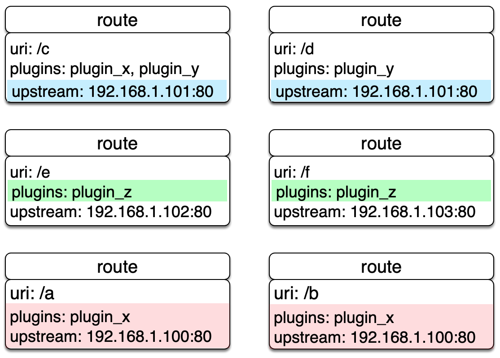

<!--
#
# Licensed to the Apache Software Foundation (ASF) under one or more
# contributor license agreements.  See the NOTICE file distributed with
# this work for additional information regarding copyright ownership.
# The ASF licenses this file to You under the Apache License, Version 2.0
# (the "License"); you may not use this file except in compliance with
# the License.  You may obtain a copy of the License at
#
#     http://www.apache.org/licenses/LICENSE-2.0
#
# Unless required by applicable law or agreed to in writing, software
# distributed under the License is distributed on an "AS IS" BASIS,
# WITHOUT WARRANTIES OR CONDITIONS OF ANY KIND, either express or implied.
# See the License for the specific language governing permissions and
# limitations under the License.
#
-->

Route 字面意思就是路由，通过定义一些规则来匹配客户端的请求，然后根据匹配结果加载并执行相应的
插件，并把请求转发给到指定 Upstream。

Route 中主要包含三部分内容：匹配规则(比如 uri、host、remote_addr 等)，插件配置(限流限速等)和上游信息。
请看下图示例，是一些 Route 规则的实例，当某些属性值相同时，图中用相同颜色标识。



我们直接在 Route 中完成所有参数的配置，优点是容易设置，每个 Route 都相对独立自由度比较高。但当我们的 Route 有比较多的重复配置（比如启用相同的插件配置或上游信息），一旦我们要更新这些相同属性时，就需要遍历所有 Route 并进行修改，给后期管理维护增加不少复杂度。

上面提及重复的缺点在 APISIX 中独立抽象了 [Service](service.md) 和 [Upstream](upstream.md) 两个概念来解决。

下面创建的 Route 示例，是把 URL 为 "/index.html" 的请求代理到地址为 "39.97.63.215:80" 的 Upstream 服务：

```shell
$ curl http://127.0.0.1:9080/apisix/admin/routes/1 -H 'X-API-KEY: edd1c9f034335f136f87ad84b625c8f1' -X PUT -i -d '
{
    "uri": "/index.html",
    "upstream": {
        "type": "roundrobin",
        "nodes": {
            "39.97.63.215:80": 1
        }
    }
}'

HTTP/1.1 201 Created
Date: Sat, 31 Aug 2019 01:17:15 GMT
Content-Type: text/plain
Transfer-Encoding: chunked
Connection: keep-alive
Server: APISIX web server

{"node":{"value":{"uri":"\/index.html","upstream":{"nodes":{"39.97.63.215:80":1},"type":"roundrobin"}},"createdIndex":61925,"key":"\/apisix\/routes\/1","modifiedIndex":61925},"action":"create"}
```

当我们接收到成功应答，表示该 Route 已成功创建。

有关 Route 的具体选项，可具体查阅 [Admin API 之 Route](../admin-api.md#route)。
