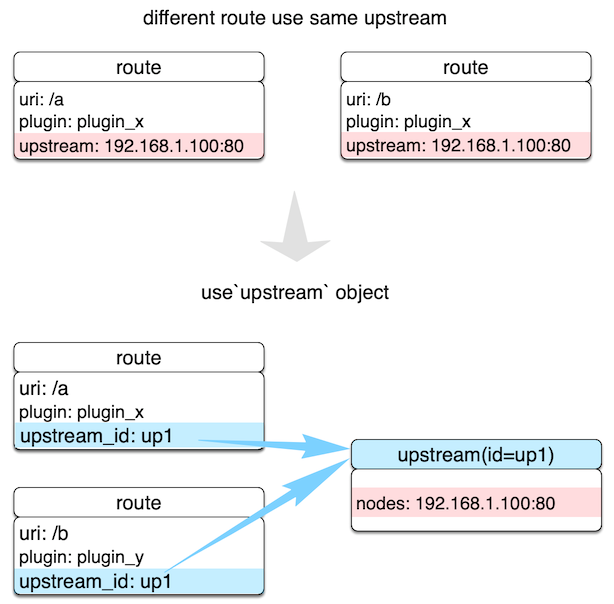

<!--
#
# Licensed to the Apache Software Foundation (ASF) under one or more
# contributor license agreements.  See the NOTICE file distributed with
# this work for additional information regarding copyright ownership.
# The ASF licenses this file to You under the Apache License, Version 2.0
# (the "License"); you may not use this file except in compliance with
# the License.  You may obtain a copy of the License at
#
#     http://www.apache.org/licenses/LICENSE-2.0
#
# Unless required by applicable law or agreed to in writing, software
# distributed under the License is distributed on an "AS IS" BASIS,
# WITHOUT WARRANTIES OR CONDITIONS OF ANY KIND, either express or implied.
# See the License for the specific language governing permissions and
# limitations under the License.
#
-->

Upstream 是虚拟主机抽象，对给定的多个服务节点按照配置规则进行负载均衡。Upstream 的地址信息可以直接配置到 `Route`（或 `Service`) 上，当 Upstream 有重复时，就需要用“引用”方式避免重复了。



如上图所示，通过创建 Upstream 对象，在 `Route` 用 ID 方式引用，就可以确保只维护一个对象的值了。

Upstream 的配置可以被直接绑定在指定 `Route` 中，也可以被绑定在 `Service` 中，不过 `Route` 中的配置
优先级更高。这里的优先级行为与 `Plugin` 非常相似

### 配置参数

APISIX 的 Upstream 除了基本的负载均衡算法选择外，还支持对上游做主被动健康检查、重试等逻辑，具体看这个[链接](../admin-api.md#upstream)。

创建上游对象用例：

```shell
curl http://127.0.0.1:9080/apisix/admin/upstreams/1 -H 'X-API-KEY: edd1c9f034335f136f87ad84b625c8f1' -X PUT -d '
{
    "type": "chash",
    "key": "remote_addr",
    "nodes": {
        "127.0.0.1:80": 1,
        "foo.com:80": 2
    }
}'
```

上游对象创建后，均可以被具体 `Route` 或 `Service` 引用，例如：

```shell
curl http://127.0.0.1:9080/apisix/admin/routes/1 -H 'X-API-KEY: edd1c9f034335f136f87ad84b625c8f1' -X PUT -d '
{
    "uri": "/index.html",
    "upstream_id": 1
}'
```

为了方便使用，也可以直接把上游地址直接绑到某个 `Route` 或 `Service` ，例如：

```shell
curl http://127.0.0.1:9080/apisix/admin/routes/1 -H 'X-API-KEY: edd1c9f034335f136f87ad84b625c8f1' -X PUT -d '
{
    "uri": "/index.html",
    "plugins": {
        "limit-count": {
            "count": 2,
            "time_window": 60,
            "rejected_code": 503,
            "key": "remote_addr"
        }
    },
    "upstream": {
        "type": "roundrobin",
        "nodes": {
            "39.97.63.215:80": 1
        }
    }
}'
```

下面是一个配置了健康检查的示例：

```shell
curl http://127.0.0.1:9080/apisix/admin/routes/1 -H 'X-API-KEY: edd1c9f034335f136f87ad84b625c8f1' -X PUT -d '
{
    "uri": "/index.html",
    "plugins": {
        "limit-count": {
            "count": 2,
            "time_window": 60,
            "rejected_code": 503,
            "key": "remote_addr"
        }
    },
    "upstream": {
         "nodes": {
            "39.97.63.215:80": 1
        }
        "type": "roundrobin",
        "retries": 2,
        "checks": {
            "active": {
                "http_path": "/status",
                "host": "foo.com",
                "healthy": {
                    "interval": 2,
                    "successes": 1
                },
                "unhealthy": {
                    "interval": 1,
                    "http_failures": 2
                }
            }
        }
    }
}'
```

更多细节可以参考[健康检查的文档](../health-check.md)。

下面是几个使用不同`hash_on`类型的配置示例：

#### Consumer

创建一个 consumer 对象:

```shell
curl http://127.0.0.1:9080/apisix/admin/consumers -H 'X-API-KEY: edd1c9f034335f136f87ad84b625c8f1' -X PUT -d '
{
    "username": "jack",
    "plugins": {
    "key-auth": {
           "key": "auth-jack"
        }
    }
}'
```

新建路由，打开`key-auth`插件认证，`upstream`的`hash_on`类型为`consumer`：

```shell
curl http://127.0.0.1:9080/apisix/admin/routes/1 -H 'X-API-KEY: edd1c9f034335f136f87ad84b625c8f1' -X PUT -d '
{
    "plugins": {
        "key-auth": {}
    },
    "upstream": {
        "nodes": {
            "127.0.0.1:1980": 1,
            "127.0.0.1:1981": 1
        },
        "type": "chash",
        "hash_on": "consumer"
    },
    "uri": "/server_port"
}'
```

测试请求，认证通过后的`consumer_name`将作为负载均衡哈希算法的哈希值：

```shell
curl http://127.0.0.1:9080/server_port -H "apikey: auth-jack"
```

##### Cookie

新建路由和`Upstream`，`hash_on`类型为`cookie`：

```shell
curl http://127.0.0.1:9080/apisix/admin/routes/1 -H 'X-API-KEY: edd1c9f034335f136f87ad84b625c8f1' -X PUT -d '
{
    "uri": "/hash_on_cookie",
    "upstream": {
        "key": "sid",
        "type ": "chash",
        "hash_on ": "cookie",
        "nodes ": {
            "127.0.0.1:1980": 1,
            "127.0.0.1:1981": 1
        }
    }
}'
```

客户端请求携带`Cookie`：

```shell
 curl http://127.0.0.1:9080/hash_on_cookie -H 'X-API-KEY: edd1c9f034335f136f87ad84b625c8f1' -H "Cookie: sid=3c183a30cffcda1408daf1c61d47b274"
```

##### Header

新建路由和`Upstream`，`hash_on`类型为`header`， `key`为`content-type`：

```shell
curl http://127.0.0.1:9080/apisix/admin/routes/1 -H 'X-API-KEY: edd1c9f034335f136f87ad84b625c8f1' -X PUT -d '
{
    "uri": "/hash_on_header",
    "upstream": {
        "key": "content-type",
        "type ": "chash",
        "hash_on ": "header",
        "nodes ": {
            "127.0.0.1:1980": 1,
            "127.0.0.1:1981": 1
        }
    }
}'
```

客户端请求携带`content-type`的`header`：

```shell
 curl http://127.0.0.1:9080/hash_on_header -H 'X-API-KEY: edd1c9f034335f136f87ad84b625c8f1' -H "Content-Type: application/json"
```
