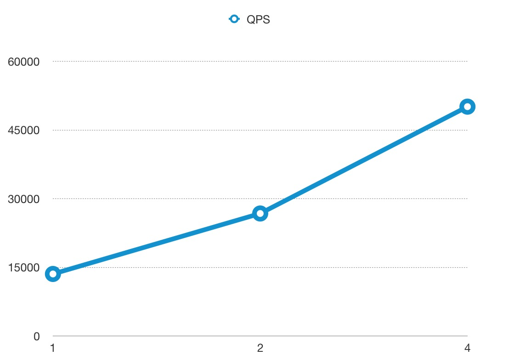

<!--
#
# Licensed to the Apache Software Foundation (ASF) under one or more
# contributor license agreements.  See the NOTICE file distributed with
# this work for additional information regarding copyright ownership.
# The ASF licenses this file to You under the Apache License, Version 2.0
# (the "License"); you may not use this file except in compliance with
# the License.  You may obtain a copy of the License at
#
#     http://www.apache.org/licenses/LICENSE-2.0
#
# Unless required by applicable law or agreed to in writing, software
# distributed under the License is distributed on an "AS IS" BASIS,
# WITHOUT WARRANTIES OR CONDITIONS OF ANY KIND, either express or implied.
# See the License for the specific language governing permissions and
# limitations under the License.
#
-->

### 测试环境

使用谷歌云的服务器进行测试，型号为 n1-highcpu-8 (8 vCPUs, 7.2 GB memory)

我们最多只使用 4 核去运行 APISIX, 剩下的 4 核用于系统和压力测试工具 [wrk](https://github.com/wg/wrk)。

### 测试反向代理

我们把 APISIX 当做反向代理来使用，不开启任何插件，响应体的大小为 1KB。

#### QPS

下图中 x 轴为 CPU 的使用个数，y 轴为每秒处理的请求数：

#### 延时

请注意 y 轴延时的单位是**微秒(μs)**，而不是毫秒：

#### 火焰图

火焰图的采样结果:

### 测试反向代理，开启 2 个插件

我们把 APISIX 当做反向代理来使用，开启限速和 prometheus 插件，响应体的大小为 1KB。

#### QPS

下图中 x 轴为 CPU 的使用个数，y 轴为每秒处理的请求数：

#### Latency

请注意 y 轴延时的单位是**微秒(μs)**，而不是毫秒：

#### 火焰图

火焰图的采样结果:

