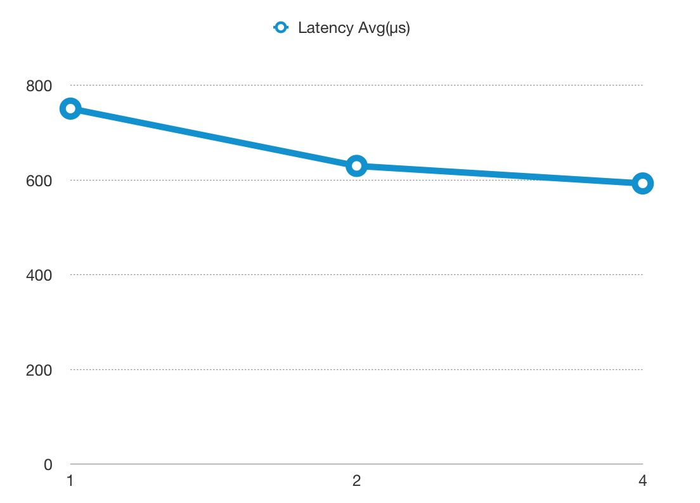

<!--
#
# Licensed to the Apache Software Foundation (ASF) under one or more
# contributor license agreements.  See the NOTICE file distributed with
# this work for additional information regarding copyright ownership.
# The ASF licenses this file to You under the Apache License, Version 2.0
# (the "License"); you may not use this file except in compliance with
# the License.  You may obtain a copy of the License at
#
#     http://www.apache.org/licenses/LICENSE-2.0
#
# Unless required by applicable law or agreed to in writing, software
# distributed under the License is distributed on an "AS IS" BASIS,
# WITHOUT WARRANTIES OR CONDITIONS OF ANY KIND, either express or implied.
# See the License for the specific language governing permissions and
# limitations under the License.
#
-->

### 测试环境

使用谷歌云的服务器进行测试，型号为 n1-highcpu-8 (8 vCPUs, 7.2 GB memory)

我们最多只使用 4 核去运行 APISIX，剩下的 4 核用于系统和压力测试工具 [wrk](https://github.com/wg/wrk)。

### 测试反向代理

我们把 APISIX 当做反向代理来使用，不开启任何插件，响应体的大小为 1KB。

#### QPS

下图中 x 轴为 CPU 的使用个数，y 轴为每秒处理的请求数：


#### 延时

请注意 y 轴延时的单位是**微秒（μs）**，而不是毫秒：


#### 火焰图

火焰图的采样结果：


如果你需要在本地服务器上运行基准测试，你需要同时运行另一个 NGINX 实例来监听 80 端口：

:::note

您可以这样从 `config.yaml` 中获取 `admin_key` 并存入环境变量：

```bash
admin_key=$(yq '.deployment.admin.admin_key[0].key' conf/config.yaml | sed 's/"//g')
```

:::

```bash
curl http://127.0.0.1:9180/apisix/admin/routes/1 -H "X-API-KEY: $admin_key" -X PUT -d '
{
    "methods": ["GET"],
    "uri": "/hello",
    "upstream": {
        "type": "roundrobin",
        "nodes": {
            "127.0.0.1:80": 1,
            "127.0.0.2:80": 1
        }
    }
}'
```

在完成配置并安装 [wrk](https://github.com/wg/wrk/) 之后，可以使用以下命令进行测试：

```bash
wrk -d 60 --latency http://127.0.0.1:9080/hello
```

### 测试反向代理，开启 2 个插件

我们把 APISIX 当做反向代理来使用，开启限速和 prometheus 插件，响应体的大小为 1KB。

#### QPS

下图中 x 轴为 CPU 的使用个数，y 轴为每秒处理的请求数：


#### Latency

请注意 y 轴延时的单位是**微秒（μs）**，而不是毫秒：



#### 火焰图

火焰图的采样结果：


如果你需要在本地服务器上运行基准测试，你需要同时运行另一个 NGINX 实例来监听 80 端口：

```bash
curl http://127.0.0.1:9180/apisix/admin/routes/1 -H "X-API-KEY: $admin_key" -X PUT -d '
{
    "methods": ["GET"],
    "uri": "/hello",
    "plugins": {
        "limit-count": {
            "count": 999999999,
            "time_window": 60,
            "rejected_code": 503,
            "key": "remote_addr"
        },
        "prometheus":{}
    },
    "upstream": {
        "type": "roundrobin",
        "nodes": {
            "127.0.0.1:80": 1,
            "127.0.0.2:80": 1
        }
    }
}'
```

在完成配置并安装 [wrk](https://github.com/wg/wrk/) 之后，可以使用以下命令进行测试：

```bash
wrk -d 60 --latency http://127.0.0.1:9080/hello
```

有关如何运行基准测试的更多参考，你可以查看此[PR](https://github.com/apache/apisix/pull/6136)和此[脚本](https://gist.github.com/membphis/137db97a4bf64d3653aa42f3e016bd01)。

:::tip

如果您想使用大量连接运行基准测试，您可能需要更新 [**keepalive**](https://github.com/apache/apisix/blob/master/conf/config.yaml.example#L241) 配置，将配置添加到 [`config.yaml`](https://github.com/apache/apisix/blob/master/conf/config.yaml) 并重新加载 APISIX。否则超过配置数量的连接将成为短连接。你可以使用以下命令运行大量连接的基准测试：

```bash
wrk -t200 -c5000 -d30s http://127.0.0.1:9080/hello
```

如果你需要了解更多信息，请参考：[ngx_http_upstream_module](http://nginx.org/en/docs/http/ngx_http_upstream_module.html)。

:::
