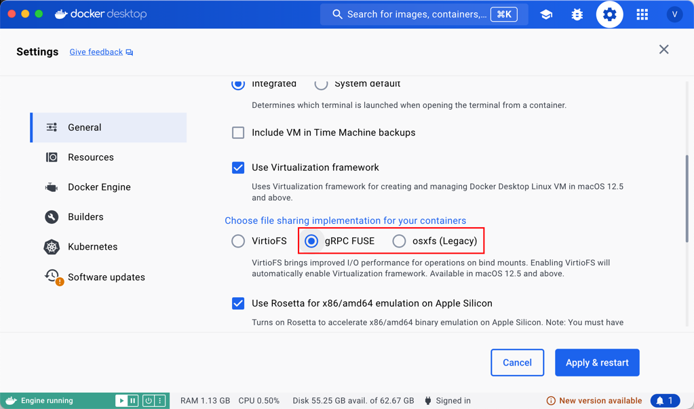

<!--
#
# Licensed to the Apache Software Foundation (ASF) under one or more
# contributor license agreements.  See the NOTICE file distributed with
# this work for additional information regarding copyright ownership.
# The ASF licenses this file to You under the Apache License, Version 2.0
# (the "License"); you may not use this file except in compliance with
# the License.  You may obtain a copy of the License at
#
#     http://www.apache.org/licenses/LICENSE-2.0
#
# Unless required by applicable law or agreed to in writing, software
# distributed under the License is distributed on an "AS IS" BASIS,
# WITHOUT WARRANTIES OR CONDITIONS OF ANY KIND, either express or implied.
# See the License for the specific language governing permissions and
# limitations under the License.
#
-->

如果你希望快速的在你的 Mac 平台上构建和开发 APISIX，你可以参考本教程。

:::note

本教程适合需要在 Mac 平台快速开始入门阶段开发的情况，如果你想要更进一步，有更好的开发体验，更好的选择是 Linux-based 虚拟机，或是直接使用这类系统作为你的开发环境。

你可以在[这里](install-dependencies.md#安装)看到具体支持的系统。

:::

## 快速构建 Apache APISIX 开发环境

### 实现思路

我们通过 Docker 来构建 Apache APISIX 的测试环境，在容器启动时将 Apache APISIX 的源代码挂载到容器内，就可以做到在容器内构建以及运行测试用例。

### 实现步骤

首先，我们需要拉取 APISIX 源码，并构建一个可以运行测试用例以及编译运行 Apache APISIX 的镜像：

```shell
git clone https://github.com/apache/apisix.git
cd apisix
docker build -t apisix-dev-env -f example/build-dev-image.dockerfile .
```

然后，我们要启动 Etcd：

```shell
docker run -d --name etcd-apisix --net=host pachyderm/etcd:v3.5.2
```

挂载 APISIX 目录并启动开发环境容器：

```shell
docker run -d --name apisix-dev-env --net=host -v $(pwd):/apisix:rw apisix-dev-env:latest
```

最后，构建 Apache APISIX 运行时并配置测试环境：

```shell
docker exec -it apisix-dev-env make deps
docker exec -it apisix-dev-env ln -s /usr/bin/openresty /usr/bin/nginx
```

### 启动和停止 APISIX

```shell
docker exec -it apisix-dev-env make run
docker exec -it apisix-dev-env make stop
```

:::note

如果你在运行 `make run` 时收到类似 `nginx: [emerg] bind() to unix:/apisix/logs/worker_events.sock failed (95: Operation not supported)` 的错误消息，请使用此解决方案。

更改你的 Docker-Desktop 的 `File Sharing` 设置：



修改为 `gRPC FUSE` 或 `osxfs` 都可以解决此问题。

:::

### 运行指定测试用例

```shell
docker exec -it apisix-dev-env prove t/admin/routes.t
```
