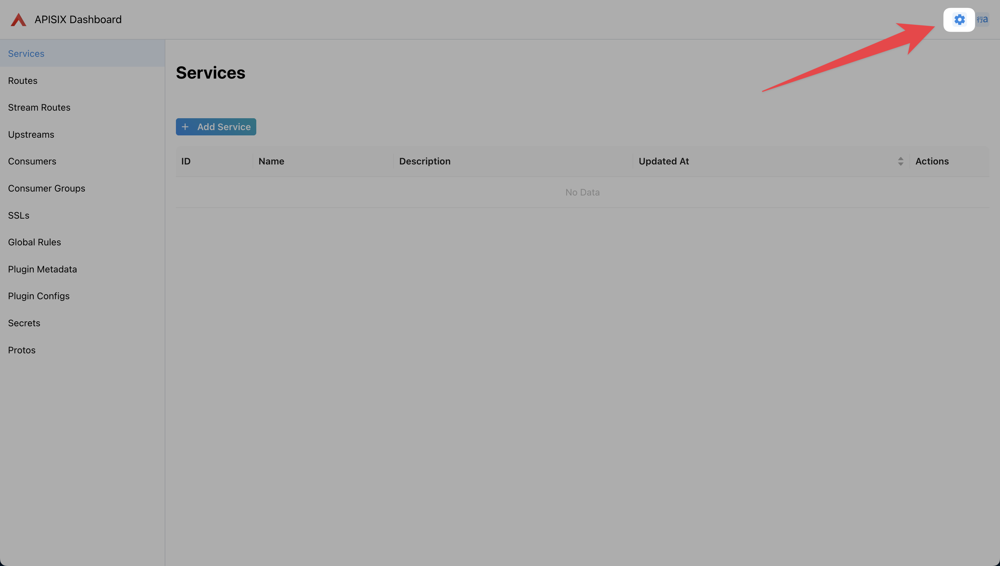
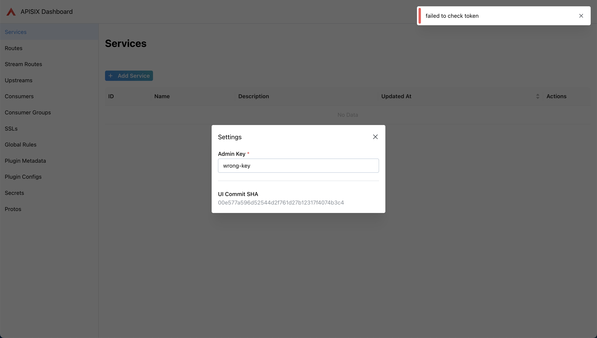
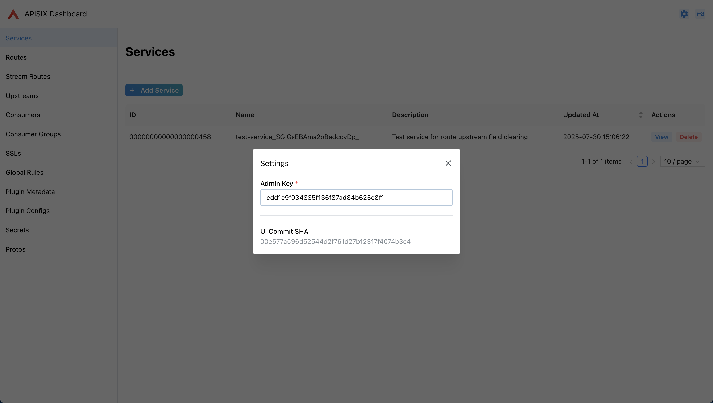

<!--
#
# Licensed to the Apache Software Foundation (ASF) under one or more
# contributor license agreements.  See the NOTICE file distributed with
# this work for additional information regarding copyright ownership.
# The ASF licenses this file to You under the Apache License, Version 2.0
# (the "License"); you may not use this file except in compliance with
# the License.  You may obtain a copy of the License at
#
#     http://www.apache.org/licenses/LICENSE-2.0
#
# Unless required by applicable law or agreed to in writing, software
# distributed under the License is distributed on an "AS IS" BASIS,
# WITHOUT WARRANTIES OR CONDITIONS OF ANY KIND, either express or implied.
# See the License for the specific language governing permissions and
# limitations under the License.
#
-->

## 概述

[Apache APISIX Dashboard](https://github.com/apache/apisix-dashboard) 为用户提供了一个直观的 Web 界面来操作和管理 Apache APISIX。APISIX 内置了 Dashboard UI，默认启用，让用户可以通过图形界面轻松配置路由、插件、上游服务等。

## 配置 Dashboard

### 启用或关闭 Dashboard

Apache APISIX 默认启用内嵌 Dashboard。如需修改此设置，请编辑 `conf/config.yaml` 文件：

```yaml title="./conf/config.yaml"
deployment:
  admin:
    # 启用内嵌 APISIX Dashboard
    enable_admin_ui: true
```

**配置说明：**

- `enable_admin_ui: true` - 启用内嵌 Dashboard（默认启用）
- `enable_admin_ui: false` - 关闭内嵌 Dashboard

修改配置后，重启 Apache APISIX 生效。

### 限制 IP 访问

Apache APISIX 支持设置 Admin API 的 IP 访问白名单，防止 Apache APISIX 被非法访问和攻击。

```yaml title="./conf/config.yaml"
deployment:
    admin:
        # http://nginx.org/en/docs/http/ngx_http_access_module.html#allow
        allow_admin:
            - 127.0.0.0/24
```

### Admin API Key

Dashboard 通过 Admin API 与 Apache APISIX 交互，需要正确的 Admin API Key 进行身份验证。

#### 配置

在 `conf/config.yaml` 中配置 Admin API Key：

```yaml title="./conf/config.yaml"
deployment:
  admin:
    admin_key:
      -
        name: admin
        role: admin
        # 使用简单的 Admin API Key 存在安全风险，部署到生产环境时请及时更新
        key: edd1c9f034335f136f87ad84b625c8f1
```

也支持通过环境变量配置：

```yaml title="./conf/config.yaml"
deployment:
  admin:
    admin_key:
      - name: admin
        # 从环境变量读取
        key: ${{ADMIN_KEY}}
        role: admin
```

使用前需设置环境变量：

```bash
export ADMIN_KEY=your-secure-api-key
```

修改配置后需重启 Apache APISIX 生效。

#### 在 Dashboard 中使用

访问 Dashboard，以 `http://127.0.0.1:9180/ui` 为例。

在未配置 Admin API Key 时，设置模态框将会弹出：


如果不小心关闭了设置模态框，也可以点击导航栏右侧的按钮  再次打开。



接下来，填入上一小节中配置的 Admin API Key，Dashboard 会自动发起请求。如配置错误，Dashboard 仍将在右上角显示 `failed to check token`：



如配置正确，Dashboard 将不再显示 `failed to check token`。此时，点击 `X` 或空白处，关闭设置模态框，即可正常使用。



## FAQ

### 为什么 Apache APISIX Dashboard 进行了重构？

Apache APISIX Dashboard 经历了多个版本的演进：

- **1.x 版本**：基于 Vue.js 的简单 Web UI，直接调用 Admin API
- **2.x 版本**：采用 React + Ant Design Pro 前端架构，引入了 Golang 后端和数据库存储

在 2.x 版本发展过程中，由于社区对功能的需求不断增加，项目逐渐变得复杂臃肿，同时与 APISIX 主版本的同步也面临挑战。

经过充分讨论，社区决定明确 Dashboard 的定位和功能边界，回归轻量化设计，确保与 APISIX 核心的紧密集成和版本同步。

未来 Apache APISIX Dashboard 将专注于：

- **简化架构**：移除不必要的复杂组件，回归 Dashboard 的本质功能
- **增强用户体验**：提供直观、高效的管理界面
- **版本同步**：与 Apache APISIX 主版本保持同步发布
- **生产就绪**：确保稳定性和可靠性，适合生产环境使用

更多规划信息请查看：[Dashboard 路线图](https://github.com/apache/apisix-dashboard/issues/2981)

### 发布周期

项目不再独立发布，且已弃用 release 和 tag 的版本标记方式。

在 Apache APISIX 发布时，将直接基于指定的 Git commit hash 构建 Dashboard，并将产物嵌入到 Apache APISIX 中。

### 旧版本的 Apache APISIX Dashboard

Apache APISIX Dashboard 3.0.1 是在重构前，使用旧发布模式的最后一个版本。它仅应与 Apache APISIX 3.0 一起使用，任何更高或更低版本未进行测试。

如有需要，可阅读 [旧版本的 Apache APISIX Dashboard 文档](https://apache-apisix.netlify.app/docs/dashboard/user_guide/)。

如果您是 Apache APISIX 或 Apache APISIX Dashboard 的新用户，强烈建议您始终以最新版本而不是任何历史版本开始。

### 贡献指南

请阅读 [Apache APISIX Dashboard README](https://github.com/apache/apisix-dashboard/blob/master/README.md)。
