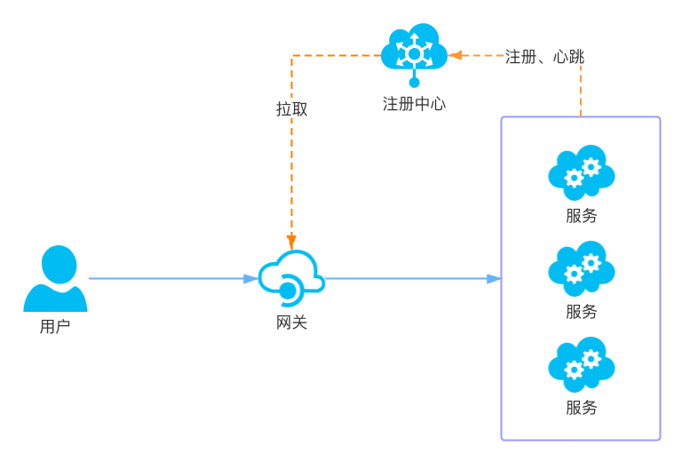

<!--
#
# Licensed to the Apache Software Foundation (ASF) under one or more
# contributor license agreements.  See the NOTICE file distributed with
# this work for additional information regarding copyright ownership.
# The ASF licenses this file to You under the Apache License, Version 2.0
# (the "License"); you may not use this file except in compliance with
# the License.  You may obtain a copy of the License at
#
#     http://www.apache.org/licenses/LICENSE-2.0
#
# Unless required by applicable law or agreed to in writing, software
# distributed under the License is distributed on an "AS IS" BASIS,
# WITHOUT WARRANTIES OR CONDITIONS OF ANY KIND, either express or implied.
# See the License for the specific language governing permissions and
# limitations under the License.
#
-->

* [**摘要**](#摘要)
* [**当前支持的注册中心**](#当前支持的注册中心)
* [**如何扩展注册中心**](#如何扩展注册中心)
    * [**基本步骤**](#基本步骤)
    * [**以 Eureka 举例**](#以-Eureka-举例)
        * [**实现 eureka.lua**](#实现-eurekalua)
        * [**Eureka 与 APISIX 之间数据转换逻辑**](#Eureka-与-APISIX-之间数据转换逻辑)
* [**注册中心配置**](#注册中心配置)
    * [**初始化服务发现**](#初始化服务发现)
    * [**Eureka 的配置**](#Eureka-的配置)
* [**upstream 配置**](#upstream-配置)

## 摘要

当业务量发生变化时，需要对上游服务进行扩缩容，或者因服务器硬件故障需要更换服务器。如果网关是通过配置来维护上游服务信息，在微服务架构模式下，其带来的维护成本可想而知。再者因不能及时更新这些信息，也会对业务带来一定的影响，还有人为误操作带来的影响也不可忽视，所以网关非常必要通过服务注册中心动态获取最新的服务实例信息。架构图如下所示：



1. 服务启动时将自身的一些信息，比如服务名、IP、端口等信息上报到注册中心；各个服务与注册中心使用一定机制（例如心跳）通信，如果注册中心与服务长时间无法通信，就会注销该实例；当服务下线时，会删除注册中心的实例信息；
2. 网关会准实时地从注册中心获取服务实例信息；
3. 当用户通过网关请求服务时，网关从注册中心获取的实例列表中选择一个进行代理；

常见的注册中心：Eureka, Etcd, Consul, Nacos, Zookeeper等

## 当前支持的注册中心

目前支持 Eureka 和基于 DNS 的服务注册发现，如 Consul 等。

基于 DNS 的服务注册发现见 [基于 DNS 的服务支持发现](../dns.md#service-discovery-via-dns)。

Eureka 的支持方式见下文。

## 如何扩展注册中心？

### 基本步骤

APISIX 要扩展注册中心其实是件非常容易的事情，其基本步骤如下：

1. 在 `apisix/discovery/` 目录中添加注册中心客户端的实现；
2. 实现用于初始化的 `_M.init_worker()` 函数以及用于获取服务实例节点列表的 `_M.nodes(service_name)` 函数；
3. 将注册中心数据转换为 APISIX 格式的数据；

### 以 Eureka 举例

#### 实现 eureka.lua

首先在 `apisix/discovery/` 目录中添加 [`eureka.lua`](../../apisix/discovery/eureka.lua);

然后在 `eureka.lua` 实现用于初始化的 `init_worker` 函数以及用于获取服务实例节点列表的 `nodes` 函数即可：

  ```lua
  local _M = {
      version = 0.1,
  }


  function _M.nodes(service_name)
      ... ...
  end


  function _M.init_worker()
      ... ...
  end


  return _M
  ```

#### Eureka 与 APISIX 之间数据转换逻辑

APISIX是通过 `upstream.nodes` 来配置上游服务的，所以使用注册中心后，通过注册中心获取服务的所有 node 后，赋值给 `upstream.nodes` 来达到相同的效果。那么 APISIX 是怎么将 Eureka 的数据转成 node 的呢？ 假如从 Eureka 获取如下数据：

```json
{
  "applications": {
      "application": [
          {
              "name": "USER-SERVICE",                 # 服务名称
              "instance": [
                  {
                      "instanceId": "192.168.1.100:8761",
                      "hostName": "192.168.1.100",
                      "app": "USER-SERVICE",          # 服务名称
                      "ipAddr": "192.168.1.100",      # 实例 IP 地址
                      "status": "UP",                 # 状态
                      "overriddenStatus": "UNKNOWN",  # 覆盖状态
                      "port": {
                          "$": 8761,                  # 端口
                          "@enabled": "true"          # 开始端口
                      },
                      "securePort": {
                          "$": 443,
                          "@enabled": "false"
                      },
                      "metadata": {
                          "management.port": "8761",
                          "weight": 100               # 权重，需要通过 spring boot 应用的 eureka.instance.metadata-map.weight 进行配置
                      },
                      "homePageUrl": "http://192.168.1.100:8761/",
                      "statusPageUrl": "http://192.168.1.100:8761/actuator/info",
                      "healthCheckUrl": "http://192.168.1.100:8761/actuator/health",
                      ... ...
                  }
              ]
          }
      ]
  }
}
```

解析 instance 数据步骤：

1. 首先要选择状态为 “UP” 的实例： overriddenStatus 值不为 "UNKNOWN" 以 overriddenStatus 为准，否则以 status 的值为准；
2. IP 地址：以 ipAddr 的值为 IP; 并且必须是 IPv4 或 IPv6 格式的；
3. 端口：端口取值规则是，如果 port["@enabled"] 等于 "true" 那么使用 port["\$"] 的值；如果 securePort["@enabled"] 等于 "true" 那么使用 securePort["$"] 的值；
4. 权重：权重取值顺序是，先判断 `metadata.weight` 是否有值，如果没有，则取配置中的 `eureka.weight` 的值, 如果还没有，则取默认值`100`；

这个例子转成 APISIX nodes 的结果如下：

```json
[
  {
    "host" : "192.168.1.100",
    "port" : 8761,
    "weight" : 100,
    "metadata" : {
      "management.port": "8761",
    }
  }
]
```

## 注册中心配置

### 初始化服务发现

首先要在 `conf/config.yaml` 文件中增加如下配置，添加不同的服务发现客户端，以便在使用过程中动态选择：

```yaml
discovery:
  eureka:
      ...
```

此名称要与 `apisix/discovery/` 目录中实现对应注册中心的文件名保持一致。

现已支持注册中心有：Eureka 。

### Eureka 的配置

在 `conf/config.yaml` 增加如下格式的配置：

```yaml
discovery:
  eureka:
    host:                            # it's possible to define multiple eureka hosts addresses of the same eureka cluster.
      - "http://${username}:${password}@${eureka_host1}:${eureka_port1}"
      - "http://${username}:${password}@${eureka_host2}:${eureka_port2}"
    prefix: "/eureka/"
    fetch_interval: 30               # 从 eureka 中拉取数据的时间间隔，默认30秒
    weight: 100                      # default weight for node
    timeout:
      connect: 2000                  # 连接 eureka 的超时时间，默认2000ms
      send: 2000                     # 向 eureka 发送数据的超时时间，默认2000ms
      read: 5000                     # 从 eureka 读数据的超时时间，默认5000ms
```

通过 `discovery.eureka.host` 配置 eureka 的服务器地址。

如果 eureka 的地址是 `http://127.0.0.1:8761/` ，并且不需要用户名和密码验证的话，配置如下：

```yaml
discovery:
  eureka:
    host:
      - "http://127.0.0.1:8761"
    prefix: "/eureka/"
```

## upstream 配置

APISIX是通过 `upstream.discovery_type`选择使用的服务发现， `upstream.service_name` 与注册中心的服务名进行关联。下面是将 URL 为 "/user/*" 的请求路由到注册中心名为 "USER-SERVICE" 的服务上例子：

```shell
$ curl http://127.0.0.1:9080/apisix/admin/routes/1 -H 'X-API-KEY: edd1c9f034335f136f87ad84b625c8f1' -X PUT -i -d '
{
    "uri": "/user/*",
    "upstream": {
        "service_name": "USER-SERVICE",
        "type": "roundrobin",
        "discovery_type": "eureka"
    }
}'

HTTP/1.1 201 Created
Date: Sat, 31 Aug 2019 01:17:15 GMT
Content-Type: text/plain
Transfer-Encoding: chunked
Connection: keep-alive
Server: APISIX web server

{"node":{"value":{"uri":"\/user\/*","upstream": {"service_name": "USER-SERVICE", "type": "roundrobin", "discovery_type": "eureka"}},"createdIndex":61925,"key":"\/apisix\/routes\/1","modifiedIndex":61925},"action":"create"}
```

因为上游的接口 URL 可能会有冲突，通常会在网关通过前缀来进行区分：

```shell
$ curl http://127.0.0.1:9080/apisix/admin/routes/1 -H 'X-API-KEY: edd1c9f034335f136f87ad84b625c8f1' -X PUT -i -d '
{
    "uri": "/a/*",
    "plugins": {
        "proxy-rewrite" : {
            regex_uri: ["^/a/(.*)", "/${1}"]
        }
    }
    "upstream": {
        "service_name": "A-SERVICE",
        "type": "roundrobin",
        "discovery_type": "eureka"
    }
}'

$ curl http://127.0.0.1:9080/apisix/admin/routes/2 -H 'X-API-KEY: edd1c9f034335f136f87ad84b625c8f1' -X PUT -i -d '
{
    "uri": "/b/*",
    "plugins": {
        "proxy-rewrite" : {
            regex_uri: ["^/b/(.*)", "/${1}"]
        }
    }
    "upstream": {
        "service_name": "B-SERVICE",
        "type": "roundrobin",
        "discovery_type": "eureka"
    }
}'
```

假如 A-SERVICE 和 B-SERVICE 都提供了一个 `/test` 的接口，通过上面的配置，可以通过 `/a/test` 访问 A-SERVICE 的 `/test` 接口，通过 `/b/test` 访问 B-SERVICE 的 `/test` 接口。

**注意**：配置 `upstream.service_name` 后 `upstream.nodes` 将不再生效，而是使用从注册中心的数据来替换，即使注册中心的数据是空的。
