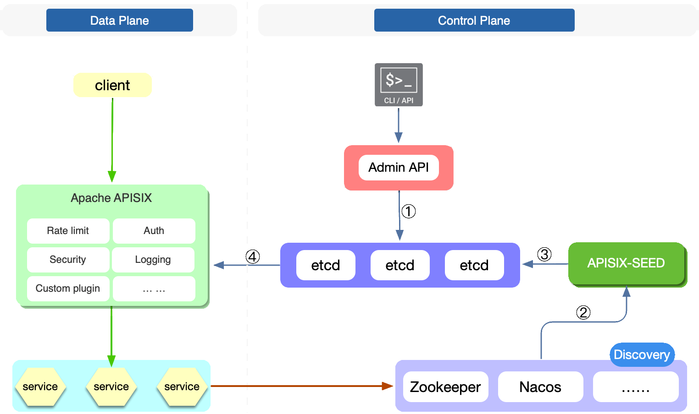

<!--
#
# Licensed to the Apache Software Foundation (ASF) under one or more
# contributor license agreements.  See the NOTICE file distributed with
# this work for additional information regarding copyright ownership.
# The ASF licenses this file to You under the Apache License, Version 2.0
# (the "License"); you may not use this file except in compliance with
# the License.  You may obtain a copy of the License at
#
#     http://www.apache.org/licenses/LICENSE-2.0
#
# Unless required by applicable law or agreed to in writing, software
# distributed under the License is distributed on an "AS IS" BASIS,
# WITHOUT WARRANTIES OR CONDITIONS OF ANY KIND, either express or implied.
# See the License for the specific language governing permissions and
# limitations under the License.
#
-->

本文档介绍了如何在 APISIX 控制面通过 Nacos 和 Zookeeper 实现服务发现。

## APISIX-Seed 架构

Apache APISIX 在早期已经支持了数据面服务发现，现在 APISIX 也通过 [APISIX-Seed](https://github.com/api7/apisix-seed) 项目实现了控制面服务发现，下图为 APISIX-Seed 架构图。

图中的数字代表的具体信息如下：

1. 通过 Admin API 向 APISIX 注册上游并指定服务发现类型。APISIX-Seed 将监听 etcd 中的 APISIX 资源变化，过滤服务发现类型并获取服务名称（如 ZooKeeper）；
2. APISIX-Seed 将在服务注册中心（如 ZooKeeper）订阅指定的服务名称，以监控和更新对应的服务信息；
3. 客户端向服务注册中心注册服务后，APISIX-Seed 会获取新的服务信息，并将更新后的服务节点写入 etcd；
4. 当 APISIX-Seed 在 etcd 中更新相应的服务节点信息时，APISIX 会将最新的服务节点信息同步到内存中。

:::note

引入 APISIX-Seed 后，如果注册中心的服务变化频繁，etcd 中的数据也会频繁变化。因此，需要在启动 etcd 时设置 `--auto-compaction` 选项，用来定期压缩历史记录，避免耗尽 etcd 存储空间。详细信息请参考 [revisions](https://etcd.io/docs/v3.5/learning/api/#revisions)。

:::

## 为什么需要 APISIX-Seed？

- 网络拓扑变得更简单

  APISIX 不需要与每个注册中心保持网络连接，只需要关注 etcd 中的配置信息即可。这将大大简化网络拓扑。

- 上游服务总数据量变小

  由于 `registry` 的特性，APISIX 可能会在 Worker 中存储全量的 `registry` 服务数据，例如 Consul_KV。通过引入 APISIX-Seed，APISIX 的每个进程将不需要额外缓存上游服务相关信息。

- 更容易管理

  服务发现配置需要为每个 APISIX 实例配置一次。通过引入 APISIX-Seed，APISIX 将对服务注册中心的配置变化无感知。

## 支持的服务发现类型

目前已经支持了 ZooKeeper 和 Nacos，后续还将支持更多的服务注册中心，更多信息请参考：[APISIX Seed](https://github.com/api7/apisix-seed#apisix-seed-for-apache-apisix)。

- 如果你想启用控制面 ZooKeeper 服务发现，请参考：[ZooKeeper 部署教程](https://github.com/api7/apisix-seed/blob/main/docs/zh/latest/zookeeper.md)。

- 如果你想启用控制面 Nacos 服务发现，请参考：[Nacos 部署教程](https://github.com/api7/apisix-seed/blob/main/docs/zh/latest/nacos.md)。
