<!--
#
# Licensed to the Apache Software Foundation (ASF) under one or more
# contributor license agreements.  See the NOTICE file distributed with
# this work for additional information regarding copyright ownership.
# The ASF licenses this file to You under the Apache License, Version 2.0
# (the "License"); you may not use this file except in compliance with
# the License.  You may obtain a copy of the License at
#
#     http://www.apache.org/licenses/LICENSE-2.0
#
# Unless required by applicable law or agreed to in writing, software
# distributed under the License is distributed on an "AS IS" BASIS,
# WITHOUT WARRANTIES OR CONDITIONS OF ANY KIND, either express or implied.
# See the License for the specific language governing permissions and
# limitations under the License.
#
-->

目前，如果你想在 APISIX 控制面使用 ZooKeeper 实现服务发现功能，需要依赖 [apisix-seed](https://github.com/api7/apisix-seed) 项目。

## `apisix-seed` 工作原理



`apisix-seed` 通过同时监听 etcd 和 ZooKeeper 的变化来完成数据交换。

流程如下：

1. 使用 APISIX 注册一个上游服务，并将服务类型设置为 `zookeeper` 并保存到 etcd；
2. `apisix-seed` 监听 etcd 中 APISIX 的资源变更，并过滤服务发现类型获得服务名称；
3. `apisix-seed` 将服务绑定到 etcd 资源，并开始在 ZooKeeper 中监控此服务；
4. 客户端向 ZooKeeper 注册该服务；
5. `apisix-seed` 获取 ZooKeeper 中的服务变更；
6. `apisix-seed` 通过服务名称查询绑定的 etcd 资源，并将更新后的服务节点写入 etcd；
7. APISIX Worker 监控 etcd 资源变更，并在内存中刷新服务节点信息。

## 如何使用

### 环境准备：配置 `apisix-seed` 和 ZooKeeper

1. 启动 ZooKeeper

```bash
docker run -itd --rm --name=dev-zookeeper -p 2181:2181 zookeeper:3.7.0
```

2. 下载并编译 `apisix-seed` 项目

```bash
git clone https://github.com/api7/apisix-seed.git
cd apisix-seed
go build
```

3. 参考以下信息修改 `apisix-seed` 配置文件，路径为 `conf/conf.yaml`

```bash
etcd:                            # APISIX etcd 配置
  host:
    - "http://127.0.0.1:2379"
  prefix: /apisix
  timeout: 30

discovery:
  zookeeper:                     # 配置 ZooKeeper 进行服务发现
    hosts:
      - "127.0.0.1:2181"         # ZooKeeper 服务器地址
    prefix: /zookeeper
    weight: 100                  # ZooKeeper 节点默认权重设为 100
    timeout: 10                  # ZooKeeper 会话超时时间默认设为 10 秒
```

4. 启动 `apisix-seed` 以监听服务变更

```bash
./apisix-seed
```

### 设置 APISIX 路由和上游

通过以下命令设置路由，请求路径设置为 `/zk/*`，上游使用 ZooKeeper 作为服务发现，服务名称为 `APISIX-ZK`。

```shell
curl http://127.0.0.1:9080/apisix/admin/routes/1 \
-H 'X-API-KEY: edd1c9f034335f136f87ad84b625c8f1' -X PUT -i -d '
{
    "uri": "/zk/*",
    "upstream": {
        "service_name": "APISIX-ZK",
        "type": "roundrobin",
        "discovery_type": "zookeeper"
    }
}'
```

### 注册服务

使用 ZooKeeper-cli 注册服务

登录 ZooKeeper 容器，使用 CLI 程序进行服务注册。具体命令如下：

```bash
# 登陆容器
docker exec -it ${CONTAINERID} /bin/bash
# 登陆 ZooKeeper 客户端
oot@ae2f093337c1:/apache-zookeeper-3.7.0-bin# ./bin/zkCli.sh
# 注册服务
[zk: localhost:2181(CONNECTED) 0] create /zookeeper/APISIX-ZK '{"host":"127.0.0.1","port":1980,"weight":100}'
```

返回结果如下：

```bash
Created /zookeeper/APISIX-ZK
```

### 请求验证

通过以下命令请求路由：

```bash
curl -i http://127.0.0.1:9080/zk/hello
```

正常返回结果：

```bash
HTTP/1.1 200 OK
Connection: keep-alive
...
hello
```
