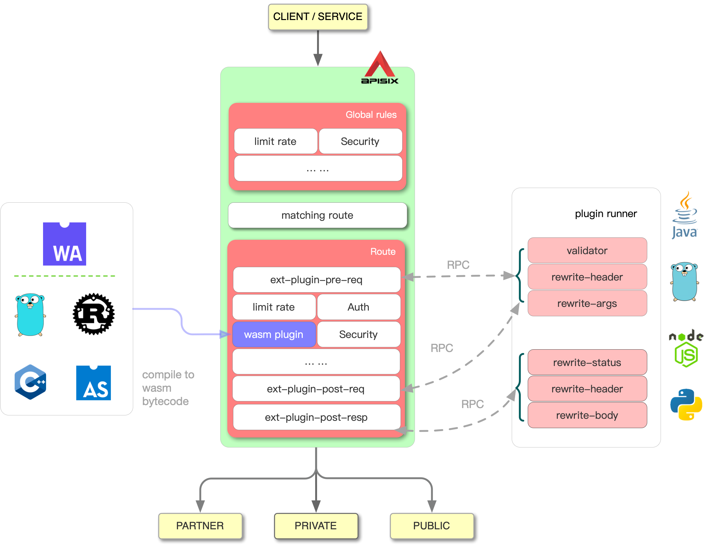

<!--
#
# Licensed to the Apache Software Foundation (ASF) under one or more
# contributor license agreements.  See the NOTICE file distributed with
# this work for additional information regarding copyright ownership.
# The ASF licenses this file to You under the Apache License, Version 2.0
# (the "License"); you may not use this file except in compliance with
# the License.  You may obtain a copy of the License at
#
#     http://www.apache.org/licenses/LICENSE-2.0
#
# Unless required by applicable law or agreed to in writing, software
# distributed under the License is distributed on an "AS IS" BASIS,
# WITHOUT WARRANTIES OR CONDITIONS OF ANY KIND, either express or implied.
# See the License for the specific language governing permissions and
# limitations under the License.
#
-->

## 什么是 External Plugin 和 Plugin Runner

APISIX 支持使用 Lua 语言编写插件，这种类型的插件在 APISIX 内部执行。
有时候你想使用其他语言来开发插件，因此，APISIX 支持以 `Sidecar` 的方式加载和运行你写的插件。
这里的 `Sidecar` 就是 Plugin Runner，你写的插件叫做 External Plugin。

## 它是如何工作的



当你在 APISIX 中配置了一个 Plugin Runner，APISIX 将以子进程的方式运行该 Plugin Runner。

该子进程与 APISIX 进程从属相同用户。当重启或者重新加载 APISIX 时，该 Plugin Runner 也将被重启。

一旦你为指定路由配置了 `ext-plugin-*` 插件，
匹配该路由的请求将触发从 APISIX 到  Plugin Runner 的 RPC 调用。

 Plugin Runner 将处理该 RPC 调用，在其侧创建一个请求，运行 External Plugin 并将结果返回给 APISIX。

 External Plugin 及其执行顺序在这里 `ext-plugin-*` 配置。与其他插件一样，External Plugin 可以动态启用和重新配置。

## 它是如何实现的

如果你对 Plugin Runner 内部实现感兴趣，请参考这份文档：
[The Implementation of Plugin Runner](../../en/latest/internal/plugin-runner.md)

## 支持的 Plugin Runner

- Java: https://github.com/apache/apisix-java-plugin-runner
- Go: https://github.com/apache/apisix-go-plugin-runner
- Python: https://github.com/apache/apisix-python-plugin-runner
- JavaScript: https://github.com/zenozeng/apisix-javascript-plugin-runner

## 在 APISIX 中配置 Plugin Runner

在生产环境运行 Plugin Runner，添加以下配置到 `config.yaml`：

```yaml
ext-plugin:
  cmd: ["blah"] # replace it to the real runner executable according to the runner you choice
```

APISIX 将以子进程的方式管理该 Plugin Runner。

注意：在 Mac 上，APISIX `v2.6` 无法管理该 Plugin Runner。

在开发过程中，我们希望单独运行 Plugin Runner，这样就可以重新启动它，而无需先重新启动 APISIX。

通过指定环境变量 `APISIX_LISTEN_ADDRESS`, 我们可以使 Plugin Runner 监听一个固定的地址。
例如：

```bash
APISIX_LISTEN_ADDRESS=unix:/tmp/x.sock
```

此时，Plugin Runner 将监听 `/tmp/x.sock`

同时，你需要配置 APISIX 发送 RPC 请求到该固定的地址：

```yaml
ext-plugin:
  # cmd: ["blah"] # don't configure the executable!
  path_for_test: "/tmp/x.sock" # without 'unix:' prefix
```

在生产环境，不应该使用 `path_for_test`，此时监听的地址将动态生成。

## 常见问题

### 由 APISIX 管理时，Plugin Runner 无法访问我的环境变量

自 `v2.7`，APISIX 可以将环境变量传递给 Plugin Runner。

然而，默认情况下，Nginx 将隐藏所有环境变量。所以你需要首先在 `conf/config.yaml` 中声明环境变量：

```yaml
nginx_config:
  envs:
    - MY_ENV_VAR
```

### APISIX 使用 SIGKILL 终止 Plugin Runner，而不是使用 SIGTERM！

自 `v2.7`，当跑在 OpenResty 1.19+ 时，APISIX 将使用 SIGTERM 来停止 Plugin Runner。

但是，APISIX 需要等待 Plugin Runner 退出，这样我们才能确保资源得以被释放。

因此，我们先发送 SIGTERM。然后在 1 秒后，如果 Plugin Runner 仍然在运行，我们将发送 SIGKILL。
