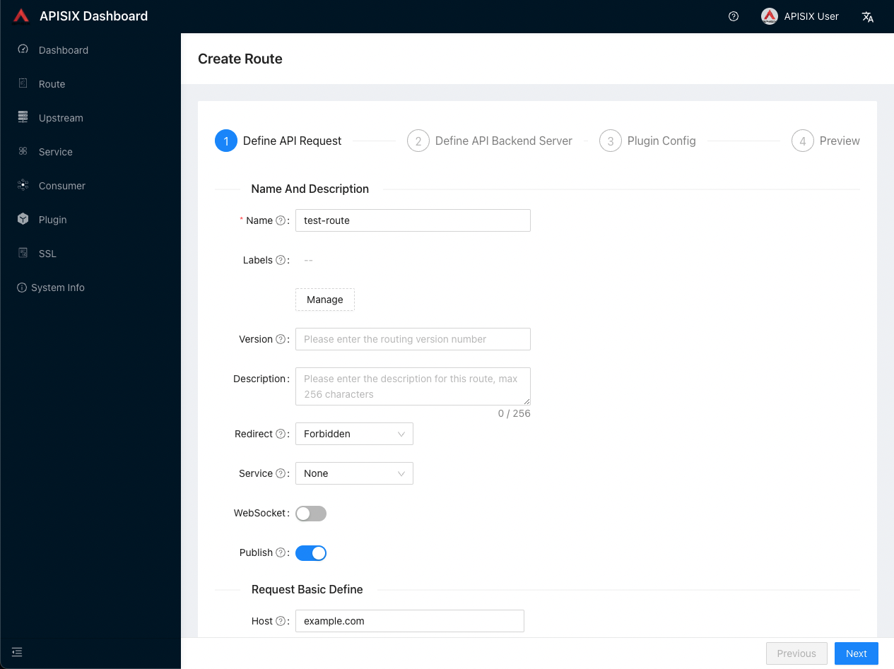
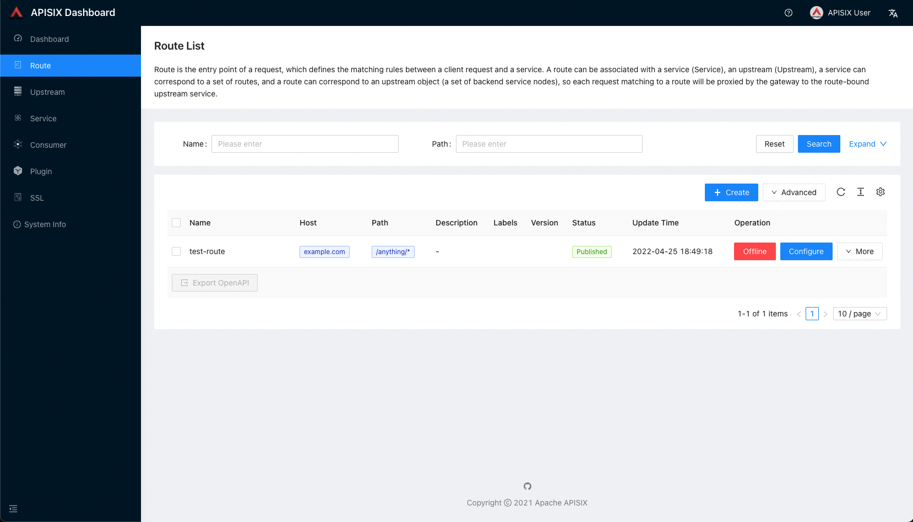

<!--
#
# Licensed to the Apache Software Foundation (ASF) under one or more
# contributor license agreements.  See the NOTICE file distributed with
# this work for additional information regarding copyright ownership.
# The ASF licenses this file to You under the Apache License, Version 2.0
# (the "License"); you may not use this file except in compliance with
# the License.  You may obtain a copy of the License at
#
#     http://www.apache.org/licenses/LICENSE-2.0
#
# Unless required by applicable law or agreed to in writing, software
# distributed under the License is distributed on an "AS IS" BASIS,
# WITHOUT WARRANTIES OR CONDITIONS OF ANY KIND, either express or implied.
# See the License for the specific language governing permissions and
# limitations under the License.
#
-->

import Tabs from '@theme/Tabs';
import TabItem from '@theme/TabItem';

本文将为你介绍 Apache APISIX 的概念、功能以及如何使用 APISIX。

通过本文你可以了解到以下内容：

- Apache APISIX 是什么？
- APISIX 的架构及主要概念。
- 如何使用 Docker 安装并运行 APISIX。
- 如何使用 Admin API 创建第一个路由并配置上游。
- 如何使用 APISIX Dashboard。
- 如何寻求帮助。

## Apache APISIX 是什么？

Apache APISIX 是 Apache 软件基金会下的云原生 API 网关，它兼具动态、实时、高性能等特点，提供了负载均衡、动态上游、灰度发布（金丝雀发布）、服务熔断、身份认证、可观测性等丰富的流量管理功能。我们可以使用 Apache APISIX 来处理传统的南北向流量，也可以处理服务间的东西向流量。同时，它也支持作为 [K8s Ingress Controller](https://github.com/apache/apisix-ingress-controller) 来使用。

### 主要特性

- 多平台支持：APISIX 提供了多平台解决方案，它不但支持裸机运行，也支持在 Kubernetes 中使用，还支持与 AWS Lambda、Azure Function、Lua 函数和 Apache OpenWhisk 等云服务集成。
- 全动态能力：APISIX 支持热加载，这意味着你不需要重启服务就可以更新 APISIX 的配置。请访问[为什么 Apache APISIX 选择 Nginx + Lua 这个技术栈？](https://apisix.apache.org/zh/blog/2021/08/25/why-apache-apisix-chose-nginx-and-lua/)以了解实现原理。
- 精细化路由：APISIX 支持使用 [NGINX 内置变量](http://nginx.org/en/docs/varindex.html)做为路由的匹配条件，你可以自定义匹配函数来过滤请求，匹配路由。
- 运维友好：APISIX 支持与以下工具和平台集成：[HashiCorp Vault](./plugins/jwt-auth.md#usage-with-hashicorp-vault)、[Zipkin](./plugins/zipkin.md)、[Apache SkyWalking](./plugins/skywalking.md)、[Consul](./discovery/consul_kv.md)、[Nacos](./discovery/nacos.md)、[Eureka](./discovery.md)。通过 [APISIX Dashboard](/docs/dashboard/USER_GUIDE)，运维人员可以通过友好且直观的 UI 配置 APISIX。
- 多语言插件支持：APISIX 支持多种开发语言进行插件开发，开发人员可以选择擅长语言的 SDK 开发自定义插件。

## 主要概念

下图为 Apache APISIX 的架构：


下表是本文涉及到的 APISIX 的主要概念和组件：

| 概念/组件    | 描述                                                                                             |
|-------------|--------------------------------------------------------------------------------------------------|
| Route       | 通过路由定义规则来匹配客户端请求，根据匹配结果加载并执行相应的插件，最后把请求转发给到指定的上游应用。  |
| Upstream    | 上游的作用是按照配置规则对服务节点进行负载均衡，它的地址信息可以直接配置到路由或服务上。               |
| Admin API   | 用户可以通过 Admin API 控制 APISIX 实例。                                                         |

## 前提条件

在开始使用 APISIX 之前，请确保你已经安装以下应用：

- [Docker](https://www.docker.com/) 和 [Docker Compose](https://docs.docker.com/compose/)。
- [curl](https://curl.se/docs/manpage.html) 用于测试 API。你也可以使用 [Hoppscotch](https://hoppscotch.io/) 之类的工具。
- 本文使用的上游服务是 [httpbin.org](https://httpbin.org)，你可以使用它进行测试。这是一个返回服务，它将返回我们在请求中传递的参数。

**请求内容：**

请求 URL 由以下参数构成：

- Protocol：即网络传输协议，在示例中，我们使用的是 `HTTP` 协议。
- Port：即端口，示例中使用的 `80` 端口。
- Host：即主机地址，示例中使用的是 `httpbin.org`。
- Path：即路径，示例中的路径是 `/get`。
- Query Parameters：即查询字符串，这里有两个字符串，分别是 `foo1` 和 `foo2`。

运行以下命令，发送请求：

```bash
curl --location --request GET "http://httpbin.org/get?foo1=bar1&foo2=bar2"
```

**响应内容：**

```json
{
  "args": {
    "foo1": "bar1",
    "foo2": "bar2"
  },
  "headers": {
    "Accept": "*/*",
    "Host": "httpbin.org",
    "User-Agent": "curl/7.29.0",
    "X-Amzn-Trace-Id": "Root=1-6088fe84-24f39487166cce1f0e41efc9"
  },
  "origin": "58.152.81.42",
  "url": "http://httpbin.org/get?foo1=bar1&foo2=bar2"
}
```

## 安装 APISIX

我们将使用 Docker 安装 APISIX 并启用 [Admin API](./admin-api.md)。

首先，通过 `git` 命令克隆 [apisix-docker](https://github.com/apache/apisix-docker) 仓库：

```bash
git clone https://github.com/apache/apisix-docker.git
cd apisix-docker/example
```

现在你可以通过 `docker-compose` 启动 APISIX。

<Tabs
  groupId="cpu-arch"
  defaultValue="x86"
  values={[
    {label: 'x86', value: 'x86'},
    {label: 'ARM/M1', value: 'arm'},
  ]}>
<TabItem value="x86">

```shell
docker-compose -p docker-apisix up -d
```

</TabItem>

<TabItem value="arm">

```shell
docker-compose -p docker-apisix -f docker-compose-arm64.yml up -d
```

</TabItem>
</Tabs>

:::note

你也可以参考 [APISIX 安装指南](./installation-guide.md)了解不同的安装方法。

:::

:::info IMPORTANT

请确保其他系统进程没有占用 **9080、9180、9443 和 2379** 端口。

在基于 UNIX 的系统中，可以使用以下命令来终止指定监听端口的运行：

```bash
sudo fuser -k 9443/tcp
```

如果 Docker 容器不能正常运行，你可以通过以下命令检查日志进行问题诊断：

```bash
docker logs -f --tail $<container_id>
```

:::

安装完成后，你可以在运行 Docker 的宿主机上执行 `curl` 命令访问 Admin API，根据返回数据判断 APISIX 是否成功启动。

```bash
# 注意：请在运行 Docker 的宿主机上执行 curl 命令。
curl "http://127.0.0.1:9180/apisix/admin/services/" -H 'X-API-KEY: edd1c9f034335f136f87ad84b625c8f1'
```

如果返回数据如下所示，则表示 APISIX 成功启动：

```json
{
  "count":0,
  "node":{
    "key":"/apisix/services",
    "nodes":[],
    "dir":true
  }
}
```

完成上述步骤后，你就已经拥有了一个正在运行的 APISIX 的实例了，现在你可以从之后的小节中学习如何创建路由以及了解 APISIX Dashboard 的操作。

## 创建路由

APISIX 提供了强大的 [Admin API](./admin-api.md) 和 [Dashboard](https://github.com/apache/apisix-dashboard) 供用户使用。在下述示例中，我们将使用 Admin API 创建一个 [Route](./terminology/route.md) 并与 [Upstream](./terminology/upstream.md) 绑定，当一个请求到达 APISIX 时，APISIX 会将请求转发到指定的上游服务中。

以下示例代码中，我们将为路由配置匹配规则，以便 APISIX 可以将请求转发到对应的上游服务：

```bash
curl "http://127.0.0.1:9180/apisix/admin/routes/1" -H "X-API-KEY: edd1c9f034335f136f87ad84b625c8f1" -X PUT -d '
{
  "methods": ["GET"],
  "host": "example.com",
  "uri": "/anything/*",
  "upstream": {
    "type": "roundrobin",
    "nodes": {
      "httpbin.org:80": 1
    }
  }
}'
```

该配置意味着，当请求满足下述的**所有**规则时，请求将被转发到上游服务（`httpbin.org:80`）：

- 请求的 HTTP 方法为 `GET`。
- 请求头包含 `host` 字段，且它的值为 `example.com`。
- 请求路径匹配 `/anything/*`，`*` 意味着任意的子路径，例如 `/anything/foo?arg=10`。

当路由创建完成后，可以通过以下命令访问上游服务：

```bash
curl -i -X GET "http://127.0.0.1:9080/anything/foo?arg=10" -H "Host: example.com"
```

该请求将被 APISIX 转发到 `http://httpbin.org:80/anything/foo?arg=10`。

## 使用上游服务创建路由

你可以通过以下命令创建一个上游，并在路由中使用它，而不是直接将其配置在路由中：

```bash
curl "http://127.0.0.1:9180/apisix/admin/upstreams/1" -H "X-API-KEY: edd1c9f034335f136f87ad84b625c8f1" -X PUT -d '
{
  "type": "roundrobin",
  "nodes": {
    "httpbin.org:80": 1
  }
}'
```

该上游配置与上一节配置在路由中的上游相同。同样使用了 `roundrobin` 作为负载均衡机制，并设置了 `httpbin.org:80` 为上游服务。为了将该上游绑定到路由，此处需要把 `upstream_id` 设置为 `"1"`。更多字段信息，请参考 [Admin API](./admin-api.md)。

上游服务创建完成后，可以通过以下命令绑定到指定路由：

```bash
curl "http://127.0.0.1:9180/apisix/admin/routes/1" -H "X-API-KEY: edd1c9f034335f136f87ad84b625c8f1" -X PUT -d '
{
  "uri": "/get",
  "host": "httpbin.org",
  "upstream_id": "1"
}'
```

我们已经创建了路由与上游服务，现在可以通过以下命令访问上游服务：

```bash
curl -i -X GET "http://127.0.0.1:9080/get?foo1=bar1&foo2=bar2" -H "Host: httpbin.org"
```

该请求将被 APISIX 转发到 `http://httpbin.org:80/anything/foo?arg=10`。

## 使用 APISIX Dashboard

你还可以使用 APISIX Dashboard 创建和配置类似于上述步骤中所创建的路由。

如果你已经完成上述操作步骤，就可以通过 [`localhost:9000`](http://localhost:9000/) 访问 APISIX Dashboard。

单击侧边栏中的 [`Route`](http://localhost:9000/routes/list)，可以查看已经配置的路由列表。你也可以看到在上述步骤中使用 Admin API 创建的路由。

你也可以通过单击 [`Create`](http://localhost:9000/routes/create) 按钮并按照提示创建新路由：



新创建的路由将被添加到路由列表中：



想要了解更多关于 APISIX Dashboard 的信息，请参考 [APISIX Dashboard 文档](/docs/dashboard/USER_GUIDE)。

## 总结

完成上述步骤后，APISIX 就可以正常运行了。如果想利用 APISIX 实现身份验证、安全性、限流限速和可观测性等功能，可通过添加插件实现。各类插件的详细信息请参考[插件市场](/plugins)。

如果你在使用当中遇到困难，可以通过 [APISIX 社区频道](/docs/general/join)或者在 GitHub 上[提交一个 issue](/docs/general/submit-issue) 寻求帮助。
