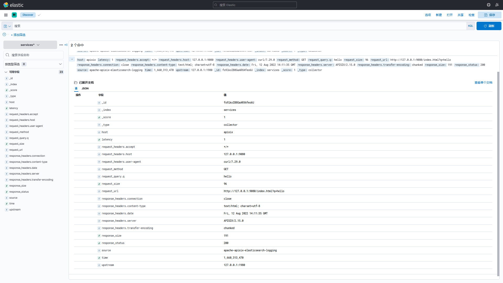

<!--
#
# Licensed to the Apache Software Foundation (ASF) under one or more
# contributor license agreements.  See the NOTICE file distributed with
# this work for additional information regarding copyright ownership.
# The ASF licenses this file to You under the Apache License, Version 2.0
# (the "License"); you may not use this file except in compliance with
# the License.  You may obtain a copy of the License at
#
#     http://www.apache.org/licenses/LICENSE-2.0
#
# Unless required by applicable law or agreed to in writing, software
# distributed under the License is distributed on an "AS IS" BASIS,
# WITHOUT WARRANTIES OR CONDITIONS OF ANY KIND, either express or implied.
# See the License for the specific language governing permissions and
# limitations under the License.
#
-->

## 描述

`elasticsearch-logging` 插件用于将 APISIX 的请求日志转发到 Elasticsearch 中进行分析和存储，启用该插件后 Apache APISIX 将在 `Log Phase` 获取请求上下文信息并序列化为 [Bulk 格式](https://www.elastic.co/guide/en/elasticsearch/reference/current/docs-bulk.html#docs-bulk) 后提交到批处理队列中，当触发批处理队列每批次最大处理容量或刷新缓冲区的最大时间时会将队列中的数据提交到 Elaticsearch 中。


## 属性

| 名称                | 是否必需 | 默认值               | 描述                                                         |
| ------------------- | -------- | -------------------- | ------------------------------------------------------------ |
| endpoint            | 必选     |                      | Elasticsearch 端点配置信息                                   |
| endpoint.uri        | 必选     |                      | Elasticsearch API                                            |
| endpoint.index      | 必选     |                      | Elasticsearch [_index field](https://www.elastic.co/guide/en/elasticsearch/reference/current/mapping-index-field.html#mapping-index-field) |
| endpoint.type       | 可选     | Elasticsearch 默认值 | Elasticsearch [_type field](https://www.elastic.co/guide/en/elasticsearch/reference/7.17/mapping-type-field.html#mapping-type-field) |
| endpoint.username   | 可选     |                      | Elasticsearch [authentication](https://www.elastic.co/guide/en/elasticsearch/reference/current/setting-up-authentication.html) username |
| endpoint.password   | 可选     |                      | Elasticsearch [authentication](https://www.elastic.co/guide/en/elasticsearch/reference/current/setting-up-authentication.html) password |
| endpoint.ssl_verify | 可选     | true                 | 当设置为 `true` 则允许 SSL 验证，参考 [OpenResty docs](https://github.com/openresty/lua-nginx-module#tcpsocksslhandshake) |
| endpoint.timeout    | 可选     | 10                   | 发送给 Elasticsearch 请求超时时间                            |

本插件支持使用批处理器来聚合并批量处理条目（日志和数据）。这样可以避免插件频繁地提交数据，默认设置情况下批处理器会每 `5` 秒钟或队列中的数据达到 `1000` 条时提交数据，如需了解或自定义批处理器相关参数设置，请参考 [Batch-Processor](../batch-processor.md#配置) 配置部分。

## 启用插件

你可以通过如下命令在指定路由上启用 `elasticsearch-logging` 插件：

### 完整配置示例

```shell
curl http://127.0.0.1:9080/apisix/admin/routes/1 \
-H 'X-API-KEY: edd1c9f034335f136f87ad84b625c8f1' -X PUT -d '
{
    "plugins":{
        "splunk-hec-logging":{
            "endpoint":{
                "uri": "http://127.0.0.1:9200",
                "index": "services",
                "type": "collector",
                "timeout": 60,
                "username": "elastic",
                "password": "123456",
                "ssl_verify": false
            },
            "buffer_duration":60,
            "max_retry_count":0,
            "retry_delay":1,
            "inactive_timeout":2,
            "batch_max_size":10
        }
    },
    "upstream":{
        "type":"roundrobin",
        "nodes":{
            "127.0.0.1:1980":1
        }
    },
    "uri":"/elasticsearch.do"
}'
```

### 最小化配置示例

```shell
curl http://127.0.0.1:9080/apisix/admin/routes/1 \
-H 'X-API-KEY: edd1c9f034335f136f87ad84b625c8f1' -X PUT -d '
{
    "plugins":{
        "splunk-hec-logging":{
            "endpoint":{
                "uri": "http://127.0.0.1:9200",
                "index": "services"
            }
        }
    },
    "upstream":{
        "type":"roundrobin",
        "nodes":{
            "127.0.0.1:1980":1
        }
    },
    "uri":"/elasticsearch.do"
}'
```

## 测试插件

- 向配置 `elasticsearch-logging` 插件的路由发送请求

```shell
$ curl -i http://127.0.0.1:9080/elasticsearch.do?q=hello
HTTP/1.1 200 OK
...
hello, world
```

- 登录 Kibana 控制台检索查看日志



## 禁用插件

禁用 `elasticsearch-logging` 插件非常简单，只需将 `elasticsearch-logging` 对应的 `JSON` 配置移除即可。

```shell
$ curl http://127.0.0.1:9080/apisix/admin/routes/1 -H 'X-API-KEY: edd1c9f034335f136f87ad84b625c8f1' -X PUT -d '
{
    "plugins":{},
    "upstream":{
        "type":"roundrobin",
        "nodes":{
            "127.0.0.1:1980":1
        }
    },
    "uri":"/elasticsearch.do"
}'
```
