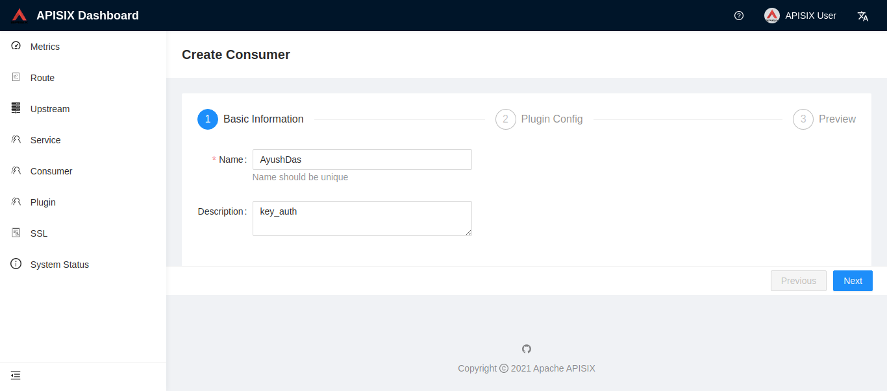
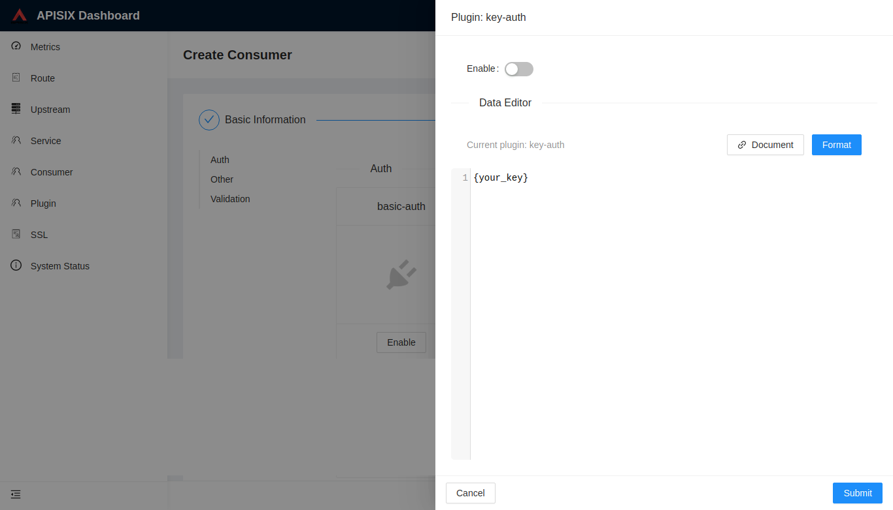

<!--
#
# Licensed to the Apache Software Foundation (ASF) under one or more
# contributor license agreements.  See the NOTICE file distributed with
# this work for additional information regarding copyright ownership.
# The ASF licenses this file to You under the Apache License, Version 2.0
# (the "License"); you may not use this file except in compliance with
# the License.  You may obtain a copy of the License at
#
#     http://www.apache.org/licenses/LICENSE-2.0
#
# Unless required by applicable law or agreed to in writing, software
# distributed under the License is distributed on an "AS IS" BASIS,
# WITHOUT WARRANTIES OR CONDITIONS OF ANY KIND, either express or implied.
# See the License for the specific language governing permissions and
# limitations under the License.
#
-->

## 目录

- [**名字**](#名字)
- [**属性**](#属性)
- [**如何启用**](#如何启用)
- [**测试插件**](#测试插件)
- [**禁用插件**](#禁用插件)

## 名字

`key-auth` 是一个认证插件，它需要与 `consumer` 一起配合才能工作。

添加 Key Authentication 到一个 `service` 或 `route`。 然后，`consumer` 将其密钥添加到查询字符串参数或标头中以验证其请求。

## 属性

| 名称 | 类型   | 必选项 | 默认值 | 有效值 | 描述                                                                                                          |
| ---- | ------ | ------ | ------ | ------ | ------------------------------------------------------------------------------------------------------------- |
| key  | string | 可选   |        |        | 不同的 `consumer` 对象应有不同的值，它应当是唯一的。不同 consumer 使用了相同的 `key` ，将会出现请求匹配异常。 |

## 如何启用

1. 创建一个 consumer 对象，并设置插件 `key-auth` 的值。

```shell
curl http://127.0.0.1:9080/apisix/admin/consumers -H 'X-API-KEY: edd1c9f034335f136f87ad84b625c8f1' -X PUT -d '
{
    "username": "jack",
    "plugins": {
        "key-auth": {
            "key": "auth-one"
        }
    }
}'
```

你可以使用浏览器打开 dashboard：`http://127.0.0.1:9080/apisix/dashboard/`，通过 web 界面来完成上面的操作，先增加一个 consumer：


然后在 consumer 页面中添加 key-auth 插件：


2. 创建 route 或 service 对象，并开启 `key-auth` 插件。

```shell
curl http://127.0.0.1:9080/apisix/admin/routes/1 -H 'X-API-KEY: edd1c9f034335f136f87ad84b625c8f1' -X PUT -d '
{
    "methods": ["GET"],
    "uri": "/index.html",
    "id": 1,
    "plugins": {
        "key-auth": {}
    },
    "upstream": {
        "type": "roundrobin",
        "nodes": {
            "39.97.63.215:80": 1
        }
    }
}'
```

## 测试插件

下面是一个正常通过 `key-auth` 验证的请求:

```shell
$ curl http://127.0.0.2:9080/index.html -H 'apikey: auth-one' -i
HTTP/1.1 200 OK
...
```

如果当前请求没有正确设置 `apikey` ，将得到一个 `401` 的应答。

```shell
$ curl http://127.0.0.2:9080/index.html -i
HTTP/1.1 401 Unauthorized
...
{"message":"Missing API key found in request"}

$ curl http://127.0.0.2:9080/index.html -H 'apikey: abcabcabc' -i
HTTP/1.1 401 Unauthorized
...
{"message":"Invalid API key in request"}
```

## 禁用插件

当你想去掉 `key-auth` 插件的时候，很简单，在插件的配置中把对应的 `json` 配置删除即可，无须重启服务，即刻生效：

```shell
$ curl http://127.0.0.1:2379/v2/keys/apisix/routes/1 -X PUT -d value='
{
    "methods": ["GET"],
    "uri": "/index.html",
    "id": 1,
    "plugins": {
    },
    "upstream": {
        "type": "roundrobin",
        "nodes": {
            "39.97.63.215:80": 1
        }
    }
}'
```

现在就已经移除了该插件配置，其他插件的开启和移除也是同样的方法。
