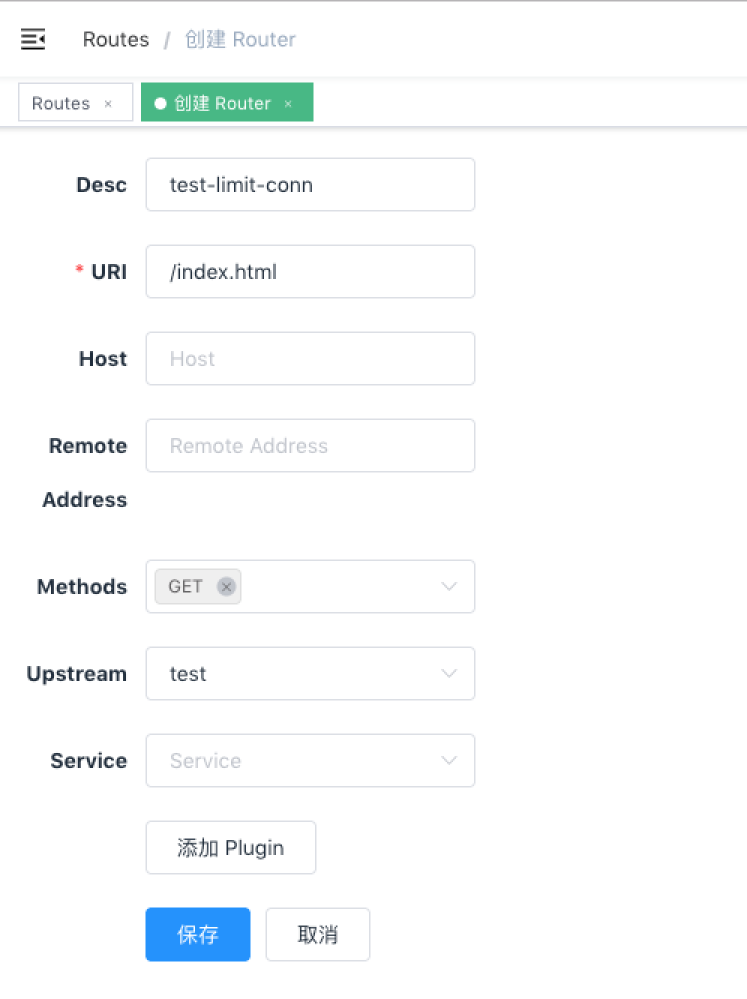
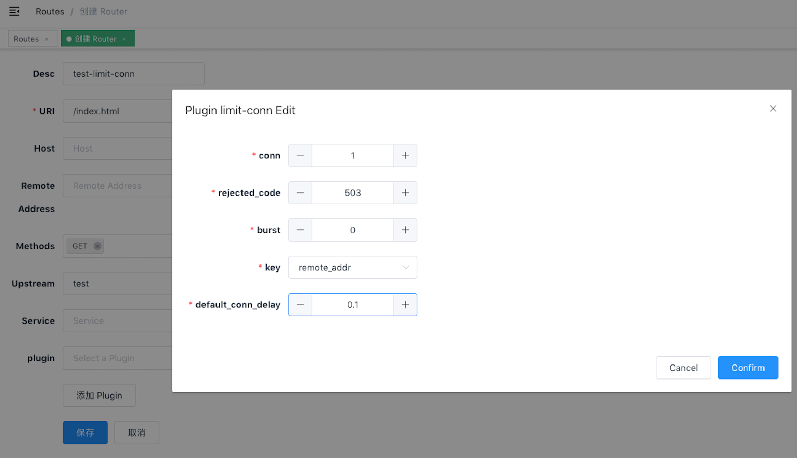

<!--
#
# Licensed to the Apache Software Foundation (ASF) under one or more
# contributor license agreements.  See the NOTICE file distributed with
# this work for additional information regarding copyright ownership.
# The ASF licenses this file to You under the Apache License, Version 2.0
# (the "License"); you may not use this file except in compliance with
# the License.  You may obtain a copy of the License at
#
#     http://www.apache.org/licenses/LICENSE-2.0
#
# Unless required by applicable law or agreed to in writing, software
# distributed under the License is distributed on an "AS IS" BASIS,
# WITHOUT WARRANTIES OR CONDITIONS OF ANY KIND, either express or implied.
# See the License for the specific language governing permissions and
# limitations under the License.
#
-->

限制并发请求（或并发连接）插件。

### 属性

| 名称               | 类型    | 必选项   | 默认值 | 有效值                                                                                    | 描述                                                                                                                                                                                                                                                                                                                                                                                                                                          |
| ------------------ | ------- | -------- | ------ | ----------------------------------------------------------------------------------------- | --------------------------------------------------------------------------------------------------------------------------------------------------------------------------------------------------------------------------------------------------------------------------------------------------------------------------------------------------------------------------------------------------------------------------------------------- |
| conn               | integer | required |        | conn > 0                                                                                  | 允许的最大并发请求数。超过 `conn` 的限制、但是低于 `conn` + `burst` 的请求，将被延迟处理。                                                                                                                                                                                                                                                                                                                                                    |
| burst              | integer | required |        | burst >= 0                                                                                | 允许被延迟处理的并发请求数。                                                                                                                                                                                                                                                                                                                                                                                                                  |
| default_conn_delay | number  | required |        | default_conn_delay > 0                                                                    | 默认的典型连接(或请求)的处理延迟时间。                                                                                                                                                                                                                                                                                                                                                                                                        |
| key                | object  | required |        | ["remote_addr", "server_addr", "http_x_real_ip", "http_x_forwarded_for", "consumer_name"] | 用户指定的限制并发级别的关键字，可以是客户端 IP 或服务端 IP。<br />例如，可以使用主机名（或服务器区域）作为关键字，以便限制每个主机名的并发性。 否则，我们也可以使用客户端地址作为关键字，这样我们就可以避免单个客户端用太多的并行连接或请求淹没我们的服务。 <br />当前接受的 key 有："remote_addr"（客户端 IP 地址）, "server_addr"（服务端 IP 地址）, 请求头中的"X-Forwarded-For" 或 "X-Real-IP", "consumer_name"（consumer 的 username）。 |
| rejected_code      | string  | optional | 503    | [200,...,599]                                                                             | 当请求超过 `conn` + `burst` 这个阈值时，返回的 HTTP 状态码                                                                                                                                                                                                                                                                                                                                                                                    |

**注：key 是可以被用户自定义的，只需要修改插件的一行代码即可完成。并没有在插件中放开是处于安全的考虑。**

在 stream 代理中使用该插件时，只有 `remote_addr` 和 `server_addr` 可以被用作 key。另外设置 `rejected_code` 毫无意义。

#### 如何启用

下面是一个示例，在指定的 route 上开启了 limit-conn 插件:

```shell
curl http://127.0.0.1:9080/apisix/admin/routes/1 -H 'X-API-KEY: edd1c9f034335f136f87ad84b625c8f1' -X PUT -d '
{
    "methods": ["GET"],
    "uri": "/index.html",
    "id": 1,
    "plugins": {
        "limit-conn": {
            "conn": 1,
            "burst": 0,
            "default_conn_delay": 0.1,
            "rejected_code": 503,
            "key": "remote_addr"
        }
    },
    "upstream": {
        "type": "roundrobin",
        "nodes": {
            "39.97.63.215:80": 1
        }
    }
}'
```

你可以使用浏览器打开 dashboard：`http://127.0.0.1:9080/apisix/dashboard/`，通过 web 界面来完成上面的操作，先增加一个 route：


然后在 route 页面中添加 limit-conn 插件：


#### test plugin

上面启用的插件的参数表示只允许一个并发请求。 当收到多个并发请求时，将直接返回 503 拒绝请求。

```shell
curl -i http://127.0.0.1:9080/index.html?sleep=20 &

curl -i http://127.0.0.1:9080/index.html?sleep=20
<html>
<head><title>503 Service Temporarily Unavailable</title></head>
<body>
<center><h1>503 Service Temporarily Unavailable</h1></center>
<hr><center>openresty</center>
</body>
</html>
```

这就表示 limit-conn 插件生效了。

#### 移除插件

当你想去掉 limit-conn 插件的时候，很简单，在插件的配置中把对应的 json 配置删除即可，无须重启服务，即刻生效：

```shell
curl http://127.0.0.1:9080/apisix/admin/routes/1 -H 'X-API-KEY: edd1c9f034335f136f87ad84b625c8f1' -X PUT -d '
{
    "methods": ["GET"],
    "uri": "/index.html",
    "upstream": {
        "type": "roundrobin",
        "nodes": {
            "39.97.63.215:80": 1
        }
    }
}'
```

现在就已经移除了 limit-conn 插件了。其他插件的开启和移除也是同样的方法。
