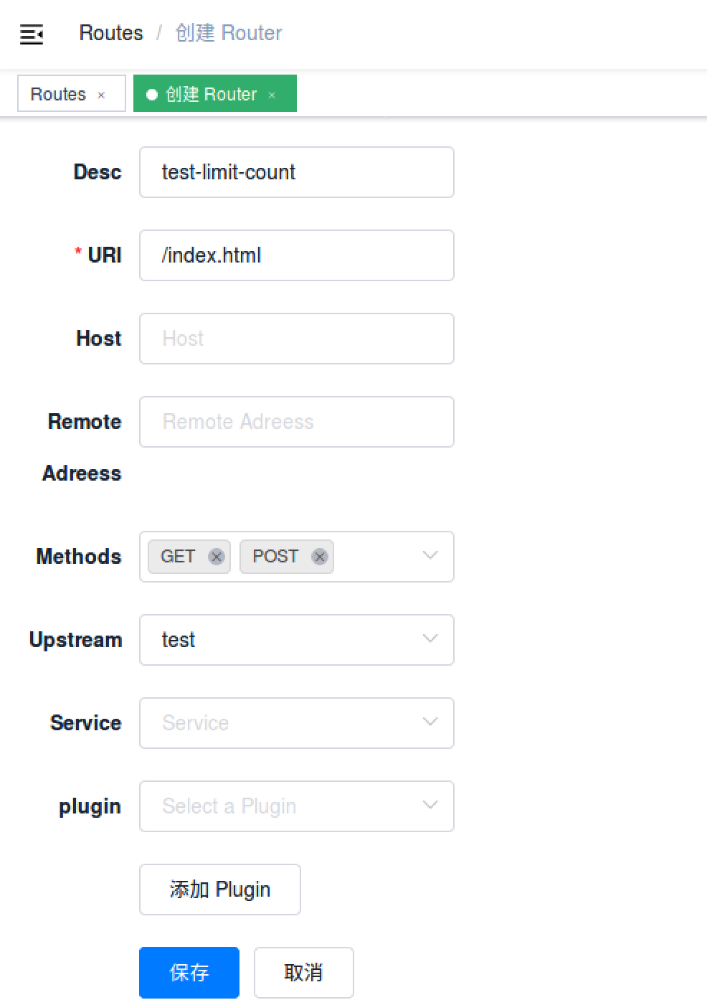

<!--
#
# Licensed to the Apache Software Foundation (ASF) under one or more
# contributor license agreements.  See the NOTICE file distributed with
# this work for additional information regarding copyright ownership.
# The ASF licenses this file to You under the Apache License, Version 2.0
# (the "License"); you may not use this file except in compliance with
# the License.  You may obtain a copy of the License at
#
#     http://www.apache.org/licenses/LICENSE-2.0
#
# Unless required by applicable law or agreed to in writing, software
# distributed under the License is distributed on an "AS IS" BASIS,
# WITHOUT WARRANTIES OR CONDITIONS OF ANY KIND, either express or implied.
# See the License for the specific language governing permissions and
# limitations under the License.
#
-->

## 目录

- [简介](#简介)
- [参数](#参数)
- [如何使用](#如何使用)
- [测试插件](#测试插件)
- [移除插件](#移除插件)

## 简介

和 [GitHub API 的限速](https://developer.github.com/v3/#rate-limiting)类似，
在指定的时间范围内，限制总的请求个数。并且在 HTTP 响应头中返回剩余可以请求的个数。

## 参数

| 名称                | 类型    | 必选项       | 默认值        | 有效值                                                                                                  | 描述                                                                                                                                                                                                                                                                                                                                                                                                                  |
| ------------------- | ------- | ------------ | ------------- | ------------------------------------------------------------------------------------------------------- | --------------------------------------------------------------------------------------------------------------------------------------------------------------------------------------------------------------------------------------------------------------------------------------------------------------------------------------------------------------------------------------------------------------------- |
| count               | integer | 必须         |               | count > 0                                                                                               | 指定时间窗口内的请求数量阈值                                                                                                                                                                                                                                                                                                                                                                                          |
| time_window         | integer | 必须         |               | time_window > 0                                                                                         | 时间窗口的大小（以秒为单位），超过这个时间就会重置                                                                                                                                                                                                                                                                                                                                                                    |
| key                 | string  | 可选         | "remote_addr" | ["remote_addr", "server_addr", "http_x_real_ip", "http_x_forwarded_for", "consumer_name", "service_id"] | 用来做请求计数的有效值。<br />例如，可以使用主机名（或服务器区域）作为关键字，以便限制每个主机名规定时间内的请求次数。我们也可以使用客户端地址作为关键字，这样我们就可以避免单个客户端规定时间内多次的连接我们的服务。<br />当前接受的 key 有："remote_addr"（客户端 IP 地址）, "server_addr"（服务端 IP 地址）, 请求头中的"X-Forwarded-For" 或 "X-Real-IP", "consumer_name"（consumer 的 username）, "service_id" 。 |
| rejected_code       | integer | 可选         | 503           | [200,...,599]                                                                                           | 当请求超过阈值被拒绝时，返回的 HTTP 状态码                                                                                                                                                                                                                                                                                                                                                                            |
| policy              | string  | 可选         | "local"       | ["local", "redis", "redis-cluster"]                                                                     | 用于检索和增加限制的速率限制策略。可选的值有：`local`(计数器被以内存方式保存在节点本地，默认选项) 和 `redis`(计数器保存在 Redis 服务节点上，从而可以跨节点共享结果，通常用它来完成全局限速)；以及`redis-cluster`，跟 redis 功能一样，只是使用 redis 集群方式。                                                                                                                                                        |
| redis_host          | string  | `redis` 必须 |               |                                                                                                         | 当使用 `redis` 限速策略时，该属性是 Redis 服务节点的地址。                                                                                                                                                                                                                                                                                                                                                            |
| redis_port          | integer | 可选         | 6379          | [1,...]                                                                                                 | 当使用 `redis` 限速策略时，该属性是 Redis 服务节点的端口                                                                                                                                                                                                                                                                                                                                                              |
| redis_password      | string  | 可选         |               |                                                                                                         | 当使用 `redis` 限速策略时，该属性是 Redis 服务节点的密码。                                                                                                                                                                                                                                                                                                                                                            |
| redis_database      | integer | 可选         | 0             | redis_database >= 0                                                                                     | 当使用 `redis` 限速策略时，该属性是 Redis 服务节点中使用的 database，并且只针对非 Redis 集群模式（单实例模式或者提供单入口的 Redis 公有云服务）生效。                                                                                                                                                                                                                                                                 |
| redis_timeout       | integer | 可选         | 1000          | [1,...]                                                                                                 | 当使用 `redis` 限速策略时，该属性是 Redis 服务节点以毫秒为单位的超时时间                                                                                                                                                                                                                                                                                                                                              |
| redis_cluster_nodes | array   | 可选         |               |                                                                                                         | 当使用 `redis-cluster` 限速策略时，该属性是 Redis 集群服务节点的地址列表。                                                                                                                                                                                                                                                                                                                                            |

**key 是可以被用户自定义的，只需要修改插件的一行代码即可完成。并没有在插件中放开是处于安全的考虑。**

## 如何使用

### 开启插件

下面是一个示例，在指定的 `route` 上开启了 `limit count` 插件:

```shell
curl -i http://127.0.0.1:9080/apisix/admin/routes/1 -H 'X-API-KEY: edd1c9f034335f136f87ad84b625c8f1' -X PUT -d '
{
    "uri": "/index.html",
    "plugins": {
        "limit-count": {
            "count": 2,
            "time_window": 60,
            "rejected_code": 503,
            "key": "remote_addr"
        }
    },
    "upstream": {
        "type": "roundrobin",
        "nodes": {
            "39.97.63.215:80": 1
        }
    }
}'
```

你可以使用浏览器打开 dashboard：`http://127.0.0.1:9080/apisix/dashboard/`，通过 web 界面来完成上面的操作，先增加一个 route：


然后在 route 页面中添加 limit-count 插件：


如果你需要一个集群级别的流量控制，我们可以借助 redis server 来完成。不同的 APISIX 节点之间将共享流量限速结果，实现集群流量限速。

如果启用单 redis 策略，请看下面例子：

```shell
curl -i http://127.0.0.1:9080/apisix/admin/routes/1 -H 'X-API-KEY: edd1c9f034335f136f87ad84b625c8f1' -X PUT -d '
{
    "uri": "/index.html",
    "plugins": {
        "limit-count": {
            "count": 2,
            "time_window": 60,
            "rejected_code": 503,
            "key": "remote_addr",
            "policy": "redis",
            "redis_host": "127.0.0.1",
            "redis_port": 6379,
            "redis_password": "password",
            "redis_database": 1,
            "redis_timeout": 1001
        }
    },
    "upstream": {
        "type": "roundrobin",
        "nodes": {
            "39.97.63.215:80": 1
        }
    }
}'
```

如果使用 `redis-cluster` 策略:

```shell
curl -i http://127.0.0.1:9080/apisix/admin/routes/1 -H 'X-API-KEY: edd1c9f034335f136f87ad84b625c8f1' -X PUT -d '
{
    "uri": "/index.html",
    "plugins": {
        "limit-count": {
            "count": 2,
            "time_window": 60,
            "rejected_code": 503,
            "key": "remote_addr",
            "policy": "redis-cluster",
            "redis_cluster_nodes": [
                "127.0.0.1:5000",
                "127.0.0.1:5001"
            ]
        }
    },
    "upstream": {
        "type": "roundrobin",
        "nodes": {
            "39.97.63.215:80": 1
        }
    }
}'
```

## 测试插件

上述配置限制了 60 秒内只能访问 2 次，前两次访问都会正常访问：

```shell
curl -i http://127.0.0.1:9080/index.html
```

响应头里面包含了 `X-RateLimit-Limit` 和 `X-RateLimit-Remaining`，他们的含义分别是限制的总请求数和剩余还可以发送的请求数：

```shell
HTTP/1.1 200 OK
Content-Type: text/html
Content-Length: 13175
Connection: keep-alive
X-RateLimit-Limit: 2
X-RateLimit-Remaining: 0
Server: APISIX web server
```

当你第三次访问的时候，就会收到包含 503 返回码的响应头：

```shell
HTTP/1.1 503 Service Temporarily Unavailable
Content-Type: text/html
Content-Length: 194
Connection: keep-alive
Server: APISIX web server

<html>
<head><title>503 Service Temporarily Unavailable</title></head>
<body>
<center><h1>503 Service Temporarily Unavailable</h1></center>
<hr><center>openresty</center>
</body>
</html>
```

这就表示 `limit count` 插件生效了。

## 移除插件

当你想去掉 `limit count` 插件的时候，很简单，在插件的配置中把对应的 json 配置删除即可，无须重启服务，即刻生效：

```shell
curl http://127.0.0.1:9080/apisix/admin/routes/1 -H 'X-API-KEY: edd1c9f034335f136f87ad84b625c8f1' -X PUT -d '
{
    "methods": ["GET"],
    "uri": "/index.html",
    "upstream": {
        "type": "roundrobin",
        "nodes": {
            "39.97.63.215:80": 1
        }
    }
}'
```

现在就已经移除了 `limit count` 插件了。其他插件的开启和移除也是同样的方法。
