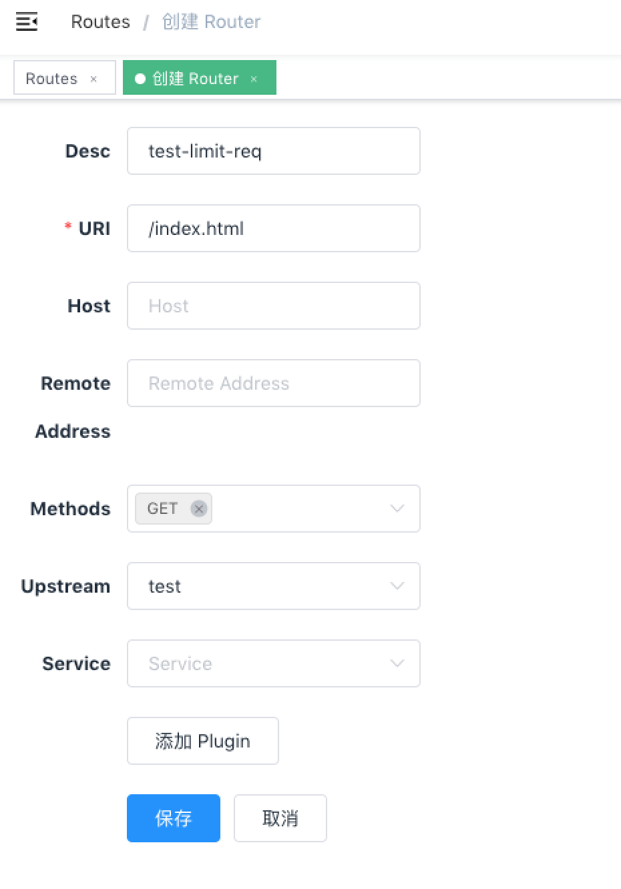
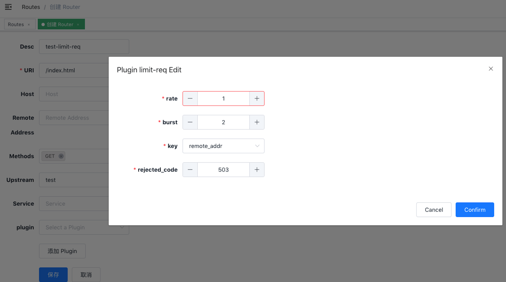

<!--
#
# Licensed to the Apache Software Foundation (ASF) under one or more
# contributor license agreements.  See the NOTICE file distributed with
# this work for additional information regarding copyright ownership.
# The ASF licenses this file to You under the Apache License, Version 2.0
# (the "License"); you may not use this file except in compliance with
# the License.  You may obtain a copy of the License at
#
#     http://www.apache.org/licenses/LICENSE-2.0
#
# Unless required by applicable law or agreed to in writing, software
# distributed under the License is distributed on an "AS IS" BASIS,
# WITHOUT WARRANTIES OR CONDITIONS OF ANY KIND, either express or implied.
# See the License for the specific language governing permissions and
# limitations under the License.
#
-->

## 目录

  - [简介](#简介)
  - [属性](#属性)
  - [示例](#示例)
    - [如何在 `route` 或 `service` 上使用](#如何在`route`或`service`上使用)
    - [如何在 `consumer` 上使用](#如何在`consumer`上使用)
  - [移除插件](#移除插件)

## 简介

限制请求速度的插件，使用的是漏桶算法。

## 属性

| 名称          | 类型    | 必选项 | 默认值 | 有效值                                                                   | 描述                                                                                                                                              |
| ------------- | ------- | ------ | ------ | ------------------------------------------------------------------------ | ------------------------------------------------------------------------------------------------------------------------------------------------- |
| rate          | integer | 必须   |        | rate > 0                                                                | 指定的请求速率（以秒为单位），请求速率超过 `rate` 但没有超过 （`rate` + `brust`）的请求会被加上延时。                                             |
| burst         | integer | 必须   |        | burst >= 0                                                              | t请求速率超过 （`rate` + `brust`）的请求会被直接拒绝。                                                                                            |
| key           | string  | 必须   |        | ["remote_addr", "server_addr", "http_x_real_ip", "http_x_forwarded_for", "consumer_name"] | 用来做请求计数的依据，当前接受的 key 有："remote_addr"(客户端IP地址), "server_addr"(服务端 IP 地址), 请求头中的"X-Forwarded-For" 或 "X-Real-IP"，"consumer_name"(consumer 的 username)。 |
| rejected_code | integer | 可选   | 503    | [200,...,599]                                                              | 当请求超过阈值被拒绝时，返回的 HTTP 状态码。                                                                                                        |

**key 是可以被用户自定义的，只需要修改插件的一行代码即可完成。并没有在插件中放开是处于安全的考虑。**

## 示例

### 如何在`route`或`service`上使用

这里以`route`为例(`service`的使用是同样的方法)，在指定的 `route` 上启用 `limit-req` 插件。

```shell
curl http://127.0.0.1:9080/apisix/admin/routes/1 -H 'X-API-KEY: edd1c9f034335f136f87ad84b625c8f1' -X PUT -d '
{
    "methods": ["GET"],
    "uri": "/index.html",
    "plugins": {
        "limit-req": {
            "rate": 1,
            "burst": 2,
            "rejected_code": 503,
            "key": "remote_addr"
        }
    },
    "upstream": {
        "type": "roundrobin",
        "nodes": {
            "39.97.63.215:80": 1
        }
    }
}'
```

你可以使用浏览器打开 dashboard：`http://127.0.0.1:9080/apisix/dashboard/`，通过 web 界面来完成上面的操作，先增加一个 route：



然后在 route 页面中添加 limit-req 插件：



**测试插件**

上述配置限制了每秒请求速率为 1，大于 1 小于 3 的会被加上延时，速率超过 3 就会被拒绝：

```shell
curl -i http://127.0.0.1:9080/index.html
```

当你超过，就会收到包含 503 返回码的响应头：

```html
HTTP/1.1 503 Service Temporarily Unavailable
Content-Type: text/html
Content-Length: 194
Connection: keep-alive
Server: APISIX web server

<html>
<head><title>503 Service Temporarily Unavailable</title></head>
<body>
<center><h1>503 Service Temporarily Unavailable</h1></center>
<hr><center>openresty</center>
</body>
</html>
```

这就表示 limit req 插件生效了。

### 如何在`consumer`上使用

consumer上开启`limit-req`插件，需要与授权插件一起配合使用，这里以key-auth授权插件为例。

1、将`limit-req`插件绑定到consumer上

```shell
curl http://127.0.0.1:9080/apisix/admin/consumers -H 'X-API-KEY: edd1c9f034335f136f87ad84b625c8f1' -X PUT -d '
{
    "username": "consumer_jack",
    "plugins": {
        "key-auth": {
            "key": "auth-jack"
        },
        "limit-req": {
            "rate": 1,
            "burst": 1,
            "rejected_code": 403,
            "key": "consumer_name"
        }
    }
}'
```

2、创建`route`并开启`key-auth`插件

```shell
curl http://127.0.0.1:9080/apisix/admin/routes/1 -H 'X-API-KEY: edd1c9f034335f136f87ad84b625c8f1' -X PUT -d '
{
    "methods": ["GET"],
    "uri": "/index.html",
    "plugins": {
        "key-auth": {
            "key": "auth-jack"
        }
    },
    "upstream": {
        "type": "roundrobin",
        "nodes": {
            "127.0.0.1:1980": 1
        }
    }
}'
```

**测试插件**

未超过`rate + burst` 的值

```shell
curl -i http://127.0.0.1:9080/index.html -H 'apikey: auth-jack'
HTTP/1.1 200 OK
......
```

当超过`rate + burst` 的值

```shell
curl -i http://127.0.0.1:9080/index.html -H 'apikey: auth-jack'
HTTP/1.1 403 Forbidden
.....
<html>
<head><title>403 Forbidden</title></head>
<body>
<center><h1>403 Forbidden</h1></center>
<hr><center>openresty</center>
</body>
</html>
```

说明绑在`consumer`上的 `limit-req`插件生效了

## 移除插件

当你想去掉 limit req 插件的时候，很简单，在插件的配置中把对应的 json 配置删除即可，无须重启服务，即刻生效：

```shell
curl http://127.0.0.1:9080/apisix/admin/routes/1 -H 'X-API-KEY: edd1c9f034335f136f87ad84b625c8f1' -X PUT -d '
{
    "methods": ["GET"],
    "uri": "/index.html",
    "upstream": {
        "type": "roundrobin",
        "nodes": {
            "39.97.63.215:80": 1
        }
    }
}'
```

移除`consumer`上的 `limit-req` 插件

```shell
curl http://127.0.0.1:9080/apisix/admin/consumers -H 'X-API-KEY: edd1c9f034335f136f87ad84b625c8f1' -X PUT -d '
{
    "username": "consumer_jack",
    "plugins": {
        "key-auth": {
            "key": "auth-jack"
        }
    }
}'
```

现在就已经移除了 limit req 插件了。其他插件的开启和移除也是同样的方法。
