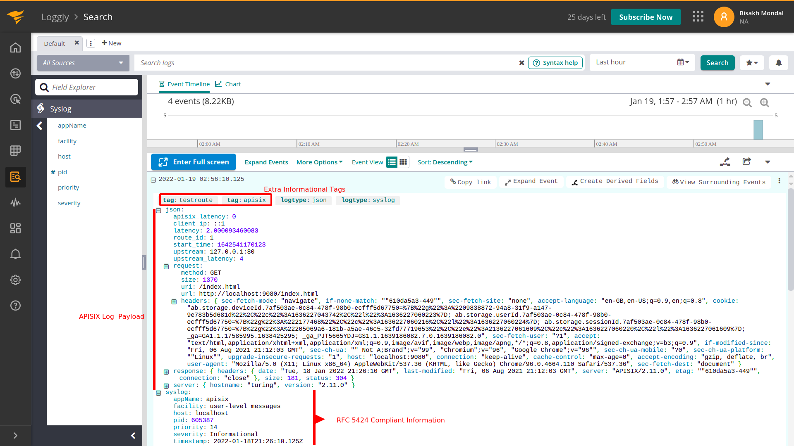

<!--
#
# Licensed to the Apache Software Foundation (ASF) under one or more
# contributor license agreements.  See the NOTICE file distributed with
# this work for additional information regarding copyright ownership.
# The ASF licenses this file to You under the Apache License, Version 2.0
# (the "License"); you may not use this file except in compliance with
# the License.  You may obtain a copy of the License at
#
#     http://www.apache.org/licenses/LICENSE-2.0
#
# Unless required by applicable law or agreed to in writing, software
# distributed under the License is distributed on an "AS IS" BASIS,
# WITHOUT WARRANTIES OR CONDITIONS OF ANY KIND, either express or implied.
# See the License for the specific language governing permissions and
# limitations under the License.
#
-->

## 描述

`loggly` 插件可用于将日志转发到 [SolarWinds Loggly](https://www.solarwinds.com/loggly) 进行分析和存储。

当启用插件时，APISIX 会将请求上下文信息序列化为符合 [Loggly Syslog](https://documentation.solarwinds.com/en/success_center/loggly/content/admin/streaming-syslog-without-using-files.htm?cshid=loggly_streaming-syslog-without-using-files) 的数据格式，即具有 [RFC5424](https://datatracker.ietf.org/doc/html/rfc5424) 兼容标头的 Syslog。

## 属性

| 名称                   | 类型          | 必选项 | 默认值 | 描述                                                                                                                                                                                                              |
|------------------------|---------------|----------|---------|---------------------------------------------------------------------------------------------------------------------------------------------------|
| customer_token         | string        | 是      |         | 将日志发送到 Loggly 时使用的唯一标识符，以确保将日志发送到正确的组织帐户。                                                                                                       |
| severity               | string (enum) | 否      | INFO    | Syslog 日志事件的严重性级别。包括：`DEBUG`、`INFO`、`NOTICE`、`WARNING`、`ERR`、`CRIT`、`ALERT` 和 `EMEGR`。                                         |
| severity_map           | object        | 否      | nil     | 一种将上游 HTTP 响应代码映射到 Syslog 中的方法。 `key-value`，其中 `key` 是 HTTP 响应代码，`value`是 Syslog 严重级别。例如`{"410": "CRIT"}`。                |
| tags                   | array         | 否      |         | 元数据将包含在任何事件日志中，以帮助进行分段和过滤。                                                                                                        |
| log_format             | object  | 否   |          |         | 日志格式以 JSON 的键值对声明。值支持字符串和嵌套对象（最多五层，超出部分将被截断）。字符串中可通过在前面加上 `$` 来引用 [APISIX 变量](../apisix-variable.md) 或 [NGINX 内置变量](http://nginx.org/en/docs/varindex.html)。 |
| include_req_body       | boolean       | 否      | false   | 当设置为 `true` 时，包含请求体。**注意**：如果请求体无法完全存放在内存中，由于 NGINX 的限制，APISIX 无法将它记录下来。               |
| include_req_body_expr   | array         | 否   |       | 当 `include_req_body` 属性设置为 `true` 时的过滤器。只有当此处设置的表达式求值为 `true` 时，才会记录请求体。有关更多信息，请参阅 [lua-resty-expr](https://github.com/api7/lua-resty-expr) 。 |
| include_resp_body      | boolean       | 否      | false   | 当设置为 `true` 时，包含响应体。                                            |
| include_resp_body_expr | array         | 否      |         | 当 `include_resp_body` 属性设置为 `true` 时进行过滤响应体，并且只有当此处设置的表达式计算结果为 `true` 时，才会记录响应体。更多信息，请参考 [lua-resty-expr](https://github.com/api7/lua-resty-expr)。 |

该插件支持使用批处理器来聚合并批量处理条目（日志或数据）。这样可以避免插件频繁地提交数据，默认设置情况下批处理器会每 `5` 秒钟或队列中的数据达到 `1000` 条时提交数据，如需了解批处理器相关参数设置，请参考 [Batch-Processor](../batch-processor.md#配置)。

如果要生成用户令牌，请在 Loggly 系统中的 `<your assigned subdomain>/loggly.com/tokens` 设置，或者在系统中单击 `Logs > Source setup > Customer tokens`。

### 默认日志格式示例

```text
<10>1 2024-01-06T06:50:51.739Z 127.0.0.1 apisix 58525 - [token-1@41058 tag="apisix"] {"service_id":"","server":{"version":"3.7.0","hostname":"localhost"},"apisix_latency":100.99985313416,"request":{"url":"http://127.0.0.1:1984/opentracing","headers":{"content-type":"application/x-www-form-urlencoded","user-agent":"lua-resty-http/0.16.1 (Lua) ngx_lua/10025","host":"127.0.0.1:1984"},"querystring":{},"uri":"/opentracing","size":155,"method":"GET"},"response":{"headers":{"content-type":"text/plain","server":"APISIX/3.7.0","transfer-encoding":"chunked","connection":"close"},"size":141,"status":200},"route_id":"1","latency":103.99985313416,"upstream_latency":3,"client_ip":"127.0.0.1","upstream":"127.0.0.1:1982","start_time":1704523851634}
```

## 插件元数据设置

你还可以通过插件元数据配置插件。详细配置如下：

| 名称       | 类型    | 必选项 | 默认值               | 有效值                           | 描述                                                                |
|------------|---------|-------|----------------------|--------------------------------|---------------------------------------------------------------------|
| host       | string  | 否    | "logs-01.loggly.com" |                                | 发送日志的主机的端点。                                                |
| port       | integer | 否    | 514                  |                                | 要连接的 Loggly 端口。仅用于 `syslog` 协议。                         |
| timeout    | integer | 否    | 5000                 |                                | 发送数据请求超时时间（以毫秒为单位）。                                 |
| protocol   | string  | 否    | "syslog"             | [ "syslog", "http", "https" ]  | 将日志发送到 Loggly 的协议。                                          |
| log_format | object  | 否    | nil                  |                                | 日志格式以 JSON 的键值对声明。值支持字符串和嵌套对象（最多五层，超出部分将被截断）。字符串中可通过在前面加上 `$` 来引用 [APISIX 变量](../../../en/latest/apisix-variable.md) 或 [NGINX 内置变量](http://nginx.org/en/docs/varindex.html)。 |

APISIX 支持 [Syslog](https://documentation.solarwinds.com/en/success_center/loggly/content/admin/streaming-syslog-without-using-files.htm)、[HTTP/S](https://documentation.solarwinds.com/en/success_center/loggly/content/admin/http-bulk-endpoint.htm)（批量端点）协议将日志事件发送到 Loggly。**默认情况下 `protocol` 的值为 `syslog`**。该协议允许你通过一些细粒度的控制（基于上游 HTTP 响应代码的日志严重性映射）发送符合 RFC5424 的系统日志事件。但是 HTTP/S 批量端点非常适合以更快的传输速度发送更大量的日志事件。

:::note 注意

Syslog 协议允许你发送符合 RFC5424 的 syslog 事件并进行细粒度控制。但是在以快速传输速度发送大量日志时，使用 HTTP/S 批量端点会更好。你可以通过以下方式更新元数据以更新使用的协议：

:::note

您可以这样从 `config.yaml` 中获取 `admin_key` 并存入环境变量：

```bash
admin_key=$(yq '.deployment.admin.admin_key[0].key' conf/config.yaml | sed 's/"//g')
```

:::

```shell
curl http://127.0.0.1:9180/apisix/admin/plugin_metadata/loggly \
-H "X-API-KEY: $admin_key" -X PUT -d '
{
   "protocol": "http"
}'
```

:::

## 启用插件

以下示例展示了如何在指定路由上启用该插件：

**完整配置**

```shell
curl http://127.0.0.1:9180/apisix/admin/routes/1 \
-H "X-API-KEY: $admin_key" -X PUT -d '
{
    "plugins":{
        "loggly":{
            "customer_token":"0e6fe4bf-376e-40f4-b25f-1d55cb29f5a2",
            "tags":["apisix", "testroute"],
            "severity":"info",
            "severity_map":{
                "503": "err",
                "410": "alert"
            },
            "buffer_duration":60,
            "max_retry_count":0,
            "retry_delay":1,
            "inactive_timeout":2,
            "batch_max_size":10
        }
    },
    "upstream":{
        "type":"roundrobin",
        "nodes":{
            "127.0.0.1:80":1
        }
    },
    "uri":"/index.html"
}'
```

**最小化配置**

```shell
curl http://127.0.0.1:9180/apisix/admin/routes/1 \
-H "X-API-KEY: $admin_key" -X PUT -d '
{
    "plugins":{
        "loggly":{
            "customer_token":"0e6fe4bf-376e-40f4-b25f-1d55cb29f5a2",
        }
    },
    "upstream":{
        "type":"roundrobin",
        "nodes":{
            "127.0.0.1:80":1
        }
    },
    "uri":"/index.html"
}'
```

## 测试插件

你可以通过以下命令向 APISIX 发出请求：

```shell
curl -i http://127.0.0.1:9080/index.html
```

发出请求后，你就可以在 Loggly 仪表盘上查看相关日志：



## 删除插件

当你需要删除该插件时，可以通过如下命令删除相应的 JSON 配置，APISIX 将会自动重新加载相关配置，无需重启服务：

```shell
curl http://127.0.0.1:9180/apisix/admin/routes/1 \
-H "X-API-KEY: $admin_key" -X PUT -d '
{
    "uri": "/index.html",
    "plugins": {},
    "upstream": {
        "type": "roundrobin",
        "nodes": {
            "127.0.0.1:80": 1
        }
    }
}'
```
