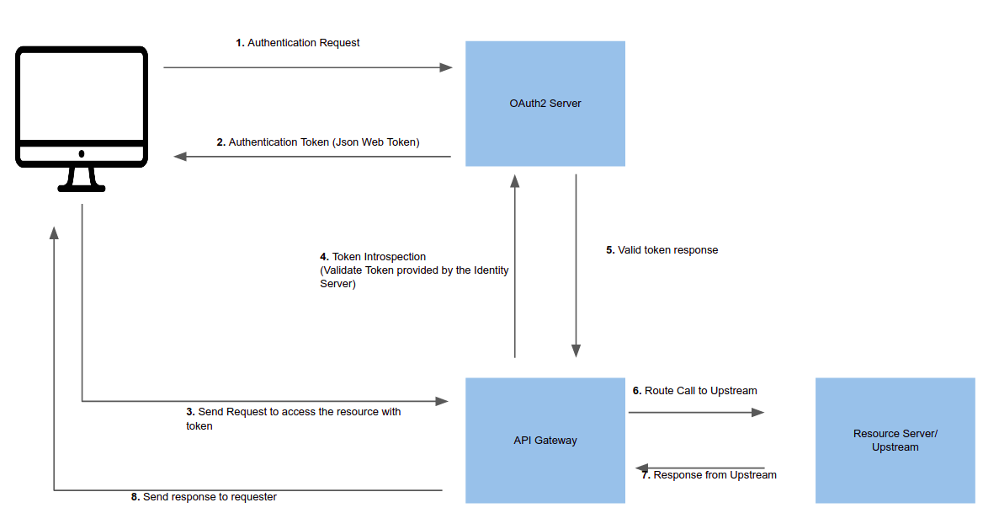

<!--
#
# Licensed to the Apache Software Foundation (ASF) under one or more
# contributor license agreements.  See the NOTICE file distributed with
# this work for additional information regarding copyright ownership.
# The ASF licenses this file to You under the Apache License, Version 2.0
# (the "License"); you may not use this file except in compliance with
# the License.  You may obtain a copy of the License at
#
#     http://www.apache.org/licenses/LICENSE-2.0
#
# Unless required by applicable law or agreed to in writing, software
# distributed under the License is distributed on an "AS IS" BASIS,
# WITHOUT WARRANTIES OR CONDITIONS OF ANY KIND, either express or implied.
# See the License for the specific language governing permissions and
# limitations under the License.
#
-->

## 目录

- [目录](#目录)
- [定义](#定义)
- [属性列表](#属性列表)
  - [令牌自省](#令牌自省)
  - [公钥自省](#公钥自省)
- [故障排除](#故障排除)

## 定义

OAuth 2 / Open ID Connect（OIDC）插件为 APISIX 提供身份验证和自省功能。

## 属性列表

| 名称                               | 类型    | 必选项 | 默认值                | 有效值  | 描述                                           |
| ---------------------------------- | ------- | ------ | --------------------- | ------- | ---------------------------------------------- |
| client_id                          | string  | 必须   |                       |         | OAuth 客户端 ID                                |
| client_secret                      | string  | 必须   |                       |         | OAuth 客户端 secret                            |
| discovery                          | string  | 必须   |                       |         | 身份服务器的发现端点的 URL                     |
| scope                              | string  | 可选   | "openid"              |         | 用于认证                                       |
| realm                              | string  | 可选   | "apisix"              |         | 用于认证                                       |
| bearer_only                        | boolean | 可选   | false                 |         | 设置为`true`将检查请求中带有承载令牌的授权标头 |
| logout_path                        | string  | 可选   | "/logout"             |         |                                                |
| redirect_uri                       | string  | 可选   | "ngx.var.request_uri" |         |                                                |
| timeout                            | integer | 可选   | 3                     | [1,...] | 超时时间，单位为秒                             |
| ssl_verify                         | boolean | 可选   | false                 |         |                                                |
| introspection_endpoint             | string  | 可选   |                       |         | 身份服务器的令牌验证端点的 URL                 |
| introspection_endpoint_auth_method | string  | 可选   | "client_secret_basic" |         | 令牌自省的认证方法名称                         |
| public_key                         | string  | 可选   |                       |         | 验证令牌的公钥                                 |
| token_signing_alg_values_expected  | string  | 可选   |                       |         | 用于对令牌进行签名的算法                       |

### 令牌自省

令牌自省通过针对 Oauth 2 授权服务器验证令牌来帮助验证请求。
前提条件是，您应该在身份服务器中创建受信任的客户端，并生成用于自省的有效令牌（JWT）。
下图显示了通过网关进行令牌自省的示例（成功）流程。



以下是 curl 命令，用于将插件启用到外部服务。
通过自省请求标头中提供的令牌，此路由将保护 https://httpbin.org/get（echo 服务）。

```bash
curl http://127.0.0.1:9080/apisix/admin/routes/5 -H 'X-API-KEY: edd1c9f034335f136f87ad84b625c8f1' -X PUT -d '
{
    "uri":"/get",
    "plugins":{
        "proxy-rewrite":{
            "scheme":"https"
        },
        "openid-connect":{
            "client_id":"api_six_client_id",
            "client_secret":"client_secret_code",
            "discovery":"full_URL_of_the_discovery_endpoint",
            "introspection_endpoint":"full_URL_of_introspection_endpoint",
            "bearer_only":true,
            "realm":"master",
            "introspection_endpoint_auth_method":"client_secret_basic"
        }
    },
    "upstream":{
        "type":"roundrobin",
        "nodes":{
            "httpbin.org:443":1
        }
    }
}'
```

以下命令可用于访问新路由。

```bash
curl -i -X GET http://127.0.0.1:9080/get -H "Host: httpbin.org" -H "Authorization: Bearer {replace_jwt_token}"
```

当 Oauth 2 授权服务器返回结果里面除了 token 之外还有过期时间, token 将在 APISIX 中缓存直至过期。
具体细节参见：

1. [lua-resty-openidc](https://github.com/zmartzone/lua-resty-openidc) 的文档和代码。
2. `exp` 字段的定义： [Introspection Response](https://tools.ietf.org/html/rfc7662#section-2.2)。

### 公钥自省

您还可以提供 JWT 令牌的公钥来验证令牌。 如果您提供了公共密钥和令牌自省端点，则将执行公共密钥工作流，而不是通过身份服务器进行验证。如果要减少额外的网络呼叫并加快过程，可以使用此方法。

以下配置显示了如何向路由添加公钥自省。

```bash
curl http://127.0.0.1:9080/apisix/admin/routes/5 -H 'X-API-KEY: edd1c9f034335f136f87ad84b625c8f1' -X PUT -d '
{
    "uri":"/get",
    "plugins":{
        "proxy-rewrite":{
            "scheme":"https"
        },
        "openid-connect":{
            "client_id":"api_six_client_id",
            "client_secret":"client_secret_code",
            "discovery":"full_URL_of_the_discovery_endpoint",
            "bearer_only":true,
            "realm":"master",
            "token_signing_alg_values_expected":"RS256",
            "public_key":"-----BEGIN CERTIFICATE-----
            {public_key}
            -----END CERTIFICATE-----"
        }
    },
    "upstream":{
        "type":"roundrobin",
        "nodes":{
            "httpbin.org:443":1
        }
    }
}'
```

## 故障排除

如果 APISIX 无法解析/连接到身份提供者，请检查/修改 DNS 设置（`conf / config.yaml`）。
