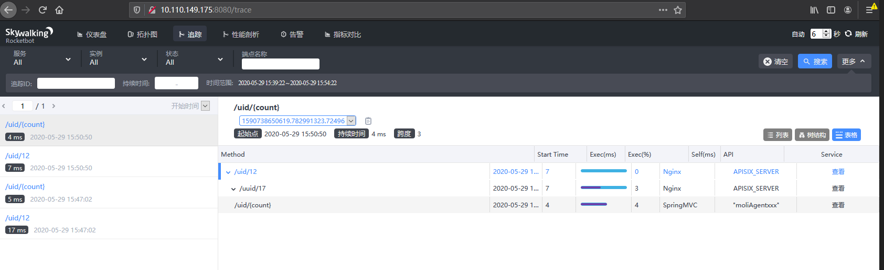

<!--
#
# Licensed to the Apache Software Foundation (ASF) under one or more
# contributor license agreements.  See the NOTICE file distributed with
# this work for additional information regarding copyright ownership.
# The ASF licenses this file to You under the Apache License, Version 2.0
# (the "License"); you may not use this file except in compliance with
# the License.  You may obtain a copy of the License at
#
#     http://www.apache.org/licenses/LICENSE-2.0
#
# Unless required by applicable law or agreed to in writing, software
# distributed under the License is distributed on an "AS IS" BASIS,
# WITHOUT WARRANTIES OR CONDITIONS OF ANY KIND, either express or implied.
# See the License for the specific language governing permissions and
# limitations under the License.
#
-->

## 描述

`skywalking` 插件用于与 [Apache SkyWalking](https://github.com/apache/skywalking) 集成。

SkyWalking 使用其原生的 NGINX Lua tracer 从服务和 URI 角度提供了分布式追踪、拓扑分析以及 metrics。

服务端目前支持 HTTP 和 gRPC 两种协议，在 APISIX 中目前只支持 HTTP 协议。

## 属性

| 名称         | 类型    | 必选项 | 默认值  | 有效值       | 描述                                                  |
| ------------ | ------ | ------ | ------ | ------------ | ----------------------------------------------------- |
| sample_ratio | number | 是     | 1      | [0.00001, 1] | 采样的比例。设置为 `1` 时，将对所有请求进行采样。         |

### 如何设置 Endpoint

你可以在配置文件（`./conf/config.yaml`）中配置以下属性：

| 名称                   | 类型    | 默认值                    | 描述                                                               |
| --------------------- | ------- | ------------------------ | ------------------------------------------------------------------ |
| service_name          | string  | "APISIX"                 | SkyWalking 上报的服务名称。                                         |
| service_instance_name | string  | "APISIX Instance Name"   | SkyWalking 上报的服务实例名。设置为 `$hostname` 时，将获取本机主机名。 |
| endpoint_addr         | string  | "http://127.0.0.1:12800" | SkyWalking 的 HTTP endpoint 地址，例如：`http://127.0.0.1:12800`。  |
| report_interval       | integer | SkyWalking 客户端内置的值 | 上报间隔时间，单位为秒。                                             |

以下是配置示例：

```yaml title="./conf/config.yaml"
plugin_attr:
  skywalking:
    service_name: APISIX
    service_instance_name: "APISIX Instance Name"
    endpoint_addr: http://127.0.0.1:12800
```

### 上游服务示例代码

```java title="Java with Spring Boot"
package com.lenovo.ai.controller;

import org.springframework.web.bind.annotation.PathVariable;
import org.springframework.web.bind.annotation.RequestMapping;
import org.springframework.web.bind.annotation.RestController;
import javax.servlet.http.HttpServletRequest;

/**
 * @author cyxinda
 * @create 2020-05-29 14:02
 * @desc skywalking test controller
 **/
@RestController
public class TestController {
    @RequestMapping("/uid/{count}")
    public String getUidList(@PathVariable("count") String countStr, HttpServletRequest request) {
        System.out.println("counter:::::"+countStr);
       return "OK";
    }
}

```

在启动服务前，需要配置 SkyWalking agent：

```shell title="agent/config/agent.config"
agent.service_name=yourservername
collector.backend_service=10.110.149.175:11800
```

使用以下命令启动服务脚本：

```shell
nohup java -javaagent:/root/skywalking/app/agent/skywalking-agent.jar \
-jar /root/skywalking/app/app.jar \
--server.port=8089 \
2>&1 > /root/skywalking/app/logs/nohup.log &
```

## 启用插件

该插件默认是禁用状态，你需要将其添加到配置文件（`./conf/config.yaml`）中才可以启用它：

```yaml title="./conf/config.yaml"
plugins:
  - ...
  - skywalking
```

配置完成后，重新加载 APISIX，此时 APISIX 会创建一个后台定时器，向 SkyWalking OAP 服务定期上报数据。

以下示例展示了如何在指定路由中启用 `skywalking` 插件：

:::note

您可以这样从 `config.yaml` 中获取 `admin_key` 并存入环境变量：

```bash
admin_key=$(yq '.deployment.admin.admin_key[0].key' conf/config.yaml | sed 's/"//g')
```

:::

```shell
curl http://127.0.0.1:9180/apisix/admin/routes/1  -H "X-API-KEY: $admin_key" -X PUT -d '
{
    "methods": ["GET"],
    "uris": [
        "/uid/*"
    ],
    "plugins": {
        "skywalking": {
            "sample_ratio": 1
        }
    },
    "upstream": {
        "type": "roundrobin",
        "nodes": {
            "10.110.149.175:8089": 1
        }
    }
}'
```

<!-- 你也可以通过 web 界面来完成上面的操作，先增加一个 route，然后在插件页面中添加 SkyWalking 插件：

 -->

## 测试插件

首先你可以通过 [Docker Compose](https://docs.docker.com/compose/install/) 启动 SkyWalking OAP 和 SkyWalking UI：

  - 在 usr/local 中创建 `skywalking.yaml` 文件。

    ```yaml
    version: "3"
    services:
    oap:
        image: apache/skywalking-oap-server:8.9.1
        restart: always
        ports:
        - "12800:12800/tcp"

    ui:
        image: apache/skywalking-ui:8.9.1
        restart: always
        ports:
        - "8080:8080/tcp"
        environment:
        SW_OAP_ADDRESS: http://oap:12800
    ```

  - 使用以下命令启动上述创建的文件：

    ```shell
    docker-compose -f skywalking.yaml up -d
    ```

    完成上述操作后，就已经启动了 SkyWalking 以及 SkyWalking  Web UI。你可以使用以下命令确认容器是否正常运行：

    ```shell
    docker ps
    ```

接下来你可以通过以下命令访问 APISIX：

```shell
curl -v http://10.110.149.192:9080/uid/12
```

```
HTTP/1.1 200 OK
OK
...
```

完成上述步骤后，打开浏览器，访问 SkyWalking 的 UI 页面，你可以看到如下服务拓扑图：


并且可以看到服务追踪列表：



## 删除插件

当你需要禁用 `skywalking` 插件时，可通过以下命令删除相应的 JSON 配置，APISIX 将会自动重新加载相关配置，无需重启服务：

```shell
curl http://127.0.0.1:9180/apisix/admin/routes/1  -H "X-API-KEY: $admin_key" -X PUT -d '
{
    "methods": ["GET"],
    "uris": [
        "/uid/*"
    ],
    "plugins": {
    },
    "upstream": {
        "type": "roundrobin",
        "nodes": {
            "10.110.149.175:8089": 1
        }
    }
}'
```

如果你想完全禁用 `skywalking` 插件，即停掉后台上报数据的定时器，就需要从配置文件（`./conf/config.yaml`）注释该插件：

```yaml title="./conf/config.yaml"
plugins:
  - ...
  #- skywalking
```
