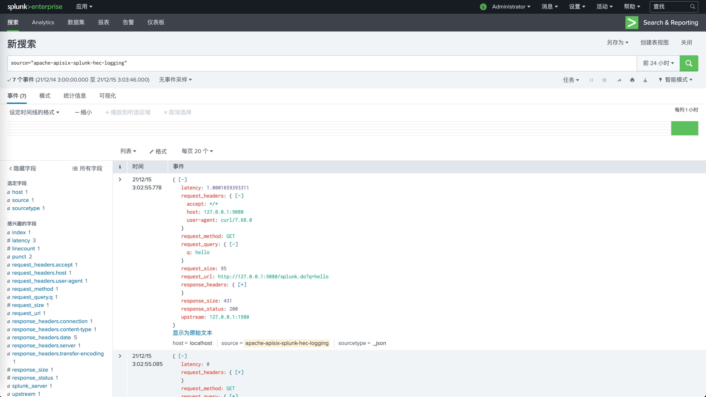

<!--
#
# Licensed to the Apache Software Foundation (ASF) under one or more
# contributor license agreements.  See the NOTICE file distributed with
# this work for additional information regarding copyright ownership.
# The ASF licenses this file to You under the Apache License, Version 2.0
# (the "License"); you may not use this file except in compliance with
# the License.  You may obtain a copy of the License at
#
#     http://www.apache.org/licenses/LICENSE-2.0
#
# Unless required by applicable law or agreed to in writing, software
# distributed under the License is distributed on an "AS IS" BASIS,
# WITHOUT WARRANTIES OR CONDITIONS OF ANY KIND, either express or implied.
# See the License for the specific language governing permissions and
# limitations under the License.
#
-->

## 描述

`splunk-hec-logging` 插件可用于将请求日志转发到 Splunk HTTP 事件收集器（HEC）中进行分析和存储。

启用该插件后，APISIX 将在 `Log Phase` 获取请求上下文信息，并将其序列化为 [Splunk Event Data 格式](https://docs.splunk.com/Documentation/Splunk/latest/Data/FormateventsforHTTPEventCollector#Event_metadata) 后提交到批处理队列中，当触发批处理队列每批次最大处理容量或刷新缓冲区的最大时间时会将队列中的数据提交到 `Splunk HEC` 中。

## 属性

| 名称                | 必选项  | 默认值 | 描述                                                                                                                                                               |
| ------------------  | ------ | ------ | ------------------------------------------------------------------------------------------------------------------------------------------------------------------ |
| endpoint            | 是     |        | Splunk HEC 端点配置信息。                                                                                                                                            |
| endpoint.uri        | 是     |        | Splunk HEC 事件收集 API。                                                                                                                                            |
| endpoint.token      | 是     |        | Splunk HEC 身份令牌。                                                                                                                                                |
| endpoint.channel    | 否     |        | Splunk HEC 发送渠道标识，更多信息请参考 [About HTTP Event Collector Indexer Acknowledgment](https://docs.splunk.com/Documentation/Splunk/8.2.3/Data/AboutHECIDXAck)。 |
| endpoint.timeout    | 否     | 10     | Splunk HEC 数据提交超时时间（以秒为单位）。                                                                                                                             |
| ssl_verify          | 否     | true   | 当设置为 `true` 时，启用 `SSL` 验证。                                                                                                                                 |
| log_format              | 否   |                   | 日志格式以 JSON 的键值对声明。值支持字符串和嵌套对象（最多五层，超出部分将被截断）。字符串中可通过在前面加上 `$` 来引用 [APISIX 变量](../apisix-variable.md) 或 [NGINX 内置变量](http://nginx.org/en/docs/varindex.html)。 |

本插件支持使用批处理器来聚合并批量处理条目（日志和数据）。这样可以避免该插件频繁地提交数据。默认情况下每 `5` 秒钟或队列中的数据达到 `1000` 条时，批处理器会自动提交数据，如需了解更多信息或自定义配置，请参考 [Batch-Processor](../batch-processor.md#配置)。

### 默认日志格式示例

```json
{
  "sourcetype": "_json",
  "time": 1704513555.392,
  "event": {
    "upstream": "127.0.0.1:1980",
    "request_url": "http://localhost:1984/hello",
    "request_query": {},
    "request_size": 59,
    "response_headers": {
      "content-length": "12",
      "server": "APISIX/3.7.0",
      "content-type": "text/plain",
      "connection": "close"
    },
    "response_status": 200,
    "response_size": 118,
    "latency": 108.00004005432,
    "request_method": "GET",
    "request_headers": {
      "connection": "close",
      "host": "localhost"
    }
  },
  "source": "apache-apisix-splunk-hec-logging",
  "host": "localhost"
}
```

## 插件元数据

| 名称             | 类型    | 必选项 | 默认值        | 有效值  | 描述                                             |
| ---------------- | ------- | ------ | ------------- | ------- | ------------------------------------------------ |
| log_format       | object  | 否    |  |         | 日志格式以 JSON 的键值对声明。值支持字符串和嵌套对象（最多五层，超出部分将被截断）。字符串中可通过在前面加上 `$` 来引用 [APISIX 变量](../apisix-variable.md) 或 [NGINX 内置变量](http://nginx.org/en/docs/varindex.html)。 |
| max_pending_entries | integer | 否 | | | 在批处理器中开始删除待处理条目之前可以购买的最大待处理条目数。|

:::info 注意

该设置全局生效。如果指定了 `log_format`，则所有绑定 `splunk-hec-logging` 的路由或服务都将使用该日志格式。

:::

以下示例展示了如何通过 Admin API 配置插件元数据：

:::note

您可以这样从 `config.yaml` 中获取 `admin_key` 并存入环境变量：

```bash
admin_key=$(yq '.deployment.admin.admin_key[0].key' conf/config.yaml | sed 's/"//g')
```

:::

```shell
curl http://127.0.0.1:9180/apisix/admin/plugin_metadata/splunk-hec-logging \
-H "X-API-KEY: $admin_key" -X PUT -d '
{
    "log_format": {
        "host": "$host",
        "@timestamp": "$time_iso8601",
        "client_ip": "$remote_addr",
        "request": { "method": "$request_method", "uri": "$request_uri" },
        "response": { "status": "$status" }
    }
}'
```

配置完成后，你将在日志系统中看到如下类似日志：

```json
[{"time":1673976669.269,"source":"apache-apisix-splunk-hec-logging","event":{"host":"localhost","client_ip":"127.0.0.1","@timestamp":"2023-01-09T14:47:25+08:00","request":{"method":"GET","uri":"/splunk.do"},"response":{"status":200},"route_id":"1"},"host":"DESKTOP-2022Q8F-wsl","sourcetype":"_json"}]
```

## 启用插件

以下示例展示了如何在指定路由上启用该插件：

**完整配置**

```shell
curl http://127.0.0.1:9180/apisix/admin/routes/1 \
-H "X-API-KEY: $admin_key" -X PUT -d '
{
    "plugins":{
        "splunk-hec-logging":{
            "endpoint":{
                "uri":"http://127.0.0.1:8088/services/collector",
                "token":"BD274822-96AA-4DA6-90EC-18940FB2414C",
                "channel":"FE0ECFAD-13D5-401B-847D-77833BD77131",
                "timeout":60
            },
            "buffer_duration":60,
            "max_retry_count":0,
            "retry_delay":1,
            "inactive_timeout":2,
            "batch_max_size":10
        }
    },
    "upstream":{
        "type":"roundrobin",
        "nodes":{
            "127.0.0.1:1980":1
        }
    },
    "uri":"/splunk.do"
}'
```

**最小化配置**

```shell
curl http://127.0.0.1:9180/apisix/admin/routes/1 \
-H "X-API-KEY: $admin_key" -X PUT -d '
{
    "plugins":{
        "splunk-hec-logging":{
            "endpoint":{
                "uri":"http://127.0.0.1:8088/services/collector",
                "token":"BD274822-96AA-4DA6-90EC-18940FB2414C"
            }
        }
    },
    "upstream":{
        "type":"roundrobin",
        "nodes":{
            "127.0.0.1:1980":1
        }
    },
    "uri":"/splunk.do"
}'
```

## 测试插件

你可以通过以下命令向 APISIX 发出请求：

```shell
curl -i http://127.0.0.1:9080/splunk.do?q=hello
```

```
HTTP/1.1 200 OK
...
hello, world
```

访问成功后，你可以登录 Splunk 控制台检索查看日志：



## 删除插件

当你需要删除该插件时，可以通过如下命令删除相应的 JSON 配置，APISIX 将会自动重新加载相关配置，无需重启服务：

```shell
curl http://127.0.0.1:9180/apisix/admin/routes/1 \
-H "X-API-KEY: $admin_key" -X PUT -d '
{
    "uri": "/hello",
    "plugins": {},
    "upstream": {
        "type": "roundrobin",
        "nodes": {
            "127.0.0.1:1980": 1
        }
    }
}'
```
