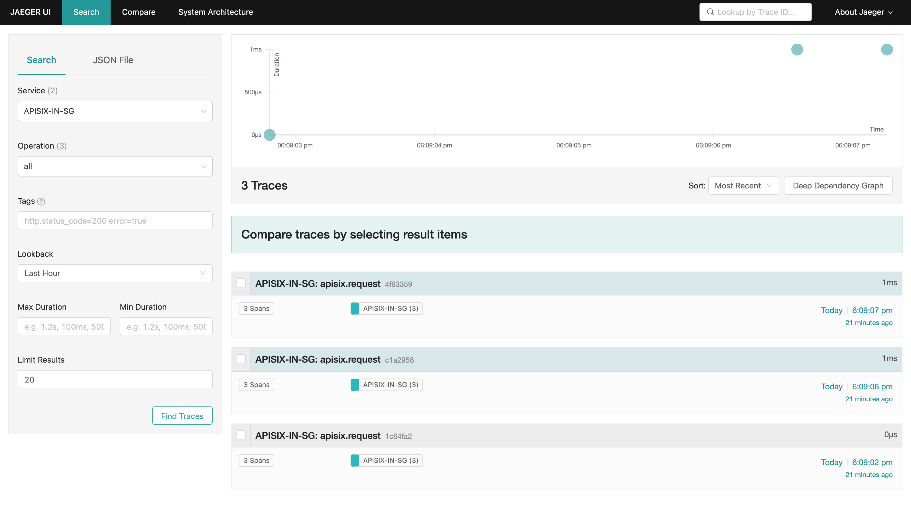
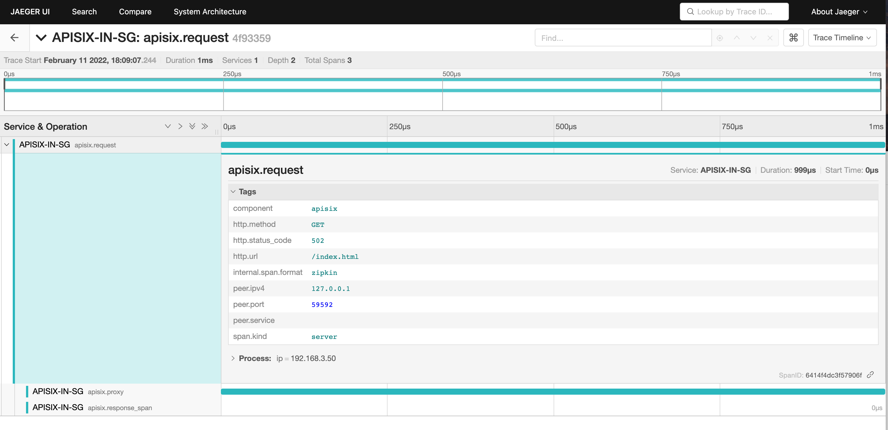

<!--
#
# Licensed to the Apache Software Foundation (ASF) under one or more
# contributor license agreements.  See the NOTICE file distributed with
# this work for additional information regarding copyright ownership.
# The ASF licenses this file to You under the Apache License, Version 2.0
# (the "License"); you may not use this file except in compliance with
# the License.  You may obtain a copy of the License at
#
#     http://www.apache.org/licenses/LICENSE-2.0
#
# Unless required by applicable law or agreed to in writing, software
# distributed under the License is distributed on an "AS IS" BASIS,
# WITHOUT WARRANTIES OR CONDITIONS OF ANY KIND, either express or implied.
# See the License for the specific language governing permissions and
# limitations under the License.
#
-->

## 描述

[Zipkin](https://github.com/openzipkin/zipkin) 是一个开源的分布调用链追踪系统。`zipkin` 插件基于 [Zipkin API 规范](https://zipkin.io/pages/instrumenting.html)，支持收集跟踪信息并上报给 Zipkin Collector。

该插件也支持 [Apache SkyWalking](https://skywalking.apache.org/docs/main/next/en/setup/backend/zipkin-trace/#zipkin-receiver) 和 [Jaeger](https://www.jaegertracing.io/docs/1.31/getting-started/#migrating-from-zipkin)，因为它们都支持了 Zipkin [v1](https://zipkin.io/zipkin-api/zipkin-api.yaml) 和 [v2](https://zipkin.io/zipkin-api/zipkin2-api.yaml) API。当然 `zipkin` 插件也可以与其他支持了 Zipkin v1 和 v2 API 格式的调用链追踪系统集成。

## 属性

| 名称         | 类型    | 必选项 | 默认值        | 有效值       | 描述                                                                 |
| ------------ | ------ | ------ | ------------ | ------------ | -------------------------------------------------------------------- |
| endpoint     | string | 是     |              |              | Zipkin 的 HTTP 节点。例如：`http://127.0.0.1:9411/api/v2/spans`。      |
| sample_ratio | number | 是     |              | [0.00001, 1] | 对请求进行采样的比例。当设置为 `1` 时，将对所有请求进行采样。              |
| service_name | string | 否     | "APISIX"     |              | 需要在 Zipkin 中显示的服务名称。                                        |
| server_addr  | string | 否     | $server_addr |              | 当前 APISIX 实例的 IPv4 地址。                                        |
| span_version | integer| 否     | 2            | [1, 2]       | span 类型的版本。                                                      |

在当前版本中，每个被跟踪的请求都会创建如下所示的 span：

```
request
├── proxy: from the beginning of the request to the beginning of header filter
└── response: from the beginning of header filter to the beginning of log
```

在旧版本（将 `span_version` 属性设置为 `1`）中，将创建如下 span：

```
request
├── rewrite
├── access
└── proxy
    └── body_filter
```

:::note

上述 span 的名称与同名的 NGINX phase 没有联系。

:::

### 上游服务示例

```go title="Go with Gin"
func GetTracer(serviceName string, port int, enpoitUrl string, rate float64) *zipkin.Tracer {
    // create a reporter to be used by the tracer
    reporter := httpreporter.NewReporter(enpoitUrl)
    // set-up the local endpoint for our service host is  ip:host

    thisip, _ := GetLocalIP()

    host := fmt.Sprintf("%s:%d", thisip, port)
    endpoint, _ := zipkin.NewEndpoint(serviceName, host)
    // set-up our sampling strategy
    sampler, _ := zipkin.NewCountingSampler(rate)
    // initialize the tracer
    tracer, _ := zipkin.NewTracer(
        reporter,
        zipkin.WithLocalEndpoint(endpoint),
        zipkin.WithSampler(sampler),
    )
    return tracer
}

func main(){
    r := gin.Default()

    tracer := GetTracer(...)

    // use middleware to extract parentID from http header that injected by APISIX
    r.Use(func(c *gin.Context) {
        span := this.Tracer.Extract(b3.ExtractHTTP(c.Request))
        childSpan := this.Tracer.StartSpan(spanName, zipkin.Parent(span))
        defer childSpan.Finish()
        c.Next()
    })

}
```

## 启用插件

以下示例展示了如何在指定路由中启用 `zipkin` 插件：

:::note

您可以像这样从 config.yaml 中获取 admin_key。

```bash
 admin_key=$(yq '.deployment.admin.admin_key[0].key' conf/config.yaml | sed 's/"//g')
```

:::

```shell
curl http://127.0.0.1:9180/apisix/admin/routes/1  -H "X-API-KEY: $admin_key" -X PUT -d '
{
    "methods": ["GET"],
    "uri": "/index.html",
    "plugins": {
        "zipkin": {
            "endpoint": "http://127.0.0.1:9411/api/v2/spans",
            "sample_ratio": 1,
            "service_name": "APISIX-IN-SG",
            "server_addr": "192.168.3.50"
        }
    },
    "upstream": {
        "type": "roundrobin",
        "nodes": {
            "127.0.0.1:1980": 1
        }
    }
}'
```

<!-- 你也可以通过 web 界面来完成上面的操作，先增加一个 route，然后在插件页面中添加 zipkin 插件：

-->

## 测试插件

首先你需要通过以下命令创建一个 Zipkin 实例：

```
docker run -d -p 9411:9411 openzipkin/zipkin
```

接下来你可以通过以下命令发起请求，该请求记录会出现在 Zipkin 中：

```shell
curl http://127.0.0.1:9080/index.html
```

```
HTTP/1.1 200 OK
...
```

最后你可以在浏览器中输入 `http://127.0.0.1:9411/zipkin` 访问 Zipkin UI 查询 traces：


### 上报到 Jaeger

除了对接 Zipkin，该插件也支持将 traces 上报到 Jaeger。

首先，请使用以下命令运行 Jaeger 后端服务：

```
docker run -d --name jaeger \
  -e COLLECTOR_ZIPKIN_HOST_PORT=:9411 \
  -p 16686:16686 \
  -p 9411:9411 \
  jaegertracing/all-in-one:1.31
```

通过以下命令创建路由并启用插件：

```shell
curl http://127.0.0.1:9180/apisix/admin/routes/1  -H "X-API-KEY: $admin_key" -X PUT -d '
{
    "methods": ["GET"],
    "uri": "/index.html",
    "plugins": {
        "zipkin": {
            "endpoint": "http://127.0.0.1:9411/api/v2/spans",
            "sample_ratio": 1,
            "service_name": "APISIX-IN-SG",
            "server_addr": "192.168.3.50"
        }
    },
    "upstream": {
        "type": "roundrobin",
        "nodes": {
            "127.0.0.1:1980": 1
        }
    }
}'
```

接下来你可以通过以下命令发起请求，该条请求记录将会出现在 Jaeger 中：

```shell
curl http://127.0.0.1:9080/index.html
```

```
HTTP/1.1 200 OK
...
```

最后你可以在浏览器中输入 `http://127.0.0.1:16686` 访问 Jaeger UI 查看 traces：





## 删除插件

当你需要禁用 `zipkin` 插件时，可以通过以下命令删除相应的 JSON 配置，APISIX 将会自动重新加载相关配置，无需重启服务：

```shell
curl http://127.0.0.1:9180/apisix/admin/routes/1 -H "X-API-KEY: $admin_key" -X PUT -d '
{
    "methods": ["GET"],
    "uri": "/index.html",
    "plugins": {
    },
    "upstream": {
        "type": "roundrobin",
        "nodes": {
            "127.0.0.1:1980": 1
        }
    }
}'
```

## 如何使用变量

以下`nginx`变量是由`zipkin` 设置的。

- `zipkin_context_traceparent` -  [W3C trace context](https://www.w3.org/TR/trace-context/#trace-context-http-headers-format), 例如：`00-0af7651916cd43dd8448eb211c80319c-b9c7c989f97918e1-01`
- `zipkin_trace_id` - 当前 span 的 trace_id
- `zipkin_span_id` - 当前 span 的 span_id

如何使用？你需要在配置文件（`./conf/config.yaml`）设置如下：

```yaml title="./conf/config.yaml"
http:
    enable_access_log: true
    access_log: "/dev/stdout"
    access_log_format: '{"time": "$time_iso8601","zipkin_context_traceparent": "$zipkin_context_traceparent","zipkin_trace_id": "$zipkin_trace_id","zipkin_span_id": "$zipkin_span_id","remote_addr": "$remote_addr","uri": "$uri"}'
    access_log_format_escape: json
plugins:
  - zipkin
plugin_attr:
  zipkin:
    set_ngx_var: true
```

你也可以在打印日志的时候带上 `trace_id`

```print error log
log.error(ngx.ERR,ngx_var.zipkin_trace_id,"error message")
```
