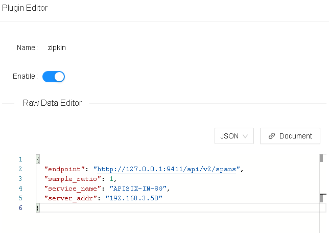

<!--
#
# Licensed to the Apache Software Foundation (ASF) under one or more
# contributor license agreements.  See the NOTICE file distributed with
# this work for additional information regarding copyright ownership.
# The ASF licenses this file to You under the Apache License, Version 2.0
# (the "License"); you may not use this file except in compliance with
# the License.  You may obtain a copy of the License at
#
#     http://www.apache.org/licenses/LICENSE-2.0
#
# Unless required by applicable law or agreed to in writing, software
# distributed under the License is distributed on an "AS IS" BASIS,
# WITHOUT WARRANTIES OR CONDITIONS OF ANY KIND, either express or implied.
# See the License for the specific language governing permissions and
# limitations under the License.
#
-->

## 目录

- [**名字**](#名字)
- [**属性**](#属性)
- [**如何启用**](#如何启用)
- [**测试插件**](#测试插件)
- [**禁用插件**](#禁用插件)

## 名字

`zipkin`(https://github.com/openzipkin/zipkin) 是一个开源的服务跟踪插件。

它还可以在 “Apache SkyWalking” 上运行，支持 Zipkin v1/v2 格式。

## 属性

| 名称         | 类型   | 必选项 | 默认值   | 有效值       | 描述                                                                 |
| ------------ | ------ | ------ | -------- | ------------ | -------------------------------------------------------------------- |
| endpoint     | string | 必须   |          |              | Zipkin 的 http 节点，例如`http://127.0.0.1:9411/api/v2/spans`。      |
| sample_ratio | number | 必须   |          | [0.00001, 1] | 监听的比例                                                           |
| service_name | string | 可选   | "APISIX" |              | 标记当前服务的名称                                                   |
| server_addr  | string | 可选   |          |              | 标记当前 APISIX 实例的IP地址，默认值是 nginx 的内置变量`server_addr` |

## 如何启用

下面是一个示例，在指定的 route 上开启了 zipkin 插件:

```shell
curl http://127.0.0.1:9080/apisix/admin/routes/1  -H 'X-API-KEY: edd1c9f034335f136f87ad84b625c8f1' -X PUT -d '
{
    "methods": ["GET"],
    "uri": "/index.html",
    "plugins": {
        "zipkin": {
            "endpoint": "http://127.0.0.1:9411/api/v2/spans",
            "sample_ratio": 1,
            "service_name": "APISIX-IN-SG",
            "server_addr": "192.168.3.50"
        }
    },
    "upstream": {
        "type": "roundrobin",
        "nodes": {
            "39.97.63.215:80": 1
        }
    }
}'
```

你可以使用浏览器打开 dashboard：`http://127.0.0.1:9080/apisix/dashboard/`，通过 web 界面来完成上面的操作，先增加一个 route：



然后在 route 页面中添加 zipkin 插件：


## 测试插件

### 运行 Zipkin 实例

e.g. 用docker:

```
sudo docker run -d -p 9411:9411 openzipkin/zipkin
```

测试示例:

```shell
$ curl http://127.0.0.1:9080/index.html
HTTP/1.1 200 OK
...
```

打开浏览器，访问 Zipkin 的 web 页面：

```
http://127.0.0.1:9411/zipkin
```


## 禁用插件

当你想去掉插件的时候，很简单，在插件的配置中把对应的 json 配置删除即可，无须重启服务，即刻生效：

```shell
$ curl http://127.0.0.1:2379/v2/keys/apisix/routes/1 -H 'X-API-KEY: edd1c9f034335f136f87ad84b625c8f1' -X PUT -d value='
{
    "methods": ["GET"],
    "uri": "/index.html",
    "plugins": {
    },
    "upstream": {
        "type": "roundrobin",
        "nodes": {
            "39.97.63.215:80": 1
        }
    }
}'
```

现在就已经移除了 Zipkin 插件了。其他插件的开启和移除也是同样的方法。

## 上游服务是Golang的示例代码

```golang
func GetTracer(serviceName string, port int, enpoitUrl string, rate float64) *zipkin.Tracer {
    // create a reporter to be used by the tracer
    reporter := httpreporter.NewReporter(enpoitUrl)
    // set-up the local endpoint for our service host is  ip:host

    thisip, _ := GetLocalIP()

    host := fmt.Sprintf("%s:%d", thisip, port)
    endpoint, _ := zipkin.NewEndpoint(serviceName, host)
    // set-up our sampling strategy
    sampler, _ := zipkin.NewCountingSampler(rate)
    // initialize the tracer
    tracer, _ := zipkin.NewTracer(
        reporter,
        zipkin.WithLocalEndpoint(endpoint),
        zipkin.WithSampler(sampler),
    )
    return tracer
}

func main(){
    r := gin.Default()

    tracer := GetTracer(...)

    // use middleware to extract parentID from http header that injected by APISIX
    r.Use(func(c *gin.Context) {
        span := this.Tracer.Extract(b3.ExtractHTTP(c.Request))
        childSpan := this.Tracer.StartSpan(spanName, zipkin.Parent(span))
        defer childSpan.Finish()
        c.Next()
    })

}
```
