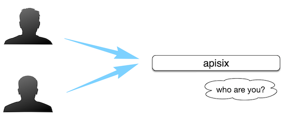
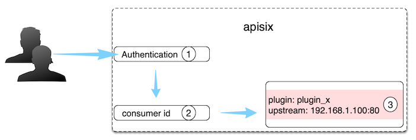

<!--
#
# Licensed to the Apache Software Foundation (ASF) under one or more
# contributor license agreements.  See the NOTICE file distributed with
# this work for additional information regarding copyright ownership.
# The ASF licenses this file to You under the Apache License, Version 2.0
# (the "License"); you may not use this file except in compliance with
# the License.  You may obtain a copy of the License at
#
#     http://www.apache.org/licenses/LICENSE-2.0
#
# Unless required by applicable law or agreed to in writing, software
# distributed under the License is distributed on an "AS IS" BASIS,
# WITHOUT WARRANTIES OR CONDITIONS OF ANY KIND, either express or implied.
# See the License for the specific language governing permissions and
# limitations under the License.
#
-->

## 描述

Consumer 是某类服务的消费者，需要与用户认证配合才可以使用。当不同的消费者请求同一个 API 时，APISIX 会根据当前请求的用户信息，对应不同的 Plugin 或 Upstream 配置。如果 [Route](./route.md)、[Service](./service.md)、[Consumer](./consumer.md) 和 [Plugin Config](./plugin-config.md) 都绑定了相同的插件，只有消费者的插件配置会生效。插件配置的优先级由高到低的顺序是：Consumer > Route > Plugin Config > Service。

对于 API 网关而言，一般情况可以通过请求域名、客户端 IP 地址等字段识别到某类请求方，然后进行插件过滤并转发请求到指定上游。但有时候该方式达不到用户需求，因此 APISIX 支持了 Consumer 对象。



如上图所示，作为 API 网关，需要知道 API Consumer（消费方）具体是谁，这样就可以对不同 API Consumer 配置不同规则。

## 配置选项

定义 Consumer 的字段如下：

| 名称     | 必选项 | 描述                                                                         |
| -------- | ---- | ------------------------------------------------------------------------------|
| username | 是   | Consumer 名称。                                                                |
| plugins  | 否   | Consumer 对应的插件配置。详细信息，请参考 [Plugins](./plugin.md)。 |

## 识别消费者

在 APISIX 中，识别 Consumer 的过程如下图：



1. 授权认证：比如有 [key-auth](../plugins/key-auth.md)、[JWT](../plugins/jwt-auth.md) 等；
2. 获取 consumer_name：通过授权认证，即可自然获取到对应的 Consumer name，它是 Consumer 对象的唯一识别标识；
3. 获取 Consumer 上绑定的 Plugin 或 Upstream 信息：完成对不同 Consumer 做不同配置的效果。

当有不同的使用者请求相同的 API，并且需要根据使用者执行不同的插件和上游配置时，使用 Consumer 是非常合适的。需要与用户身份验证系统结合使用。

目前，可以与 Consumer 配置的身份验证插件包括 `basic-auth` 、`hmac-auth`、`jwt-auth`、`key-auth`、`ldap-auth` 和 `wolf-rbac`。

你可以参考 [key-auth](../plugins/key-auth.md) 认证授权插件的调用逻辑，进一步理解 Consumer 概念和使用。

:::note 注意

如需了解更多关于 Consumer 对象的信息，你可以参考 [Admin API Consumer](../admin-api.md#consumer) 资源介绍。

:::

## 使用示例

以下示例介绍了如何对某个 Consumer 开启指定插件：

:::note

您可以这样从 `config.yaml` 中获取 `admin_key` 并存入环境变量：

```bash
admin_key=$(yq '.deployment.admin.admin_key[0].key' conf/config.yaml | sed 's/"//g')
```

:::

1. 创建 Consumer，指定认证插件 `key-auth`，并开启特定插件 `limit-count`。

    ```shell
    curl http://127.0.0.1:9180/apisix/admin/consumers \
    -H "X-API-KEY: $admin_key" -X PUT -d '
    {
        "username": "jack",
        "plugins": {
            "key-auth": {
                "key": "auth-one"
            },
            "limit-count": {
                "count": 2,
                "time_window": 60,
                "rejected_code": 503,
                "key": "remote_addr"
            }
        }
    }'
    ```

2. 创建路由，设置路由规则和启用插件配置。

    ```shell
    curl http://127.0.0.1:9180/apisix/admin/routes/1 \
    -H "X-API-KEY: $admin_key" -X PUT -d '
    {
        "plugins": {
            "key-auth": {}
        },
        "upstream": {
            "nodes": {
                "127.0.0.1:1980": 1
            },
            "type": "roundrobin"
        },
        "uri": "/hello"
    }'
    ```

3. 测试插件。

    连续发送三次测试请求，前两次返回正常，没达到限速阈值。

    ```shell
    curl http://127.0.0.1:9080/hello -H 'apikey: auth-one' -I
    ```

    第三次测试返回 `503`，请求被限制：

    ```shell
    HTTP/1.1 503 Service Temporarily Unavailable
    ...
    ```

通过 [consumer-restriction](../plugins/consumer-restriction.md) 插件，限制用户 `jack` 对该 Route 的访问。

1. 设置黑名单，禁止 jack 访问该 API。

    ```shell
    curl http://127.0.0.1:9180/apisix/admin/routes/1  \
    -H "X-API-KEY: $admin_key" -X PUT -d '
    {
        "plugins": {
            "key-auth": {},
            "consumer-restriction": {
                "blacklist": [
                    "jack"
                ]
            }
        },
        "upstream": {
            "nodes": {
                "127.0.0.1:1980": 1
            },
            "type": "roundrobin"
        },
        "uri": "/hello"
    }'
    ```

2. 通过以下命令访问该路由，均返回 `403`，`jack` 被禁止访问。

    ```shell
    curl http://127.0.0.1:9080/hello -H 'apikey: auth-one' -I
    ```

    返回结果：

    ```
    HTTP/1.1 403
    ...
    ```
