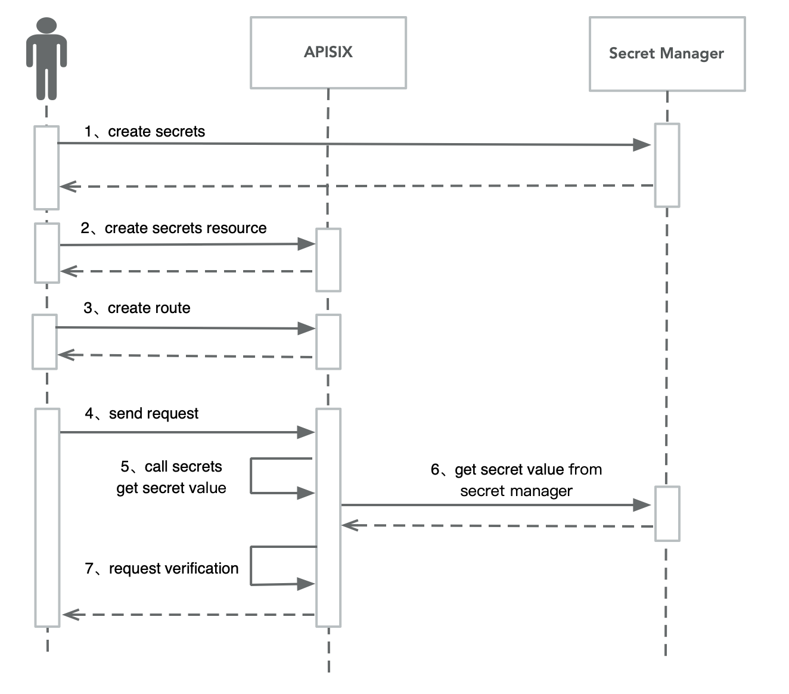

<!--
#
# Licensed to the Apache Software Foundation (ASF) under one or more
# contributor license agreements.  See the NOTICE file distributed with
# this work for additional information regarding copyright ownership.
# The ASF licenses this file to You under the Apache License, Version 2.0
# (the "License"); you may not use this file except in compliance with
# the License.  You may obtain a copy of the License at
#
#     http://www.apache.org/licenses/LICENSE-2.0
#
# Unless required by applicable law or agreed to in writing, software
# distributed under the License is distributed on an "AS IS" BASIS,
# WITHOUT WARRANTIES OR CONDITIONS OF ANY KIND, either express or implied.
# See the License for the specific language governing permissions and
# limitations under the License.
#
-->

## 描述

密钥是指 APISIX 运行过程中所需的任何敏感信息，它可能是核心配置的一部分（如 etcd 的密码），也可能是插件中的一些敏感信息。APISIX 中常见的密钥类型包括：

- 一些组件（etcd、Redis、Kafka 等）的用户名、密码
- 证书的私钥
- API 密钥
- 敏感的插件配置字段，通常用于身份验证、hash、签名或加密

APISIX Secret 允许用户在 APISIX 中通过一些密钥管理服务（Vault 等）来存储密钥，在使用的时候根据 key 进行读取，确保密钥在整个平台中不以明文的形式存在。

其工作原理如图所示：


APISIX 目前支持通过以下方式存储密钥：

- [环境变量](#使用环境变量管理密钥)
- [HashiCorp Vault](#使用-vault-管理密钥)
- [AWS Secrets Manager](#使用-aws-secrets-manager-管理密钥)
- [GCP Secrets Manager](#使用-gcp-secrets-manager-管理密钥)

你可以在以下插件的 consumer 配置中通过指定格式的变量来使用 APISIX Secret 功能，比如 `key-auth` 插件。

:::note

如果某个配置项为：`key: "$ENV://ABC"`，当 APISIX Secret 中没有检索到 $ENV://ABC 对应的真实值，那么 key 的值将是 "$ENV://ABC" 而不是 `nil`。

:::

## 使用环境变量管理密钥

使用环境变量来管理密钥意味着你可以将密钥信息保存在环境变量中，在配置插件时通过特定格式的变量来引用环境变量。APISIX 支持引用系统环境变量和通过 Nginx `env` 指令配置的环境变量。

### 引用方式

```
$ENV://$env_name/$sub_key
```

- env_name: 环境变量名称
- sub_key: 当环境变量的值是 JSON 字符串时，获取某个属性的值

如果环境变量的值是字符串类型，如：

```
export JACK_AUTH_KEY=abc
```

则可以通过如下方式引用：

```
$ENV://JACK_AUTH_KEY
```

如果环境变量的值是一个 JSON 字符串，例如：

```
export JACK={"auth-key":"abc","openid-key": "def"}
```

则可以通过如下方式引用：

```
# 获取环境变量 JACK 的 auth-key
$ENV://JACK/auth-key

# 获取环境变量 JACK 的 openid-key
$ENV://JACK/openid-key
```

### 示例：在 key-auth 插件中使用

第一步：APISIX 实例启动前创建环境变量

```
export JACK_AUTH_KEY=abc
```

第二步：在 `key-auth` 插件中引用环境变量

:::note

您可以这样从 `config.yaml` 中获取 `admin_key` 并存入环境变量：

```bash
admin_key=$(yq '.deployment.admin.admin_key[0].key' conf/config.yaml | sed 's/"//g')
```

:::

```shell
curl http://127.0.0.1:9180/apisix/admin/consumers \
-H "X-API-KEY: $admin_key" -X PUT -d '
{
    "username": "jack",
    "plugins": {
        "key-auth": {
            "key": "$ENV://JACK_AUTH_KEY"
        }
    }
}'
```

通过以上步骤，可以将 `key-auth` 插件中的 key 配置保存在环境变量中，而不是在配置插件时明文显示。

## 使用 Vault 管理密钥

使用 Vault 来管理密钥意味着你可以将密钥信息保存在 Vault 服务中，在配置插件时通过特定格式的变量来引用。APISIX 目前支持对接 [Vault KV 引擎的 V1 版本](https://developer.hashicorp.com/vault/docs/secrets/kv/kv-v1)。

### 引用方式

```
$secret://$manager/$id/$secret_name/$key
```

- manager: 密钥管理服务，可以是 Vault、AWS、GCP 等
- APISIX Secret 资源 ID，需要与添加 APISIX Secret 资源时指定的 ID 保持一致
- secret_name: 密钥管理服务中的密钥名称
- key：密钥管理服务中密钥对应的 key

### 示例：在 key-auth 插件中使用

第一步：在 Vault 中创建对应的密钥，可以使用如下命令：

```shell
vault kv put apisix/jack auth-key=value
```

第二步：通过 Admin API 添加 Secret 资源，配置 Vault 的地址等连接信息：

```shell
curl http://127.0.0.1:9180/apisix/admin/secrets/vault/1 \
-H "X-API-KEY: $admin_key" -X PUT -d '
{
    "uri": "https://127.0.0.1:8200"，
    "prefix": "apisix",
    "token": "root"
}'
```

如果使用 APISIX Standalone 版本，则可以在 `apisix.yaml`  文件中添加如下配置：

```yaml
secrets:
  - id: vault/1
    prefix: apisix
    token: root
    uri: 127.0.0.1:8200
```

:::tip

它现在支持使用 [`namespace` 字段](../admin-api.md#secret-config-body-requset-parameters) 设置 [HashiCorp Vault Enterprise](https://developer.hashicorp.com/vault/docs/enterprise/namespaces#vault-api-and-namespaces) 和 HCP Vault 所支持的多租户命名空间概念。

:::

第三步：在 `key-auth` 插件中引用 APISIX Secret 资源，填充秘钥信息：

```shell
curl http://127.0.0.1:9180/apisix/admin/consumers \
-H "X-API-KEY: $admin_key" -X PUT -d '
{
    "username": "jack",
    "plugins": {
        "key-auth": {
            "key": "$secret://vault/1/jack/auth-key"
        }
    }
}'
```

通过上面两步操作，当用户请求命中 `key-auth` 插件时，会通过 APISIX Secret 组件获取到 key 在 Vault 中的真实值。

## 使用 AWS Secrets Manager 管理密钥

使用 AWS Secrets Manager 管理密钥是一种安全且便捷的方式来存储和管理敏感信息。通过这种方式，你可以将密钥信息保存在 AWS Secret Manager 中，并在配置 APISIX 插件时通过特定的格式引用这些密钥。

APISIX 目前支持两种访问方式： [长期凭证的访问方式](https://docs.aws.amazon.com/zh_cn/sdkref/latest/guide/access-iam-users.html) 和 [短期凭证的访问方式](https://docs.aws.amazon.com/zh_cn/sdkref/latest/guide/access-temp-idc.html)。

### 引用方式

在 APISIX 中引用密钥时，可以使用以下格式：

```
$secret://$manager/$id/$secret_name/$key
```

- manager: 密钥管理服务，可以是 Vault、AWS 等
- APISIX Secret 资源 ID，需要与添加 APISIX Secret 资源时指定的 ID 保持一致
- secret_name: 密钥管理服务中的密钥名称
- key：当密钥的值是 JSON 字符串时，获取某个属性的值

### 相关参数

| 名称 | 必选项 | 默认值 | 描述 |
| --- | --- | --- | --- |
| access_key_id | 是 |  | AWS 访问密钥 ID |
| secret_access_key | 是 |  | AWS 访问密钥 |
| session_token | 否 |  | 临时访问凭证信息 |
| region | 否 | us-east-1 | AWS 区域 |
| endpoint_url | 否 | https://secretsmanager.{region}.amazonaws.com | AWS Secret Manager 地址 |

### 示例：在 key-auth 插件中使用

这里以 key-auth 插件的使用为例，展示如何通过 AWS Secret Manager 管理密钥：

第一步：在 AWS Secret Manager 中创建对应的密钥，这里使用 [localstack](https://www.localstack.cloud/) 模拟，可以使用如下命令：

```shell
docker exec -i localstack sh -c "awslocal secretsmanager create-secret --name jack --description 'APISIX Secret' --secret-string '{\"auth-key\":\"value\"}'"
```

第二步：通过 Admin API 添加 Secret 资源，配置 AWS Secret Manager 的地址等连接信息：

你可以在环境变量中存储关键密钥信息，保证配置信息是安全的，在使用到地方进行引用：

```shell
export AWS_ACCESS_KEY_ID=<access_key_id>
export AWS_SECRET_ACCESS_KEY=<secrets_access_key>
export AWS_SESSION_TOKEN=<token>
```

当然，你也可以通过直接在配置中指定所有信息内容：

```shell
curl http://127.0.0.1:9180/apisix/admin/secrets/aws/1 \
-H "X-API-KEY: $admin_key" -X PUT -d '
{
    "endpoint_url": "http://127.0.0.1:4566",
    "region": "us-east-1",
    "access_key_id": "access",
    "secret_access_key": "secret",
    "session_token": "token"
}'
```

如果使用 APISIX Standalone 版本，则可以在 `apisix.yaml`  文件中添加如下配置：

```yaml
secrets:
  - id: aws/1
    endpoint_url: http://127.0.0.1:4566
    region: us-east-1
    access_key_id: access
    secret_access_key: secret
    session_token: token
```

第三步：在 `key-auth` 插件中引用 APISIX Secret 资源，填充秘钥信息：

```shell
curl http://127.0.0.1:9180/apisix/admin/consumers \
-H "X-API-KEY: $admin_key" -X PUT -d '
{
    "username": "jack",
    "plugins": {
        "key-auth": {
            "key": "$secret://aws/1/jack/auth-key"
        }
    }
}'
```

通过上面两步操作，当用户请求命中 `key-auth` 插件时，会通过 APISIX Secret 组件获取到 key 在 AWS Secret Manager 中的真实值。

### 验证

你可以通过如下指令进行验证：

```shell
# 示例：将下面的 your_route 替换为实际的路由路径
curl -i http://127.0.0.1:9080/your_route -H 'apikey: value'
```

这将验证 key-auth 插件是否正确地使用 AWS Secret Manager 中的密钥。

## 使用 GCP Secrets Manager 管理密钥

使用 GCP Secret Manager 来管理密钥意味着你可以将密钥信息保存在 GCP 服务中，在配置插件时通过特定格式的变量来引用。APISIX 目前支持对接 GCP Secret Manager, 所支持的验证方式是[OAuth 2.0](https://developers.google.com/identity/protocols/oauth2?hl=zh-cn)。

### 引用方式

```
$secret://$manager/$id/$secret_name/$key
```

引用方式和之前保持一致：

- manager: 密钥管理服务，可以是 Vault、AWS\GCP 等
- APISIX Secret 资源 ID，需要与添加 APISIX Secret 资源时指定的 ID 保持一致
- secret_name: 密钥管理服务中的密钥名称
- key：当密钥的值是 JSON 字符串时，获取某个属性的值

### 必要参数

| 名称                     | 必选项   | 默认值                                           | 描述                                                                                                                             |
| ----------------------- | -------- | ------------------------------------------------ | -------------------------------------------------------------------------------------------------------------------------------  |
| auth_config             | 是       |                                                  | `auth_config` 和 `auth_file` 必须配置一个。                                                                                     |
| auth_config.client_email | 是       |                                                  | 谷歌服务帐号的 email 参数。                                                                                                           |
| auth_config.private_key | 是       |                                                  | 谷歌服务帐号的私钥参数。                                                                                                           |
| auth_config.project_id  | 是       |                                                  | 谷歌服务帐号的项目 ID。                                                                                                            |
| auth_config.token_uri   | 否       | https://oauth2.googleapis.com/token              | 请求谷歌服务帐户的令牌的 URI。                                                                                                        |
| auth_config.entries_uri | 否       |   https://secretmanager.googleapis.com/v1     | 谷歌密钥服务访问端点 API。                                                                                                   |
| auth_config.scope      | 否       |   https://www.googleapis.com/auth/cloud-platform                                               | 谷歌服务账号的访问范围，可参考 [OAuth 2.0 Scopes for Google APIs](https://developers.google.com/identity/protocols/oauth2/scopes)|
| auth_file               | 是       |                                                  | `auth_config` 和 `auth_file` 必须配置一个。          |
| ssl_verify              | 否       | true                                             | 当设置为 `true` 时，启用 `SSL` 验证。                 |

你需要配置相应的认证参数，或者通过 auth_file 来指定认证文件，其中 auth_file 的内容为认证参数的 json 格式。

### 示例

以下一种正确的配置实例：

```
curl http://127.0.0.1:9180/apisix/admin/secrets/gcp/1 \
-H "X-API-KEY: $admin_key" -X PUT -d '
{
    "auth_config" : {
        "client_email": "email@apisix.iam.gserviceaccount.com",
        "private_key": "private_key",
        "project_id": "apisix-project",
        "token_uri": "https://oauth2.googleapis.com/token",
        "entries_uri": "https://secretmanager.googleapis.com/v1",
        "scope": ["https://www.googleapis.com/auth/cloud-platform"]
    }
}'

```
