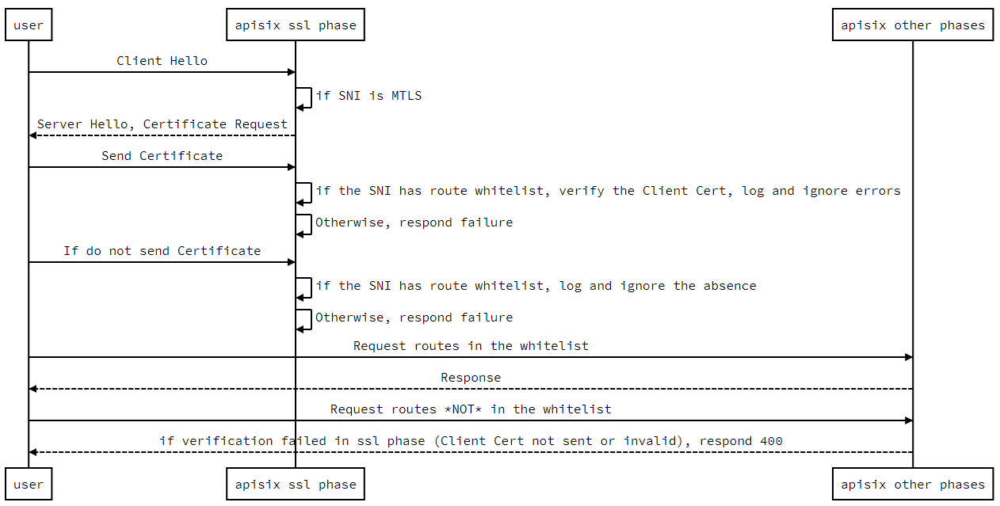

<!--
#
# Licensed to the Apache Software Foundation (ASF) under one or more
# contributor license agreements.  See the NOTICE file distributed with
# this work for additional information regarding copyright ownership.
# The ASF licenses this file to You under the Apache License, Version 2.0
# (the "License"); you may not use this file except in compliance with
# the License.  You may obtain a copy of the License at
#
#     http://www.apache.org/licenses/LICENSE-2.0
#
# Unless required by applicable law or agreed to in writing, software
# distributed under the License is distributed on an "AS IS" BASIS,
# WITHOUT WARRANTIES OR CONDITIONS OF ANY KIND, either express or implied.
# See the License for the specific language governing permissions and
# limitations under the License.
#
-->

mTLS 是一种双向身份认证的方式。如果在你的网络环境中，要求只有受信任的客户端才可以访问服务端，那么可以启用 mTLS 来验证客户端的身份，保证服务端 API 的安全。本文主要介绍了如何配置客户端与 Apache APISIX 之间的双向认证（mTLS）。

## 配置

本示例包含以下过程：

1. 生成证书；
2. 在 APISIX 中配置证书；
3. 在 APISIX 中创建并配置路由；
4. 测试验证。

为了使测试结果更加清晰，本文提到的示例会向上游传递一些有关客户端证书的信息，其中包括：`serial`，`fingerprint` 和 `common name`。

### 生成证书

我们需要生成三个测试证书，分别是根证书、服务器证书、客户端证书。只需通过以下命令，就可以通过 `OpenSSL` 生成我们需要的测试证书。

```shell
# 根证书
openssl genrsa -out ca.key 2048
openssl req -new -sha256 -key ca.key -out ca.csr -subj "/CN=ROOTCA"
openssl x509 -req -days 36500 -sha256 -extensions v3_ca -signkey ca.key -in ca.csr -out ca.cer

# 服务器证书
openssl genrsa -out server.key 2048
# 注意：CN 值中的 `test.com` 为我们要测试的域名/主机名。
openssl req -new -sha256 -key server.key -out server.csr -subj "/CN=test.com"
openssl x509 -req -days 36500 -sha256 -extensions v3_req  -CA  ca.cer -CAkey ca.key  -CAserial ca.srl  -CAcreateserial -in server.csr -out server.cer

# 客户端证书
openssl genrsa -out client.key 2048
openssl req -new -sha256 -key client.key  -out client.csr -subj "/CN=CLIENT"
openssl x509 -req -days 36500 -sha256 -extensions v3_req  -CA  ca.cer -CAkey ca.key  -CAserial ca.srl  -CAcreateserial -in client.csr -out client.cer

# 将客户端证书转换为 pkcs12 供 Windows 使用（可选）
openssl pkcs12 -export -clcerts -in client.cer -inkey client.key -out client.p12
```

### 在 APISIX 中配置证书

使用 `curl` 命令请求 APISIX Admin API 创建一个 SSL 资源并指定 SNI。

:::note 注意

证书中的换行需要替换为其转义字符 `\n`

:::

```shell
curl -X PUT 'http://127.0.0.1:9180/apisix/admin/ssls/1' \
--header 'X-API-KEY: edd1c9f034335f136f87ad84b625c8f1' \
--header 'Content-Type: application/json' \
--data-raw '{
    "sni": "test.com",
    "cert": "<服务器证书>",
    "key": "<服务器证书私钥>",
    "client": {
        "ca": "<客户端证书公钥>"
    }
}'
```

- `sni`：指定证书的域名（CN），当客户端尝试通过 TLS 与 APISIX 握手时，APISIX 会将 `ClientHello` 中的 SNI 数据与该字段进行匹配，找到对应的服务器证书进行握手。
- `cert`：服务器证书。
- `key`：服务器证书的私钥。
- `client.ca`：用来验证客户端证书的 CA 文件。为了演示方便，这里使用了同一个 `CA`。

### 配置测试路由

使用 `curl` 命令请求 APISIX Admin API 创建一个路由。

```shell
curl -X PUT 'http://127.0.0.1:9180/apisix/admin/routes/1' \
--header 'X-API-KEY: edd1c9f034335f136f87ad84b625c8f1' \
--header 'Content-Type: application/json' \
--data-raw '{
    "uri": "/anything",
    "plugins": {
        "proxy-rewrite": {
            "headers": {
                "X-Ssl-Client-Fingerprint": "$ssl_client_fingerprint",
                "X-Ssl-Client-Serial": "$ssl_client_serial",
                "X-Ssl-Client-S-DN": "$ssl_client_s_dn"
            }
        }
    },
    "upstream": {
        "nodes": {
            "httpbin.org":1
        },
        "type":"roundrobin"
    }
}'
```

APISIX 会根据 SNI 和上一步创建的 SSL 资源自动处理 TLS 握手，所以我们不需要在路由中指定主机名（但也可以显式地指定主机名）。

另外，上面 `curl` 命令中，我们启用了 `proxy-rewrite` 插件，它将动态地更新请求头的信息，示例中变量值的来源是 `NGINX` 变量，你可以在这里找到它们：http://nginx.org/en/docs/http/ngx_http_ssl_module.html#variables。

### 测试验证

由于我们使用域名 `test.com` 作为测试域名，在开始验证之前，我们必须先将测试域名添加到你的 DNS 或者本地的 `hosts` 文件中。

1. 如果我们不使用 `hosts`，只是想测试一下结果，那么你可以使用下面的命令直接进行测试：

```
curl --resolve "test.com:9443:127.0.0.1" https://test.com:9443/anything -k --cert ./client.cer --key ./client.key
```

2. 如果你需要修改 `hosts`，请阅读下面示例（以 Ubuntu 为例）：

- 修改 /etc/hosts 文件

  ```shell
  # 127.0.0.1 localhost
  127.0.0.1 test.com
  ```

- 验证测试域名是否生效

  ```shell
  ping test.com

  PING test.com (127.0.0.1) 56(84) bytes of data.
  64 bytes from localhost.localdomain (127.0.0.1): icmp_seq=1 ttl=64 time=0.028 ms
  64 bytes from localhost.localdomain (127.0.0.1): icmp_seq=2 ttl=64 time=0.037 ms
  64 bytes from localhost.localdomain (127.0.0.1): icmp_seq=3 ttl=64 time=0.036 ms
  64 bytes from localhost.localdomain (127.0.0.1): icmp_seq=4 ttl=64 time=0.031 ms
  ^C
  --- test.com ping statistics ---
  4 packets transmitted, 4 received, 0% packet loss, time 3080ms
  rtt min/avg/max/mdev = 0.028/0.033/0.037/0.003 ms
  ```

- 测试

  ```shell
  curl https://test.com:9443/anything -k --cert ./client.cer --key ./client.key
  ```

  然后你将收到下面的响应体：

  ```shell
  {
    "args": {},
    "data": "",
    "files": {},
    "form": {},
    "headers": {
      "Accept": "*/*",
      "Host": "test.com",
      "User-Agent": "curl/7.81.0",
      "X-Amzn-Trace-Id": "Root=1-63256343-17e870ca1d8f72dc40b2c5a9",
      "X-Forwarded-Host": "test.com",
      "X-Ssl-Client-Fingerprint": "c1626ce3bca723f187d04e3757f1d000ca62d651",
      "X-Ssl-Client-S-Dn": "CN=CLIENT",
      "X-Ssl-Client-Serial": "5141CC6F5E2B4BA31746D7DBFE9BA81F069CF970"
    },
    "json": null,
    "method": "GET",
    "origin": "127.0.0.1",
    "url": "http://test.com/anything"
  }
  ```

由于我们在示例中配置了 `proxy-rewrite` 插件，我们可以看到响应体中包含上游收到的请求体，包含了正确数据。

## 基于对 URI 正则表达式匹配，绕过 MTLS

APISIX 允许配置 URI 白名单以便绕过 MTLS。如果请求的 URI 在白名单内，客户端证书将不被检查。注意，如果针对白名单外的 URI 发请求，而该请求缺乏客户端证书或者提供了非法客户端证书，会得到 HTTP 400 响应，而不是在 SSL 握手阶段被拒绝。

### 时序图



### 例子

1. 配置路由和证书

:::note

您可以这样从 `config.yaml` 中获取 `admin_key` 并存入环境变量：

```bash
admin_key=$(yq '.deployment.admin.admin_key[0].key' conf/config.yaml | sed 's/"//g')
```

:::

```bash
curl http://127.0.0.1:9180/apisix/admin/routes/1 \
-H "X-API-KEY: $admin_key" -X PUT -d '
{
    "uri": "/*",
    "upstream": {
        "nodes": {
            "httpbin.org": 1
        }
    }
}'

curl http://127.0.0.1:9180/apisix/admin/ssls/1 \
-H "X-API-KEY: $admin_key" -X PUT -d '
{
    "cert": "'"$(<t/certs/mtls_server.crt)"'",
    "key": "'"$(<t/certs/mtls_server.key)"'",
    "snis": [
        "*.apisix.dev"
    ],
    "client": {
        "ca": "'"$(<t/certs/mtls_ca.crt)"'",
        "depth": 10,
        "skip_mtls_uri_regex": [
            "/anything.*"
        ]
    }
}'
```

2. 如果没提供客户端证书，而 URI 又不在白名单内，会得到 HTTP 400 响应。

```bash
curl https://admin.apisix.dev:9443/uuid -v \
--resolve 'admin.apisix.dev:9443:127.0.0.1' --cacert t/certs/mtls_ca.crt
* Added admin.apisix.dev:9443:127.0.0.1 to DNS cache
* Hostname admin.apisix.dev was found in DNS cache
*   Trying 127.0.0.1:9443...
* TCP_NODELAY set
* Connected to admin.apisix.dev (127.0.0.1) port 9443 (#0)
* ALPN, offering h2
* ALPN, offering http/1.1
* successfully set certificate verify locations:
*   CAfile: t/certs/mtls_ca.crt
  CApath: /etc/ssl/certs
* TLSv1.3 (OUT), TLS handshake, Client hello (1):
* TLSv1.3 (IN), TLS handshake, Server hello (2):
* TLSv1.3 (IN), TLS handshake, Encrypted Extensions (8):
* TLSv1.3 (IN), TLS handshake, Request CERT (13):
* TLSv1.3 (IN), TLS handshake, Certificate (11):
* TLSv1.3 (IN), TLS handshake, CERT verify (15):
* TLSv1.3 (IN), TLS handshake, Finished (20):
* TLSv1.3 (OUT), TLS change cipher, Change cipher spec (1):
* TLSv1.3 (OUT), TLS handshake, Certificate (11):
* TLSv1.3 (OUT), TLS handshake, Finished (20):
* SSL connection using TLSv1.3 / TLS_AES_256_GCM_SHA384
* ALPN, server accepted to use h2
* Server certificate:
*  subject: C=cn; ST=GuangDong; L=ZhuHai; CN=admin.apisix.dev; OU=ops
*  start date: Dec  1 10:17:24 2022 GMT
*  expire date: Aug 18 10:17:24 2042 GMT
*  subjectAltName: host "admin.apisix.dev" matched cert's "admin.apisix.dev"
*  issuer: C=cn; ST=GuangDong; L=ZhuHai; CN=ca.apisix.dev; OU=ops
*  SSL certificate verify ok.
* Using HTTP2, server supports multi-use
* Connection state changed (HTTP/2 confirmed)
* Copying HTTP/2 data in stream buffer to connection buffer after upgrade: len=0
* Using Stream ID: 1 (easy handle 0x56246de24e30)
> GET /uuid HTTP/2
> Host: admin.apisix.dev:9443
> user-agent: curl/7.68.0
> accept: */*
>
* TLSv1.3 (IN), TLS handshake, Newsession Ticket (4):
* TLSv1.3 (IN), TLS handshake, Newsession Ticket (4):
* old SSL session ID is stale, removing
* Connection state changed (MAX_CONCURRENT_STREAMS == 128)!
< HTTP/2 400
< date: Fri, 21 Apr 2023 07:53:23 GMT
< content-type: text/html; charset=utf-8
< content-length: 229
< server: APISIX/3.2.0
<
<html>
<head><title>400 Bad Request</title></head>
<body>
<center><h1>400 Bad Request</h1></center>
<hr><center>openresty</center>
<p><em>Powered by <a href="https://apisix.apache.org/">APISIX</a>.</em></p></body>
</html>
* Connection #0 to host admin.apisix.dev left intact
```

3. 虽然没提供客户端证书，但是 URI 在白名单内，请求会被成功处理和响应。

```bash
curl https://admin.apisix.dev:9443/anything/foobar -i \
--resolve 'admin.apisix.dev:9443:127.0.0.1' --cacert t/certs/mtls_ca.crt
HTTP/2 200
content-type: application/json
content-length: 416
date: Fri, 21 Apr 2023 07:58:28 GMT
access-control-allow-origin: *
access-control-allow-credentials: true
server: APISIX/3.2.0
...
```

## 总结

想了解更多有关 Apache APISIX 的 mTLS 功能介绍，可以阅读：[TLS 双向认证](../mtls.md)。
