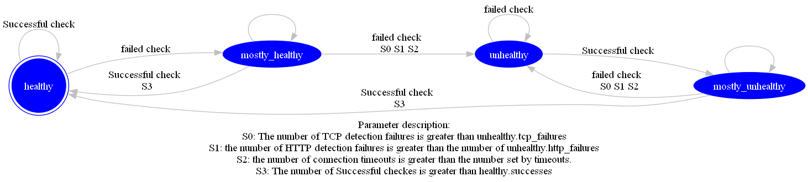

<!--
#
# Licensed to the Apache Software Foundation (ASF) under one or more
# contributor license agreements.  See the NOTICE file distributed with
# this work for additional information regarding copyright ownership.
# The ASF licenses this file to You under the Apache License, Version 2.0
# (the "License"); you may not use this file except in compliance with
# the License.  You may obtain a copy of the License at
#
#     http://www.apache.org/licenses/LICENSE-2.0
#
# Unless required by applicable law or agreed to in writing, software
# distributed under the License is distributed on an "AS IS" BASIS,
# WITHOUT WARRANTIES OR CONDITIONS OF ANY KIND, either express or implied.
# See the License for the specific language governing permissions and
# limitations under the License.
#
-->

## 描述

本文主要介绍了 Apache APISIX 的健康检查功能。健康检查功能可以在上游节点发生故障或者迁移时，将请求代理到健康的节点上，最大程度避免服务不可用的问题。APISIX 的健康检查功能使用 [lua-resty-healthcheck](https://github.com/api7/lua-resty-healthcheck) 实现，并分为主动检查和被动检查。

## 主动健康检查

主动健康检查主要是指 APISIX 通过预设的探针类型，主动探测上游节点的存活性。目前 APISIX 支持 `HTTP`、`HTTPS`、`TCP` 三种探针类型。

当发向健康节点 A 的 N 个连续探针都失败时（取决于如何配置），则该节点将被标记为不健康，不健康的节点将会被 APISIX 的负载均衡器忽略，无法收到请求；若某个不健康的节点，连续 M 个探针都成功，则该节点将被重新标记为健康，进而可以被代理。

## 被动健康检查

被动健康检查是指，通过判断从 APISIX 转发到上游节点的请求响应状态，来判断对应的上游节点是否健康。相对于主动健康检查，被动健康检查的方式无需发起额外的探针，但是也无法提前感知节点状态，可能会有一定量的失败请求。

若发向健康节点 A 的 N 个连续请求都被判定为失败（取决于如何配置），则该节点将被标记为不健康。

:::note 注意

由于不健康的节点无法收到请求，仅使用被动健康检查策略无法重新将节点标记为健康，因此通常需要结合主动健康检查策略。

:::

:::tip 提示

- 只有在 `upstream` 被请求时才会开始健康检查，如果 `upstream` 被配置但没有被请求，不会触发启动健康检查。
- 如果没有健康的节点，那么请求会继续发送给上游。

:::

## 属性

| 名称                                            | 配置类型            |  类型   | 有效值               | 默认值                                                                                         | 描述                                                                    |
| ----------------------------------------------- | ------------------ | ------- | -------------------- | --------------------------------------------------------------------------------------------- | ------------------------------------------------------------------------- |
| upstream.checks.active.type                     | 主动检查            | string  | `http` `https` `tcp` | http                                                                                           | 主动检查的类型。                                                  |
| upstream.checks.active.timeout                  | 主动检查            | integer |                      | 1                                                                                              | 主动检查的超时时间（单位为秒）。                          |
| upstream.checks.active.concurrency              | 主动检查            | integer |                      | 10                                                                                             | 主动检查时同时检查的目标数。                                |
| upstream.checks.active.http_path                | 主动检查            | string  |                      | /                                                                                              | 主动检查的 HTTP 请求路径。                                      |
| upstream.checks.active.host                     | 主动检查            | string  |                      | ${upstream.node.host}                                                                          | 主动检查的 HTTP 请求主机名。                                   |
| upstream.checks.active.port                     | 主动检查            | integer | `1` 至 `65535`       | ${upstream.node.port}                                                                          | 主动检查的 HTTP 请求主机端口。                                |
| upstream.checks.active.https_verify_certificate | 主动检查            | boolean |                      | true                                                                                           | 主动检查使用 HTTPS 类型检查时，是否检查远程主机的 SSL 证书。 |
| upstream.checks.active.req_headers              | 主动检查            | array   |                      | []                                                                                             | 主动检查使用 HTTP 或 HTTPS 类型检查时，设置额外的请求头信息。 |
| upstream.checks.active.healthy.interval         | 主动检查（健康节点）| integer | `>= 1`               | 1                                                                                              | 主动检查（健康节点）检查的间隔时间（单位为秒）|
| upstream.checks.active.healthy.http_statuses    | 主动检查（健康节点）| array   | `200` 至 `599`       | [200, 302]                                                                                      | 主动检查（健康节点）HTTP 或 HTTPS 类型检查时，健康节点的 HTTP 状态码。 |
| upstream.checks.active.healthy.successes        | 主动检查（健康节点）| integer | `1` 至 `254`         | 2                                                                                               | 主动检查（健康节点）确定节点健康的次数。              |
| upstream.checks.active.unhealthy.interval       | 主动检查（非健康节点）| integer | `>= 1`               | 1                                                                                               | 主动检查（非健康节点）检查的间隔时间（单位为秒）|
| upstream.checks.active.unhealthy.http_statuses  | 主动检查（非健康节点）| array   | `200` 至 `599`       | [429, 404, 500, 501, 502, 503, 504, 505]                                                        | 主动检查（非健康节点）HTTP 或 HTTPS 类型检查时，非健康节点的 HTTP 状态码。 |
| upstream.checks.active.unhealthy.http_failures  | 主动检查（非健康节点）| integer | `1` 至 `254`         | 5                                                                                               | 主动检查（非健康节点）HTTP 或 HTTPS 类型检查时，确定节点非健康的次数。 |
| upstream.checks.active.unhealthy.tcp_failures   | 主动检查（非健康节点）| integer | `1` 至 `254`         | 2                                                                                               | 主动检查（非健康节点）TCP 类型检查时，确定节点非健康的次数。 |
| upstream.checks.active.unhealthy.timeouts       | 主动检查（非健康节点）| integer | `1` 至 `254`         | 3                                                                                               | 主动检查（非健康节点）确定节点非健康的超时次数。  |
| upstream.checks.passive.type       | 被动检查 | string | `http` `https` `tcp`         | http                                                                                               | 被动检查的类型。  |
| upstream.checks.passive.healthy.http_statuses   | 被动检查（健康节点）|  array   | `200` 至 `599`       | [200, 201, 202, 203, 204, 205, 206, 207, 208, 226, 300, 301, 302, 303, 304, 305, 306, 307, 308] | 被动检查（健康节点）HTTP 或 HTTPS 类型检查时，健康节点的 HTTP 状态码。 |
| upstream.checks.passive.healthy.successes       | 被动检查（健康节点）|  integer | `0` 至 `254`         | 5                                                                                               | 被动检查（健康节点）确定节点健康的次数。              |
| upstream.checks.passive.unhealthy.http_statuses | 被动检查（非健康节点）| array   | `200` 至 `599`       | [429, 500, 503]                                                                                 | 被动检查（非健康节点）HTTP 或 HTTPS 类型检查时，非健康节点的 HTTP 状态码。 |
| upstream.checks.passive.unhealthy.tcp_failures  | 被动检查（非健康节点）| integer | `0` 至 `254`         | 2                                                                                               | 被动检查（非健康节点）TCP 类型检查时，确定节点非健康的次数。 |
| upstream.checks.passive.unhealthy.timeouts      | 被动检查（非健康节点）| integer | `0` 至 `254`         | 7                                                                                               | 被动检查（非健康节点）确定节点非健康的超时次数。  |
| upstream.checks.passive.unhealthy.http_failures | 被动检查（非健康节点）| integer | `0` 至 `254`         | 5                                                                                         | 被动检查（非健康节点）HTTP 或 HTTPS 类型检查时，确定节点非健康的次数。 |

## 配置示例

你可以通过 Admin API 在路由中启用健康检查功能：

:::note

您可以这样从 `config.yaml` 中获取 `admin_key` 并存入环境变量：

```bash
admin_key=$(yq '.deployment.admin.admin_key[0].key' conf/config.yaml | sed 's/"//g')
```

:::

```shell
curl http://127.0.0.1:9180/apisix/admin/routes/1 -H "X-API-KEY: $admin_key" -X PUT -d '
{
    "uri": "/index.html",
    "plugins": {
        "limit-count": {
            "count": 2,
            "time_window": 60,
            "rejected_code": 503,
            "key": "remote_addr"
        }
    },
    "upstream": {
         "nodes": {
            "127.0.0.1:1980": 1,
            "127.0.0.1:1970": 1
        },
        "type": "roundrobin",
        "retries": 2,
        "checks": {
            "active": {
                "timeout": 5,
                "http_path": "/status",
                "host": "foo.com",
                "healthy": {
                    "interval": 2,
                    "successes": 1
                },
                "unhealthy": {
                    "interval": 1,
                    "http_failures": 2
                },
                "req_headers": ["User-Agent: curl/7.29.0"]
            },
            "passive": {
                "healthy": {
                    "http_statuses": [200, 201],
                    "successes": 3
                },
                "unhealthy": {
                    "http_statuses": [500],
                    "http_failures": 3,
                    "tcp_failures": 3
                }
            }
        }
    }
}'
```

启用成功后，如果 APISIX 探测到不健康的节点，将会在错误日志中输出如下日志：

```shell
enabled healthcheck passive while logging request
failed to receive status line from 'nil (127.0.0.1:1980)': closed
unhealthy TCP increment (1/2) for '(127.0.0.1:1980)'
failed to receive status line from 'nil (127.0.0.1:1980)': closed
unhealthy TCP increment (2/2) for '(127.0.0.1:1980'
```

:::tip 提示

需要将错误日志的级别调整为 `info` 才可以观测到上述日志信息

:::

你可以通过[控制接口](../control-api.md) 中的 `GET /v1/healthcheck` 接口获取健康检查信息。如下所示：

```shell

curl http://127.0.0.1:9090/v1/healthcheck/upstreams/healthycheck -s | jq .

```

## 健康检查信息

APISIX 提供了丰富的健康检查信息，其中  `status` 以及 `counter` 的返回对于健康检查是至关重要的。在 APISIX 中，节点有四个状态：`healthy`、`unhealthy`、`mostly_unhealthy`、`mostly_healthy`。`mostly_healthy` 状态表示当前节点状态是健康的，但在健康检查期间，节点健康检测并不是一直是成功的。`mostly_unhealthy` 状态表示当前节点状态是不健康的，但在健康检查期间，节点健康检测并不是一直是失败的。节点的状态转换取决于本次健康检查的成功或失败，以及 `counter` 中记录的 `tcp_failure`、`http_failure`、`success`、`timeout_failure` 四个数据。

获取健康检查信息，通过以下 curl 命令可以获取健康检查信息：

```shell
curl -i http://127.0.0.1:9090/v1/healthcheck
```

响应示例：

```json
[
  {
    "nodes": {},
    "name": "/apisix/routes/1",
    "type": "http"
  },
  {
    "nodes": [
      {
        "port": 1970,
        "hostname": "127.0.0.1",
        "status": "healthy",
        "ip": "127.0.0.1",
        "counter": {
          "tcp_failure": 0,
          "http_failure": 0,
          "success": 0,
          "timeout_failure": 0
        }
      },
      {
        "port": 1980,
        "hostname": "127.0.0.1",
        "status": "healthy",
        "ip": "127.0.0.1",
        "counter": {
          "tcp_failure": 0,
          "http_failure": 0,
          "success": 0,
          "timeout_failure": 0
        }
      }
    ],
    "name": "/apisix/routes/example-hc-route",
    "type": "http"
  }
]
```

### 状态转换图



请注意，所有节点在没有初始探测的情况下都以`healthy`状态启动，计数器仅在状态更改时重置和更新。因此，当节点处于`healthy`状态且所有后续检查都成功时，`success`计数器不会更新，保持为零。

### counter 信息

若健康检查失败，`counter` 中的 `success` 计数将被置零。若健康检查成功，则会将 `tcp_failure`、`http_failure`、`timeout_failure` 数据置零。

| 名称            | 描述                    | 作用                                                                       |
|----------------|------------------------|----------------------------------------------------------------------------|
|success         | 健康检查成功的次数         |当 success 大于 healthy.successes 配置值时，节点会变为 healthy 状态               |
|tcp_failure     | TCP 类型健康检查失败次数   |当 tcp_failure 大于 unhealthy.tcp_failures 配置值时，节点会变为 unhealthy 状态    |
|http_failure    | HTTP 类型的健康检查失败次数 |当 http_failure 大于 unhealthy.http_failures 配置值时，节点会变为 unhealthy 状态 |
|timeout_failure | 节点健康检查超时次数       |当 timeout_failure 大于 unhealthy.timeouts 配置值时，节点会变为 unhealthy 状态    |
